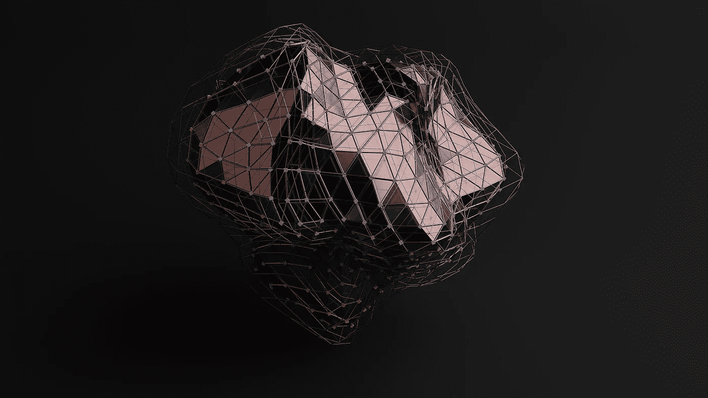

# NFT 即将登陆 Instagram

> 原文：<https://medium.com/coinmonks/nfts-are-coming-to-instagram-53c1260c9459?source=collection_archive---------54----------------------->

# 马克·扎克伯格证实，用户将能够通过该平台“造币”

时候到了。Instagram 将在未来几个月采用可以在 Polygon、Solana、Flow 以及当然还有以太坊上铸造的 NFT，该平台将支持 MetaMask 和更多钱包。下周将进行更新测试，并将首先在美国推出。

Meta 证实这项服务将完全免费(Twitter 在这一点上有竞争对手)，我们将能够通过验证将我们的 NFT 作为个人资料图片发布。

如果很多人不知道什么是 NFT，我们可以预计将会有大量新用户进入这个领域。

> 加入 Coinmonks [电报频道](https://t.me/coincodecap)和 [Youtube 频道](https://www.youtube.com/c/coinmonks/videos)了解加密交易和投资

# 另外，阅读

*   [加拿大最佳加密交易机器人](https://coincodecap.com/5-best-crypto-trading-bots-in-canada) | [库币评论](https://coincodecap.com/kucoin-review)
*   [用于 Huobi 的加密交易信号](https://coincodecap.com/huobi-crypto-trading-signals) | [HitBTC 审查](/coinmonks/hitbtc-review-c5143c5d53c2)
*   [TraderWagon 回顾](https://coincodecap.com/traderwagon-review) | [北海巨妖 vs 双子 vs 比特亚德](https://coincodecap.com/kraken-vs-gemini-vs-bityard)
*   [如何在 FTX 交易所交易期货](https://coincodecap.com/ftx-futures-trading) | [OKEx vs 币安](https://coincodecap.com/okex-vs-binance)
*   [OKEx vs KuCoin](https://coincodecap.com/okex-kucoin) | [摄氏替代品](https://coincodecap.com/celsius-alternatives) | [如何购买 VeChain](https://coincodecap.com/buy-vechain)