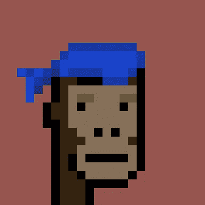
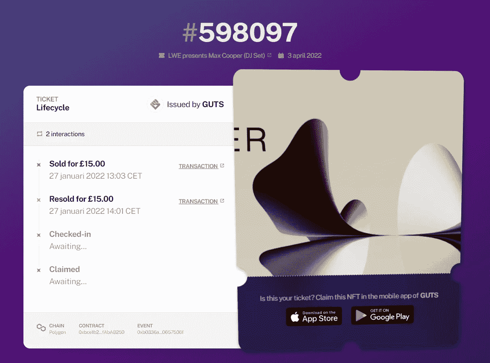
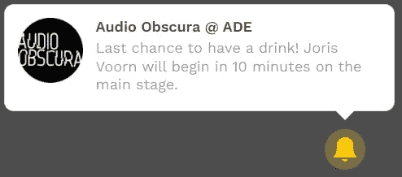
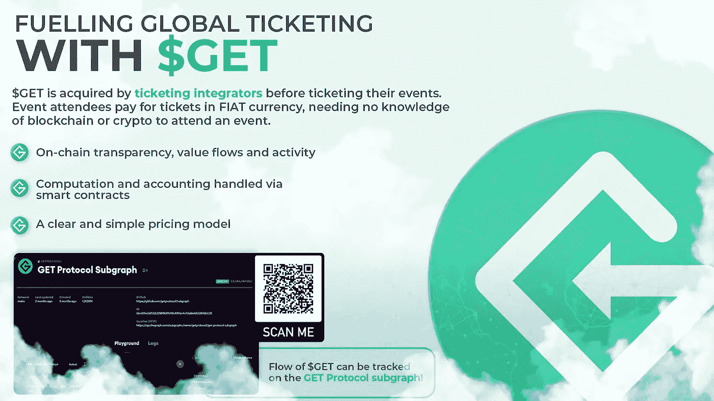

# NFT 不仅仅是 jpegs。使用 GET 协议深入了解 NFT 票务。

> 原文：<https://medium.com/coinmonks/nfts-are-much-more-than-just-jpegs-99c20cd963fd?source=collection_archive---------0----------------------->

# 内容:

> 简而言之
> 
> NFT 与票务:天作之合？
> 
> GET 协议简介
> 
> 得到 NFT 门票的好处
> 
> 获取协议作为票务标准
> 
> $GET 令牌

# 简而言之

他们无处不在。从阿姆和史努比·道格到帕丽斯·希尔顿和贾斯汀比伯。他们的共同点是都参与了非功能性测试。在他们的案例中:NFT JPEG/数字艺术

Jimmy Fallon and Paris Hilton discuss their love for NFTs. Courtesy of the Tonight Show.

## 事实真相

一个 NFT 代表一个“**不可替代的令牌**一个**非** - **可替换的**令牌是**唯一的**，因此存储在区块链上。这些令牌是**互不可互换的**，这意味着所有令牌都互不相同。不像**比特币** (= **可替换**)那样，你拥有 1890 万个比特币中的哪一个并不重要。因为它们都是一样的，因此可以互换。

所以在实践中，一个代表某物的唯一令牌**可以**转移**给其他人。数字艺术 NFT 是目前的炒作:艺术家铸造 NFT，并将他们的艺术与这些独特的令牌联系起来。然后他们的艺术品在诸如 Opensea 和 Rarible 这样的市场上进行交易。**

 [## 毕普以 6900 万美元卖出了一幅 NFT

### 直到 10 月，数码艺术家麦克·温克尔曼——被称为毕普——卖出的最高价格是 100 美元…

www.theverge.com](https://www.theverge.com/2021/3/11/22325054/beeple-christies-nft-sale-cost-everydays-69-million) 

流行的 NFT 数字艺术的两个例子是**朋克**和**无聊的猿类**。

CryptoPunk #4156 (Forgive the “right click, save as”)

例如，上图中的加密朋克去年以超过 1000 万美元的价格售出。而在撰写本文时，一只无聊猿的最低价是 100 ETH(300.000 美元)。

拥有通过区块链保证其**唯一性**的令牌打开了许多可能性。NFT 艺术只是触及了表面。NFTs 的作用远不止于此！

# NFT 与票务:天作之合？

NFT 票务有许多企业家设想未来每张票都是 NFT。这里只是许多例子中的一部分:

 [## Ted Leonsis 看到了票务领域的区块链未来

### 新冠肺炎疫情在各个方面都加快了数字技术的应用。“[我们]一直知道，10 年后，我们有…

www.sportico.com](https://www.sportico.com/business/tech/2021/ted-leonsis-blockchain-ticketing-1234624872/)  [## 亿万富翁马克·库班想把小牛的球票变成 NFTs

### 达拉斯小牛队的老板马克·库班自己一直有点金融特立独行，所以他…

finance.yahoo.com](https://finance.yahoo.com/news/billionaire-mark-cuban-wants-turn-151934328.html) 

A statement from FTX founder & billionaire founderSamuel Bankman-Fried

那么，为什么它最近获得了这么多的关注呢？让我们先来探究一下目前票务行业的一些缺陷。

## 当前票务行业的缺陷

在试图解决任何问题之前，必须先解决一个问题。目前的票务行业有很多:

1.  **机票欺诈**
    在网上购买机票时，并不总是很容易知道这张机票是真的还是假的**。人们被**骗**买假票的故事数不胜数。**
2.  ****倒票**
    热门赛事的售票一旦开始，就是抢票潮。人们不总是知道的是，他们不仅仅是冲向其他粉丝。也反对那些买票只是为了以更高的价格倒卖的人(黄牛党)。甚至复杂的**机器人**也参与其中。
    这些黄牛在这个过程中没有增加任何价值，却大赚了一笔。这是以牺牲艺术家、粉丝、场馆、活动组织者……以及所有使活动产业成为现在这个样子的人的利益为代价的。**
3.  ****人为的供应不足**
    众所周知，票务公司经常只提供部分库存票**出售。然后，他们使用剩余库存(当奖品因供不应求而爆炸时)，在第三方网站上销售。**这是一个一边为自己创收，一边拔光粉丝的过程。**
4.  **不知道谁拥有这张票。尤其是在 COVID19 期间，这经常会导致问题。
    以[低地](https://www.gelderlander.nl/home/iedereen-is-ticket-voor-dtrh-of-lowlands-kwijt-en-wie-via-via-kocht-misschien-ook-zijn-geld~a7171538/)为例。活动取消了，原来的购票人得到了退款。与此同时，买了二手票的持票人让他们的票**作废**。他们只能听凭原买家的摆布来要回他们的钱。如果彩票多次转手，那就更难了。**

**首先，这是一个被不诚实的参与者所困扰的行业，一个没有人信任另一个人的行业。以下只是众多例子中的几个:**

** [## 二级票务市场价值 150 亿美元。粉丝要付费多久？

### 尼尔斯·弗拉姆最近在华特迪士尼音乐厅表演时，在已经令人印象深刻的职业生涯中达到了另一个水平。的…

bigthink.com](https://bigthink.com/neuropsych/scalping/)  [## 新的票贩子年轻、无所顾忌，而且非常在线

### 挂出与今天的青少年偶像票黄牛不和谐-普通人，没有机器人的时刻，哈里·斯泰尔斯…

www.theatlantic.com](https://www.theatlantic.com/technology/archive/2019/11/discord-scalpers-harry-styles-ticket-resale-verified-fan/602647/) 

所以需要解决的**主要问题**是:**倒票**、**缺乏透明度、可追溯性和真实性证明**。

本质上，这是一个等待被区块链颠覆的行业。但在我们深入探讨之前，我想澄清一点，仅仅是一张 NFT**门票并不是这些问题的最终解决方案。
但结合其他工具，它不仅解决了这些问题，还增加了以前不可能实现的**优势**。**

**GET Protocol** 是一个完美的展示，因为它已经实现了所有这些。这就是为什么我会在这篇博客中关注他们的解决方案。

# GET 协议简介

**GET Protocol** 是一个早在 **2017** 就见天日的项目。
作为一种介绍方式:早期的一个片段，他们的首席执行官(Maarten Bloemers)出现在一个受欢迎的荷兰脱口秀节目中。他与一些荷兰艺术家一起解释了行业中的**问题**以及他如何计划**扰乱**它:

GET protocol featured on DWDD in March 2018

与此同时，很多事情都发生了变化。每张 GET 票都是一个 **NFT** ，在撰写本文**时，已有超过 125 万张在线票**通过它得到处理。概念证明肯定是有的:

[https://explorer.get-protocol.io/](https://explorer.get-protocol.io/)

GET protocol featured on Bankless in January 2022

# “零摩擦”过程

## 买你的票

要做到这一点，用户必须毫无困难地享受区块链/NFT 票务**的所有好处。**需要有 0 摩擦力。而且是这种情况。你用法定货币买票，然后像往常一样结账。其他一切都在后台发生。你不需要以太坊钱包或者任何关于区块链/密码的知识来买票。

让我们用 GET 协议支持的随机事件对**进行测试**。我决定买一张马克斯·库伯的演出门票，它与 GET integrator GUTS 门票一起出售:

[https://guts.events/yrwilh-max-cooper/lezoiu](https://guts.events/yrwilh-max-cooper/lezoiu/)

## 二级市场

不幸的是，我的“第一版”已经售罄。所以如果我想要一张票，我必须从二级市场买一张。我只需点击“查看机票市场”即可。

在这种情况下，活动组织者可能已经决定，您不能通过出售门票获利，因为“Katey”正在以**原价**出售门票。除了这个应用程序，我没有办法找到凯蒂是谁，也没有办法在其他地方买票。请记住，我还需要通过应用程序转移门票，以获得手机上的**动态二维码。**这授予我**访问**该事件的权限。因此，剥头皮是不可能的。

我决定从二级市场**购买这张票**:

The available payment methods depend on the event organizer (others have Google Pay, PayPal, debit cards, bank wire… available. Even crypto is possible)

我结账，付款，然后票就落在我的钱包里了，钱包是票务提供商的应用程序的钱包。凯蒂**自动**拿到**存入**她银行账户的钱。这是一个简单的过程，不会超过几分钟。

## 票证的生命周期

在**背景**中，在购买的那一刻，一张 **NFT** 得到了代表这张票的**铸造**。如果我愿意，我可以在[浏览器](https://explorer.get-protocol.io)上跟踪我的票证的**历史**(这对**真实性、透明度和责任**很重要):

[https://explorer.get-protocol.io/ticket/598097](https://explorer.get-protocol.io/ticket/598097)

我们可以在多边形网络上找到我们购买门票的活动:

[https://polygonscan . com/tx/0x79b 2032 c 6a 63 be 6 D6 F3 b 80 c 09732021 F3 c 2428513 Abd 9890 e 73411 B4 e 98 F8 b 91](https://polygonscan.com/tx/0x79b2032c6a63be6d6f3b80c09732021f3c2428513abd9890e73411b4e98f8b91)

## 以 NFT 的身份申请入场券

以 NFT 的身份申领门票是一种“事后诸葛亮”的可能性。它**不是强制性的**，只影响“演出后”的体验。稍后我将回到这个问题和它的好处。

申领可以通过在应用程序中复制/粘贴您的钱包地址或扫描其二维码来完成。

这张 NFT 的门票可以作为收藏品放在你的钱包里或者交易。这里有一个**收藏家的冰箱**的例子:

我从凯蒂那里买的票只有在事件过去后才能被称为 NFT 奖(稍后会有更多关于这一点和它的重要性)。
但这里有另一个例子，在 **OpenSea** 上 **NFT 票可交易**:

[https://opensea.io/assets/matic/0x2055244a719229d669488e389388f2d653a452f4/605584](https://opensea.io/assets/matic/0x2055244a719229d669488e389388f2d653a452f4/605584)

# 使用 GET 协议燃料票的好处

据我所知，获得协议驱动的门票彻底改变了售票方式。他们向所有相关人员提供各种福利。以下只是其中的一部分:

*   **门票不能倒卖或欺诈**
    我将在下面解释这是如何执行的，但这是一个防水系统，就像荷兰著名喜剧演员约切姆·梅耶尔在推特上说的那样:

For the non-Dutch speaking: he’s saying that not one of his tickets has been resold for a bigger price on the black market since he’s selling his tickets with GUTS.

*   **与粉丝互动** 门票与持票人的手机挂钩。这使得事件之前、期间或之后的沟通成为可能。

*   **活动组织者总是知道谁拥有门票** 这使得在取消活动后报销成为一个简单而公平的过程。
*   **数据&营销** 数字门票提供更多关于与会者的**数据**。举例来说，活动组织者可以瞄准那些还没有买票但已经看过之前表演的粉丝。每个事件的所有数据都可以在仪表板上实时跟踪。

*   **动态定价** 选项动态定价使艺术家能够**捕捉**一张票的**真实价值**。以慈善活动为例，只有一定数量的门票。在这种情况下，买票者可能会出价高于对方。一旦有人出价高于你，你会收到一条信息，你可以再次出价或者拿回你的钱。
*   **对二级市场的控制**
    一个艺人可以设定二级市场的**规则**。举几个例子:
    -门票只能原价转售
    -门票最高可转售。x%的利润
    - x%的利润归活动组织者
    - …
*   无数**其他利益**可以实施
    例如在**体育产业**:可以允许**季票**持有者**出租**他们的季票，而租金的百分之一归俱乐部所有(双赢)。
    或者想象一场足球比赛，其中**的观众**可以在体育场内通过手机观看进球的**回放**。

以上由以下工具**实施**:

1.  你买票的那一刻，系统**将它**链接到你的 **sim 卡&电话号码。**
2.  门票存在于门票提供商的**封闭生态系统/应用**中，具有预定义的**规则**。只有满足这些规则，才能出售/转让门票。
3.  门票在生态系统外**无效**(由每 5-10 秒变化一次的**动态二维码**强制执行，是进入权的唯一证明)

总结一下:

> 购买电子门票后(没有实体/PDF 版本)，它会立即链接到你的手机和 sim 卡上。动态二维码(进入权的证明)每 5-10 秒变化一次。这意味着制作二维码的截图并发送给其他人是没有结果的。截图的持有者没有进入权，因为它与入口处的扫描仪不匹配。
> 
> *只有在活动门票被扫描后，您才能领取 NFT 门票并将其放入您的钱包。这是有道理的，否则你可以把它送给潜在的买家，然后像黄牛一样操作。*
> 
> *你可以在“演示事件”中测试一下:*
> 
> [*https://guts.tickets/demo*](https://guts.tickets/demo)
> 
> *如果你去“ticketmarket ”,你可以看到二级市场上出售的门票。请随意购买测试票，它不会花你任何(真正的)钱。*

# 非功能性票据

NFT 门票的引入首先在艺人和粉丝之间建立了一种持久的联系。但是它们不是唯一的好处

*   **透明度&问责制**
    任何人都可以检查任何一张门票的**生命周期**(即它最初的售价、它的转售价格、它转手了多少次……)&它的**真实性。** *还记得票贩子是如何保留很大一部分票库存，直到他们人为地让奖品暴涨* *(由于供需错配)？用 GET 你可以找到你需要的关于区块链任何事件的所有数据* *。*

*   **门票作为收藏品**
    门票永远放在你的钱包里/区块链上**，不能被篡改。想象一下拥有柯特·科本/涅槃乐队的最后一张演唱会门票 NFT…这肯定会成为收藏中非常有价值的一件物品。每个钱包都有一个可视化的冰箱，你可以在那里展示自己的收藏。**

****** [## 票务灰烬-获取协议收藏品|获取协议

### 票务的余烬“燃烧的余烬总是被装备来点燃”没有比这更好的时间来使用一个简洁的报价…

www.get-protocol.io](https://www.get-protocol.io/content/the-ember-of-ticketing-get-protocol-collectibles) 

*   **三级交易市场**但是门票成为 NFT 打开了第三级交易市场**的大门** :
    声称的 NFT 可以在 OpenSea 等平台上交易(就像我们看到的数字艺术/JPEG)。它们可以被编程，这样艺术家就可以获得版税分成(意味着每次转售的被动收入)。某些门票可以获得**独特性/稀有性**，使其**比其他门票**更有价值。
    你可以在这里看到在 OpenSea [上获得 NFT 的门票](https://opensea.io/collection/get-protocol)

*   **DeFi 赛事融资**
    门票作为 NFTs 的一个非常有趣的使用案例是，它们可以用作赛事融资的**抵押品**。将来，你可以通过提前购买 NFT 的门票，在门票售出后从中获利，来投资你喜欢的艺术家/表演。智能合同和首批试点项目的完成指日可待！这篇博客会有更详细的介绍。

*   **粉丝参与**
    艺人获得工具，利用 NFT 门票进行社区建设和粉丝参与。想想看，NFT 门票让人们可以进入特殊的社区场所，甚至被用于管理，在那里粉丝可以投票决定他们在未来的节目中想要什么。

GET-powered NFT 门票在艺术家和粉丝之间建立了持久的联系，确保钱最终进入正确的口袋，并提供了仅受一个人的想象力限制的工具。** ** [## NFT 十大铸币市场| CoinCodeCap

### 在开始投资和购买 NFT 之前，用户需要考虑一些关于最佳市场的因素。所以让我们…

coincodecap.com](https://coincodecap.com/nft-marketplaces) 

# 获取协议作为票务标准

要知道 GET Protocol **不是票务公司**很重要。GET Protocol 本身不卖任何票。这是一种**后端**技术，可以被票务公司(现有的或新的)采用/整合**。在撰写本文的时候，全球的票务公司都在使用它作为他们的票务基础设施(更多信息请见下文)。更多的人正在赶来。**

目标是成为**票务标准**。就像任何知识/资源有限的人都可以使用 WordPress 来建立一个网站一样，任何想成为票务员的人**都可以使用 GET。甚至是一家老牌票务公司也想从 NFT 门票中获益。**

## 可用产品:白色标签和数字双

横向增长是通过向客户提供两种产品来实现的:白色标签**和数字双标**。

## 白色标签

当一家票务公司决定采用**白标**产品时，他们基本上获得了**一家票务公司开始售票所需的一切**:后台、移动应用程序、网站……该产品针对的是任何想要创办**新票务公司**或**现有票务公司**的人，他们想要**彻底改革**和**升级**他们现有的/遗留的技术。

 [## 创造体验的技术|获取协议

### 使用 NFTs 和区块链增强您的门票。轻松实施最新技术并释放优势…

www.get-protocol.io](https://www.get-protocol.io/white-label) 

## 数字孪生

另一方面，**数字双胞胎**是由**现有票务公司**提供和使用的产品，这些公司希望**保留**他们现有的**基础设施**，但同时挖掘 NFT **门票**的好处。

 [## 区块链上增压的 NFT 门票| GET 协议

### 使用 NFTs 和区块链增强您的门票。轻松实施最新技术并释放优势…

www.get-protocol.io](https://www.get-protocol.io/digital-twin) 

# 当前的采用者/集成商

在撰写本文时，官方宣布售票公司对他们所有的票都使用该协议。

最近几个月，新票务公司整合的速度已经大幅提高。我期待一个滚雪球效应，因为一个**共识**最终形成，即 **NFT 票务**就是**未来**。

同样重要的是要注意，虽然最近某些竞争对手进入了这个领域，但在产品、创新、采用和可伸缩性方面，它们都无法与 GET 相提并论。GET 自 2017 年以来一直存在，**在超过 100 万张门票**和**数千场活动**中经受住了考验。

# 官方宣布的集成商:

## 1) GUTS 门票( [https://guts.tickets](https://guts.tickets/) )

GUTS 是第一家将 GET Protocol 整合为白色标签的票务公司。它同时由 GET Protocol 创始人创建的**向**展示**这项技术。
这是有道理的，因为如果没有经过验证的跟踪记录，在行业中被采用的可能性几乎为零。同时，GUTS 已经成长为荷兰最大的票务公司之一。**

 [## 喜剧加密:荷兰最受欢迎的喜剧演员如何击败票贩子-解密

### 在他的祖国荷兰，Jochem Myjer 有超过 200 万的粉丝——将近 15%…

decrypt.co](https://decrypt.co/4928/how-comedy-artist-jochem-myjer-beats-ticket-touts-with-guts-ticketing-blockchain) 

## 2) getTicket

getTicket 是一家位于韩国的票务公司。就在 getTicket 诞生后，疫情大受欢迎，我们还没有看到他们的太多。但是有了与韩国流行音乐的链接，它们当然值得关注。

 [## K-Pop 走向区块链

### 1987 年，一个名为 SoBangCha(英语中的“消防车”)的三人组在…

www.worldcoinindex.com](https://www.worldcoinindex.com/news/k-pop-goes-blockchain) 

## 3)检票口事件([https://www.wicketevents.com](https://www.wicketevents.com/))

Wicket 是一家位于意大利的票务公司。尽管有病毒限制，Wicket 已经在葡萄酒行业举办了许多活动。例如，他们获得了 2020 年**米兰葡萄酒节**的数字版门票:

人们还看到他们为意大利银行创造了[事件](https://app.wicketevents.com/v2c5u8-giro-ditalia/nzh9wm)。

## 4)tec tix([https://www . tec tix . de](https://www.tectix.de/))

一家总部设在德国的票务公司销售以体育产业为重点的门票。与 getTicket 相比，它们是在疫情热播之前创作的，所以我们还没有看到它们卖出多少票。

## 5)弗洛基([https://弗洛基. nl](https://flockey.nl/) )

弗洛基是一家在荷兰成立的新票务公司。他们在 covid19 期间有一个**特殊的监控系统，与**荷兰政府**合作进行测试活动，并获得了 2021 **欧洲电视网歌唱节的门票。****

## 6)Djebber([https://www . Djebber . nl](https://www.djebber.nl/))

Djebber 是一家来自荷兰的票务公司，拥有一批重量级喜剧演员，如 Jochem Myjer、Ronald Goedemondt、Jasper Van Der Veen、Henry Van Loon 等。

## 7)不服票(【https://defytickets.com】T2

DeFy Tickets 是位于美国**的第一家集成商。**

## 8)YourTicketPovider([https://www . yourticketprovider . nl](https://www.yourticketprovider.nl/))

YTP 是第一个数字孪生积分器。总部位于荷兰，自 2012 年以来一直活跃于市场，每年售出超过 200 万张门票。它们归 cm.com 所有(他们自己每年卖出数百万张门票，包括一级方程式赛事)。

Yourticketprovider 首席执行官巴特·佩特:

> 由于这种与 GET 协议的独特集成，我们将帮助组织者利用 NFTs 进入、探索和利用这一新的在线空间的许多机会，例如更安全的二级市场、预先资助活动和销售数字商品。对于游客来说，门票不仅仅是条形码，我们现在支持游客的完整旅程和线下及线上体验。”

## 9)XTIXS([https://XTIXS . info](https://xtixs.info/))

XTIXS 活跃于**几大洲**并为活动客户的全球受众提供服务。他们的简历中有几个突出的**节日**，比如 Exit 2.0、坎昆音乐周、随想曲、秘密至日等等。此外，他们还出售体育赛事的门票:例如，墨西哥足球俱乐部“蒂华纳 Xoloitzcuintles de Caliente”(或“**Xolox”**)就是他们的客户之一。

## 未来的集成商:

## 10)eTicketaBlanca([https://www.eticketablanca.com](https://www.eticketablanca.com)

eTicketaBlanca 是一家哥伦比亚票务公司，为全国各地的活动提供便利，从体育到戏剧等等。它们将是第二个数字双积分器。

## 11)遗迹门票([https://relictickets.com](https://relictickets.com/))

从我们读到的关于他们的东西来判断:他们是认真的！

## 12)新氮氧化物

我们还不太了解他们，除此之外，他们已经使用 GET 协议创建了许多(测试)事件，这些事件可以在区块链上被跟踪。

[https://t.me/getevents](https://t.me/getevents)

## 13) Jeike 票务( [https://www.jeike.io](https://www.jeike.io/) )

由 **Radix 体育有限公司**在 GET 协议上创建的票务公司。

当然，更多的人正在赶来。该团队已经多次表示，他们的**被来自全球各地的潜在集成商的请求**淹没了(平均每天超过 3 个请求！).

## GET 在哪里使用？

GET 正被用于许多不同的行业。下面是一些例子:

*   活动行业(你可以在这里找到一些使用过 GET fueled 门票的艺术家的名单
*   博物馆([事件](https://guts.events/jpj0k1-open-tuinen-dagen-2021/q0srge)的示例)
*   大学([事件示例](https://guts.events/cpnwda-masterclass-tandtechniek/?next=%2Fcpnwda-masterclass-tandtechniek%2Fllwjr2))
*   葡萄酒行业([事件示例](https://app.wicketevents.com/th5r6j-visite-e-degustazioni-/yopydi/))
*   体育产业([事件示例](https://app.wicketevents.com/v2c5u8-giro-ditalia/nzh9wm))
*   办公室注册([事件](https://guts.events/wsw8gc-office-reservation/f3o5fn)示例)
*   …

> 如果采用是对用例的确认，那么 GET 协议就足够了。

You can track the locations of all events on this community made website that scans and takes the data from the blockchain: [http://dashboard.get-community.com](http://dashboard.get-community.com/map)/map

# 获取协议令牌

由于 GET 协议的目标是完全**去中心化**(由 GET 持有者通过 **DAO 治理**运行)并且支付在链上完成，所以它有自己的令牌。$GET 没有“造币函数”,所以再也不能创建更多的$GET 了。令牌的两个主要功能是**“天然气作为燃料”**和**“治理令牌”**。

## $获取作为燃料票的气体

每个希望使用该协议发行门票、创建活动的票务公司……必须**花费**(从而从交易所购买)**$获得**。这叫做**【充值】**。由于他们发行的每张票都需要$GET 作为**燃料**，这$GET 在使用**后被转移到道国库**(稍后会有更多介绍)。

*   票务公司必须支付的每张票的价格是以菲亚特计价的**。如果$GET 变得不那么值钱，那么票务公司就需要更多的$ GET/票，反之亦然。**
*   在**价格**达到最高点的时候，会拍摄一张**快照**。这样他们就可以保护 T4 免受价格波动的影响。
*   一个**仪表板**将很快发布，使所有集成商的购买过程变得更加容易**。**
*   **每张票**的**成本**取决于**他们使用的**产品**(白标对数字双标)以及他们希望他们的票拥有的**功能**。**
*   **$GET 的用法是通过智能合约强制执行的**。检票员不花费$GET** 就不能使用协议**。****

****

**使用情况可在链上处**追踪:****

**[https://the graph . com/hosted-service/sub graph/get protocol/get-protocol-sub graph](https://thegraph.com/hosted-service/subgraph/getprotocol/get-protocol-subgraph)**

****

**On 31/01/22 for example 8411 tickets were minted, which required 586,20 $GET**

**为了更深入地探究令牌组学，我推荐这篇博客:**

 **[## 概观

### 该协议的运作已被设计为优化:链上的透明度，价值流，和…

docs.get-protocol.io](https://docs.get-protocol.io/docs/dao-token-economics-overview)** 

## **$GET 作为治理令牌**

**GET 协议背后的团队的目标是让它成为**票务标准**。有了这个目标，就为**完全分散的**协议铺平了道路。**

**将建立一个 **DAO 结构**，它将**管理**协议。基金会将认真指导这一过程，以确保平稳有效的过渡。下面是该团队对其设置过程的更深入的解释:**

> **对于那些不熟悉 DAO 或分散自治组织概念的人来说，它本质上是一个由拥有共同目标的一群人创建的组织，并不是通过一系列命令或领导来执行，而是通过一套编码为计算机程序的规则来执行。**
> 
> **由于智能合约的兴起，这一过程不仅成为了一种可行的可能性，而且实际上是一种成功的现实。MakerDAO 就是一个很好的例子，该公司在 2017 年底通过智能合约推出了他们的 DAI stablecoin 和相应的 DAO。它可以说是最成功的项目之一，在撰写本文时，其智能合同锁定了 64 亿美元。持有 Maker 令牌的社区能够做出治理决策，例如年度借款费用、所需的抵押品和其他 DAI 决策。通过这个例子可以看出，这些智能合同是以公开透明为目标而创建的，并且得益于在区块链上运行，是去中心化的。**
> 
> ****道的形成大致分四步:****
> 
> **-围绕共享目标设计和创建了一组规则，这些规则将被编码到 DAO 智能合约中。这个过程涉及大量的审计，以确保没有发现任何安全缺陷。**
> 
> **-在部署 DAO 之前，有一个适当的令牌结构是很重要的，在这个结构中，社区可以成为利益相关者，DAO 本身拥有用于组织使用和奖励社区活动的令牌。一旦部署了 DAO，社区可以使用在此阶段获得的令牌来对 DAO 的操作方向做出治理决策。**
> 
> **-一旦审核并发布了包含所有规则的核心 smart 契约，并且完成了令牌资助，就可以部署 DAO，以便它变得完全自主。由于所有规则、金融交易和治理决定都记录在区块链上，这意味着道可以实现完全透明、不变性和不腐败。**
> 
> **-为了做出决策，必须提交提案，并通过让机构群体利益主体对他们希望实施的提案进行投票来达成共识。利益相关者拥有的投票数量(或他们的投票权重)通常与他们持有的令牌数量相关联，提案通过所需的百分比要求编码到 DAO smart 契约中。**
> 
> ****如果这是最终目标，为什么首先需要基金会？****
> 
> ***从本质上讲，最初几年的集中化会极大地加快采用的过程。就像我们现在看到的那样。***
> 
> **在 GET 协议创建的初始阶段，基金会的我们必须亲力亲为，确保我们专注于与我们有相同愿景的入职票务员和企业家，为票务链中的每个人提供最佳的票务体验。**
> 
> **从一开始，我们就看到希望实现该协议的公司和个人的请求数量激增。我们对所有感兴趣的出票人进行一定程度的审查，这样，我们完全相信，第一批实施该协议的先驱公司将会成功地分享该协议的使命，并坚持我们自己的标准。**
> 
> **然而，正如我们从一开始就提到的，GET 协议的最终目标是成为一个去中心化的系统，为任何人提供开源工具，无论是艺术家、场馆、推广商还是有抱负的票务员，都可以使用该协议建立自己的票务公司。创建一个票务公司应该像用 wordpress 创建一个网站一样简单。然而，要达到这一点需要时间，需要对我们所有的系统进行战斗测试，并需要一只指导手来确保该协议达到被采用的水平。**

****$GET** 代币在道组织中基本上算作**票**，并拥有**超值层**。
特别是票务公司，作为协议中最重要的利益相关者，将希望拥有$GET 的很大份额。他们的票务收入依赖于代码的方向/质量。**

## **获取刀库**

**在写这篇文章的时候，DAO 的国库大约有 260 万美元。
它被分裂成:**

*   **一个 [**以太坊钱包**](https://etherscan.io/address/0x0c6a327fcb01aaa53789998dc8b5ea8076f38dc1)**
*   **一个 [**多边形钱包**](https://polygonscan.com/address/0x4E242E831eE532AE39E626D254e5a718270dd75B)**

**这两个钱包本质上都是由代币持有者拥有的。以太坊钱包收到了来自**基金会的首批$GET 代币。** Polygon 钱包(也被称为“收费员”)将继续增长**，因为所有门票销售的结果都是从市场上购买并转入市场。****

****要知道，用过的$GET 仅在事件发生后才转移到 DAO 钱包。它也不会自动转移到收费员。它驻留在“EconomicsGET [*钱包*](https://polygonscan.com/address/0x07faA643ad0eE4ee358d5E101573A5fdfBEcD0a9) *”中，直到调用该函数来“刷卡”它(任何人都可以调用)。*****

********

****所有代币持有者均拥有此 DAO 金库。只有通过治理(在代币越多，投票权就越大的地方投票)，才能决定 T2 如何处置这些资金。社区/持有者中最流行的两种**结果似乎是**注**和**烧**。******

****

1.  ****定
    定**这个即将到来的时刻已经被**确认**。在大多数加密货币项目中，下注意味着“从团队控制的钱包里给下注者代币”。这当然摊薄了流通供应和赌注回报是无效的一个下降的价格。
    就 GET 而言，情况有所不同。GET 是数字加密领域为数不多的几个为数字货币持有者带来利润的项目之一。因此，作为赌注奖励的 1 美元 GET 完全可以来自对 1 美元 GET 的**市场买入。****
2.  ****烧钱** 在 DAO 金库被创造出来之前所有的(用过的)美金 GET 都被烧钱了[烧钱钱包](https://etherscan.io/token/0x8a854288a5976036a725879164ca3e91d30c6a1b?a=0x0000000000000000000000000000000000000000)。持有者仍然可以通过治理投票支持(或者部分结合投资)。这将减少 GET 美元的供应，造成更多的稀缺性。**

****如何以及在哪里获得 GET:****

** [## 如何和在哪里获得美元

### 编辑描述

常见问题解答. get-protocol.io](https://faq.get-protocol.io/get-protocol-tokenomics/how-to-buy-get)** 

# **有关 GET 协议的详细信息**

*   **[GET 网站](https://www.get-protocol.io/)**
*   **[获取常见问题解答](https://faq.get-protocol.io/)**
*   **[GET 开发者中心](https://docs.get-protocol.io/)**
*   **[不和](https://t.co/zpUFDsD80s)**
*   **[获取 Twitter](https://twitter.com/GetProtocol)**
*   **[GET 社区仪表板](http://dashboard.get-community.com)**
*   **[获取门票浏览器](https://explorer.get-protocol.io)******