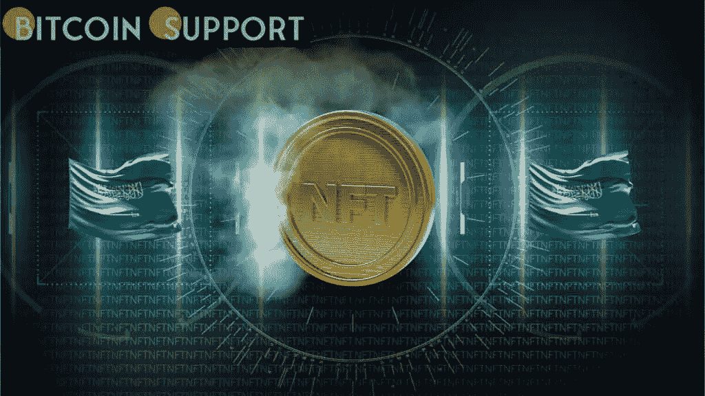

# 沙特阿拉伯公主说，NFT 是艺术的下一个媒介

> 原文：<https://medium.com/coinmonks/nfts-are-the-next-medium-for-art-says-the-princess-of-saudi-arabia-e7a6132963ec?source=collection_archive---------73----------------------->

[https://bitcoinsupports.com/](https://bitcoinsupports.com/)

沙特公主 Reem Al Faisal 表示，不可替换的代币(NFT)是艺术家向广泛人群展示其作品的一种新方式。

**分散艺术**

Reem Al fais Al 公主说，非分散艺术是艺术发展的自然步骤，它使艺术家能够接触到来自不同种族、文化和地方的人。他还表示，NFT 已经做了分散金融(defi)对金融业所做的事情。他说，他们有“分散的艺术”。过去，有报道称沙特公主推出了她的第一个 NFT，以及第一个用 NFTs 制作的沙特艺术虚拟展览。30 多年来，摄影师 Al Faisal 一直在 NFT 的 Opensea 市场出售她的作品。

沙特公主说，她很惊讶 NFTs 刚出来的时候，人们并没有把它当成一种新的艺术展示方式。她说:“

***”人们对此大惊小怪，但我不明白他们为什么如此震惊，人们进入非艺术类电影，特别是艺术家和摄影师。这是艺术表达的下一个媒介。”另一方面，非现金交易券受到了批评家的攻击，他们说代币被用来藏钱。尽管事实上他们帮助艺术家。英国安全和国防智库皇家联合服务研究所(RUSI)似乎支持这种说法，称 NFTs 可以用来帮助洗钱计划更好地运作。

然而，在接受 Bitcoin.com 新闻采访时，阿尔·费萨尔表示，她会跟上行业的变化。

***“这是区块链、元宇宙的世界，我想在那个世界上展示我的作品，”阿尔·费萨尔解释道。***

**金融界的一个重要变化**

56 岁的费萨尔公主告诉 Bitcoin.com 新闻，她一直对区块链很感兴趣，她说这是沙特人日常生活的一部分。她还说 NFT 是个好主意。一家名为 Dar Al Saaed 的公司已经与区块链有业务往来。不仅仅是区块链·阿尔·费萨尔喜欢。她还喜欢加密货币，她称之为“最神奇的技术”

Al Faisal 表示，与海湾合作委员会(GCC)的一些邻国不同，沙特阿拉伯王国尚未像其一些邻国那样正式采用加密货币。她说，沙特政府“可能会监管加密货币，让人们自由使用，因为它已经证明自己是金融领域的一项重要发展”。

Al Faisal 还说，沙特的一些人相信，那个说加密货币是非法的王国，总有一天会允许它们自由使用。”她说:“

***”沙特一直采用它能找到的最先进的东西。它采用了任何新的东西，因为加密货币仍然是新的，所以预计这些也将被采用。”***

**免责声明:以上为作者观点，不应视为投资建议。读者应该自己做研究。*****

> 加入 Coinmonks [电报频道](https://t.me/coincodecap)和 [Youtube 频道](https://www.youtube.com/c/coinmonks/videos)了解加密交易和投资

# 另外，阅读

*   [Botsfolio vs nap bots vs Mudrex](/coinmonks/botsfolio-vs-napbots-vs-mudrex-c81344970c02)|[gate . io 交流回顾](/coinmonks/gate-io-exchange-review-61bf87b7078f)
*   [CoinFLEX 评论](https://coincodecap.com/coinflex-review) | [AEX 交易所评论](https://coincodecap.com/aex-exchange-review) | [UPbit 评论](https://coincodecap.com/upbit-review)
*   [AscendEx 保证金交易](https://coincodecap.com/ascendex-margin-trading) | [Bitfinex 赌注](https://coincodecap.com/bitfinex-staking) | [bitFlyer 审核](https://coincodecap.com/bitflyer-review)
*   [Bitget 评论](https://coincodecap.com/bitget-review) | [双子星 vs BlockFi](https://coincodecap.com/gemini-vs-blockfi) cmd| [OKEx 期货交易](https://coincodecap.com/okex-futures-trading)
*   [AscendEx Staking](https://coincodecap.com/ascendex-staking)|[Bot Ocean Review](https://coincodecap.com/bot-ocean-review)|[最佳比特币钱包](https://coincodecap.com/bitcoin-wallets-india)
*   [霍比审核](https://coincodecap.com/huobi-review) | [OKEx 保证金交易](https://coincodecap.com/okex-margin-trading) | [期货交易](https://coincodecap.com/futures-trading)
*   [网格交易机器人](https://coincodecap.com/grid-trading) | [Cryptohopper 审查](/coinmonks/cryptohopper-review-a388ff5bae88) | [Bexplus 审查](https://coincodecap.com/bexplus-review)
*   [7 个最佳零费用加密交易平台](https://coincodecap.com/zero-fee-crypto-exchanges)
*   [氹欞侊贸易评论](https://coincodecap.com/anny-trade-review) | [火笔保证金交易](/coinmonks/huobi-margin-trading-b3b06cdc1519)