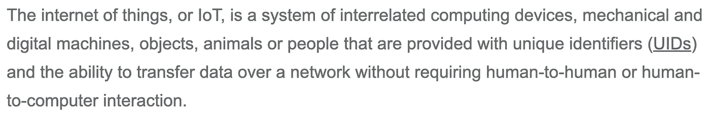

# NFT 不会消失第二版:数字世界就在我们面前

> 原文：<https://medium.com/coinmonks/nfts-arent-going-away-edition-2-the-digital-world-is-upon-us-c2e0a1960b49?source=collection_archive---------59----------------------->

## 我们的世界正变得越来越数字化，越来越依赖新技术，这一事实不容置疑。非功能性测试是这一领域的又一进步。

“物联网”是一个让许多人感到困惑的术语，部分原因是一个不必要的技术定义:

除去多余的绒毛，物联网本质上只是将事物连接到互联网。对许多人来说，这是一个令人困惑的话题，不是因为它有多复杂，而是因为它有多宽泛。这个话题几乎适用于你能想到的任何东西，只要它与互联网相连。想想智能手机、家用电器或交通工具。随着时间的推移，互联网变得越来越突出，它不断交织在我们生活的几乎每一个方面。

物联网为什么重要？这证明了一个事实，我们的世界正变得越来越依赖数字数据和媒体。科技越来越融入我们的日常生活。

输入 NFTs。不仅仅是 JPEG，这项新技术提供了创造价值的能力，这种价值是 100%数字化的，与现实生活的利益相关，或者是大脑可以想象的任何东西。

当股票证券在 17 世纪初首次交易时，购买者会收到一份实物股票证书，证明他们拥有某家公司的股票。快进到今天，证券交易几乎 100%以电子方式进行。为什么？这更容易，更快，也更少麻烦。这也是为什么互联网作为一个整体如此成功，以及为什么 NFTs 可以建立在这一成功之上。

NFT 把新技术带到了主要的舞台，到目前为止，它只受到用户能力的限制。这项技术只能发展到我们掌握的程度。但重要的是要记住，这一切都还是那么新鲜。罗马不是一天建成的，区块链的技术也不会在一天之内达到最大能力。

如果你发现自己在质疑非功能性测试是否会成为一种时尚，请想一想:为什么会成为时尚？随着我们的世界越来越依赖数字技术，这难道不是一件非常有益的事情吗？

你不能否认技术在世界各地变得越来越显著和容易获得。以前的实物资产变成数字资产只是时间问题，而非实物资产将有助于推动这一转变。

> 加入 Coinmonks [电报频道](https://t.me/coincodecap)和 [Youtube 频道](https://www.youtube.com/c/coinmonks/videos)了解加密交易和投资

# 另外，阅读

*   [麻雀交换评论](https://coincodecap.com/sparrow-exchange-review) | [纳什交换评论](https://coincodecap.com/nash-exchange-review)
*   [维护卡审核](https://coincodecap.com/uphold-card-review) | [信任钱包 vs MetaMask](https://coincodecap.com/trust-wallet-vs-metamask)
*   [Exness 点评](https://coincodecap.com/exness-review)|[moon xbt Vs bit get Vs Bingbon](https://coincodecap.com/bingbon-vs-bitget-vs-moonxbt)
*   [如何开始通过加密贷款赚取被动收入](https://coincodecap.com/passive-income-crypto-lending)
*   [加密货币储蓄账户](/coinmonks/cryptocurrency-savings-accounts-be3bc0feffbf) | [加密交易机器人](https://coincodecap.com/best-crypto-trading-bots)
*   [BigONE 交易所评论](/coinmonks/bigone-exchange-review-64705d85a1d4) | [CEX。IO 审查](https://coincodecap.com/cex-io-review) | [交换区审查](/coinmonks/swapzone-review-crypto-exchange-data-aggregator-e0ad78e55ed7)