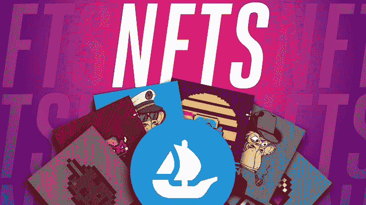
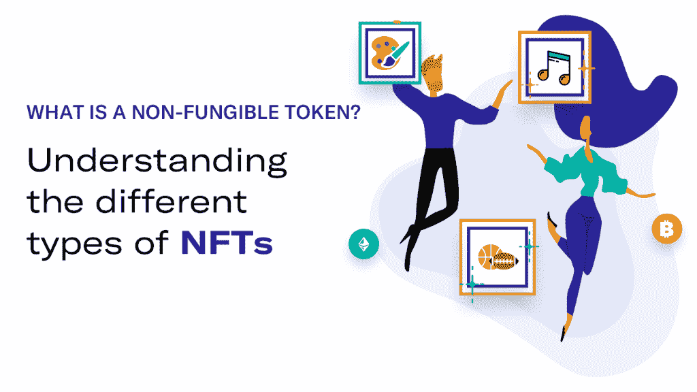

# 除了数字艺术，NFT 还有哪些使用案例？

> 原文：<https://medium.com/coinmonks/nfts-beyond-digital-art-what-are-some-of-the-use-case-of-nft-45f9b886c91b?source=collection_archive---------11----------------------->

大多数人不知道什么是 NFT，50%听说过 NFT 的人仍然不完全理解什么是 NFT 及其目的

然而，很多人仍然认为非功能性汽车主要是在区块链上制造的图片，这篇文章将向你展示什么是非功能性汽车，如何制造和购买你的第一辆 NFT，以及一些非功能性汽车的使用案例

然而，这篇文章详细介绍了 NFT 到底是什么，它的用例超越了数字艺术，以及如何铸造和购买一个非功能性的艺术

# NFT 到底是什么？

NFT 代表不可替换的令牌；可以存储在区块链中以声明项目所有权的唯一数字资产；它可以是艺术、照片、视频、Gif 等形式，可以用来表示有形和无形的项目或资产。因此，什么是有形资产和无形资产？

有形资产是实物，是可以触摸的东西；可存储在区块链上以主张所有权的真实或具体结果，例如土地、建筑物、汽车、t 恤等

无形资产可以是企业中可以存储在区块链中的任何有价值的财产，包括知识产权、客户名单、慈善事业、证书、文件等

# 除了数字艺术，NFT 还有哪些使用案例？

*   不可替换的令牌具有唯一的属性；它们通常与特定资产相关联。它们可用于证明游戏皮肤等数字物品的所有权，直至实物资产的所有权。
*   NFT 主要是用于交易数字艺术和游戏角色，但还有更多其他的，包括:
*   NFTs 可用于确保您购买的产品是真实的。
*   NFTs 可用于转让地契，提供所有权证明，甚至使用带有时间戳的 NFTs 来跟踪财产价值随时间的变化。
*   NFTs 可用于存储新生婴儿的出生证明
*   NFT 也是表现学术资格的好方法
*   非专利技术对于保护知识产权非常重要
*   NFTs 可以很快被用来代替门票或派对门票
*   NFTs 可用于投票，这将减少作弊/操纵投票。

# 如何铸造和购买你的第一个 NFT

为了造币，Nft 需要一个加密钱包，如币安钱包，信任钱包元掩码，或任何具有 dapp 的钱包，但信任钱包或元掩码推荐用于移动设备。

选择一个 NFT 市场，如币安 NFTs、OpenSea、Rarible 和 SuperRare。

首先，你需要打开一个加密钱包，然后将其连接到 NFT 市场，如 Opensea、Rarible e.t.c

选择一个你想要铸造的区块链，例如以太坊，多边形，Fantom，Bnb chain 等。因此，以太坊区块链拥有高燃气费，你可以选择低燃气费的区块链。

创建您独特的数字资产，并以您选择的投标价格在您推荐的 NFTs 市场上列出它们。

购买 NFTs 很简单，只需前往 NFTs 市场，用 Eth、polygon、bsc 或创造者要求的硬币连接并资助您的钱包，然后购买

加入我们的电报社区，获取加密新闻、加密宝石、支持和加密教程；

电报链接:[https://t.me/+6ek5FpdVW89jNjE0](https://t.me/+6ek5FpdVW89jNjE0)

> 加入 Coinmonks [电报频道](https://t.me/coincodecap)和 [Youtube 频道](https://www.youtube.com/c/coinmonks/videos)了解加密交易和投资

# 另外，阅读

*   [如何在 FTX 交易所交易期货](https://coincodecap.com/ftx-futures-trading) | [OKEx vs 币安](https://coincodecap.com/okex-vs-binance)
*   [OKEx vs KuCoin](https://coincodecap.com/okex-kucoin) | [摄氏替代品](https://coincodecap.com/celsius-alternatives) | [如何购买 VeChain](https://coincodecap.com/buy-vechain)
*   [ProfitFarmers 点评](https://coincodecap.com/profitfarmers-review) | [如何使用 Cornix Trading Bot](https://coincodecap.com/cornix-trading-bot)
*   [如何匿名购买比特币](https://coincodecap.com/buy-bitcoin-anonymously) | [比特币现金钱包](https://coincodecap.com/bitcoin-cash-wallets)
*   [瓦济里克斯 NFT 评论](https://coincodecap.com/wazirx-nft-review)|[Bitsgap vs Pionex](https://coincodecap.com/bitsgap-vs-pionex)|[Tangem 评论](https://coincodecap.com/tangem-wallet-review)