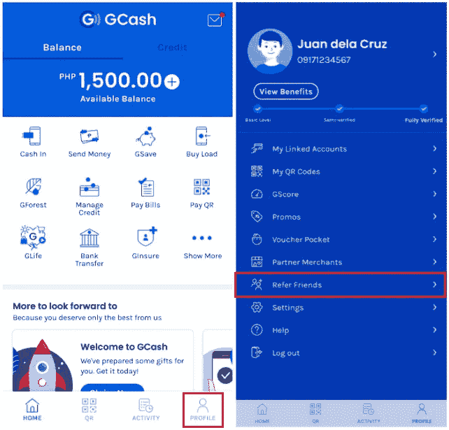

# NFT 建设伟大的社区。以下是品牌可以学习的方式。

> 原文：<https://medium.com/coinmonks/nfts-build-great-communities-heres-how-brands-can-learn-636f6a70159f?source=collection_archive---------23----------------------->

Doodles NFT from the defiant.io

在社区建设方面，NFT 做了大量的工作。

在典型的一天，不和谐服务器会有数万条消息。在推特发布后的 30 分钟内，NFT 的推特帖子将会有成千上万的粉丝。

人们对 NFT 着迷。

他们是如何做到的？更重要的是，在社区建设方面，品牌能学到什么。

*WAGMI*

**口碑是 NFT 营销的主要推动力。**有句谚语说，NFT 人会说各种各样的话，WAGMI 或“我们都会成功的。”在这个领域，许多人可以*成功*或者变得富有。你邀请你的朋友和朋友的朋友来参加这个机会。

这在一定程度上是由 NFT 的本质决定的。它们可以改变生活，通过以非常低的成本进入项目，您可以在一两周内体验 100 倍回报的可能性。与此同时，这是一个有时间限制和有限的机会。通常只有 10，000 个单位在其整个生命周期内发行，成千上万的人将争夺供应。

除此之外，NFT 需要通过其任务驱动性质的口碑。

为了获得 NFT 奖，项目团队会要求你完成任务。虽然这可能很简单，就像在他们的不和谐服务器上玩游戏一样，但通常会有推荐方。

你必须邀请 10 个人加入不和频道，或者在推特上贴上 3 个朋友的标签。他们可能会通过 Gleam.io 等方式开展社交媒体活动，这是一种抽彩方式，您执行的每项任务(跟踪和查看 soc med 页面，邀请推荐人)都会为您赢得一张抽彩券。

许多品牌都复制了这种客户获取战略。这是一种经过考验的方法，付出了巨大的代价。

GCash Referral Link

当优步在菲律宾首次发布时，他们提供免费的积分，此外，每个加入平台的朋友都会给你更多的积分。同样，每次成功转诊，GCash (Mynt Finance)和 ShopBack 均提供 PHP50 (~USD1)。

虽然这些都是成功的收购策略，但它们需要大量的营销预算。NFT 免费提供，但仍能达到大众效应。如果品牌要从这个领域学习，那么他们必须提供 NFT 提供的东西——一个真正改变生活的机会。

from GRY.PH

*一起*

在一个日益分化的世界里，NFT 社区一心一意要合作。

NFT 项目通过以下方式进行合作:
-跨社区伙伴关系
-市政厅问我任何事
-特别接触蓝筹股持有者

对于第一个项目，想想特斯拉为苹果的忠实消费者提供免费电动汽车，反之亦然。通过结合两个不同社区的力量，两者都能成长。

特斯拉用户也可以购买苹果产品，反之亦然。这些不是相互排斥的事件。同样，无聊猿游艇俱乐部的 NFT 持有者也可能是志那都红豆的投资者。

Clonex, from NFT News Pro

第二点与第一点是一致的。为什么丰田会邀请任天堂的 CEO 在一个挤满了丰田成员——客户、供应商和员工——的市政厅发表演讲？因为这两个品牌可以相互增值。

丰田 x 任天堂可能会导致合作关系，比如后者的游戏产品被放在前者的汽车后座上。这是一个大胆的想法，但两个品牌合作的方式肯定不止一种。

关于最后一点，这样做通常是为了提高较小社区的项目价值。回到特斯拉的例子，一个创业方向盘套品牌可以授权特斯拉车主使用特殊的限量版产品。如果特斯拉的顾客对封面满意，那么他们会担保这个小品牌，并在上面宣传。

虽然传统品牌尚未抓住这一合作趋势，但有远见的公司已经接受了这一趋势。

GRY。PH，一个国际时尚市场已经表明，将不同的社区聚集在一起可以产生双赢。他们的在线网站吸引了来自世界各地的街头服饰和时尚品牌，并通过购买时附带的有限 NFT 创造了特殊产品。

毕竟，你不可能一辈子只买一件衬衫。

请点击这里查看他们是如何做到的

> 加入 Coinmonks [电报频道](https://t.me/coincodecap)和 [Youtube 频道](https://www.youtube.com/c/coinmonks/videos)了解加密交易和投资

# 另外，阅读

*   [3 商业评论](/coinmonks/3commas-review-an-excellent-crypto-trading-bot-2020-1313a58bec92) | [Pionex 评论](https://coincodecap.com/pionex-review-exchange-with-crypto-trading-bot) | [Coinrule 评论](/coinmonks/coinrule-review-2021-a-beginner-friendly-crypto-trading-bot-daf0504848ba)
*   [莱杰 vs n rave](/coinmonks/ledger-vs-ngrave-zero-7e40f0c1d694)|[莱杰 nano s vs x](/coinmonks/ledger-nano-s-vs-x-battery-hardware-price-storage-59a6663fe3b0) | [币安评论](/coinmonks/binance-review-ee10d3bf3b6e)
*   [Bybit Exchange 审查](/coinmonks/bybit-exchange-review-dbd570019b71) | [Bityard 审查](https://coincodecap.com/bityard-reivew) | [Jet-Bot 审查](https://coincodecap.com/jet-bot-review)
*   [3 commas vs Cryptohopper](/coinmonks/3commas-vs-pionex-vs-cryptohopper-best-crypto-bot-6a98d2baa203)|[赚取加密利息](/coinmonks/earn-crypto-interest-b10b810fdda3)
*   最好的比特币[硬件钱包](/coinmonks/hardware-wallets-dfa1211730c6) | [BitBox02 回顾](/coinmonks/bitbox02-review-your-swiss-bitcoin-hardware-wallet-c36c88fff29)
*   [block fi vs Celsius](/coinmonks/blockfi-vs-celsius-vs-hodlnaut-8a1cc8c26630)|[Hodlnaut 审核](/coinmonks/hodlnaut-review-best-way-to-hodl-is-to-earn-interest-on-your-bitcoin-6658a8c19edf) | [KuCoin 审核](https://coincodecap.com/kucoin-review)
*   [Bitsgap 审查](/coinmonks/bitsgap-review-a-crypto-trading-bot-that-makes-easy-money-a5d88a336df2) | [Quadency 审查](/coinmonks/quadency-review-a-crypto-trading-automation-platform-3068eaa374e1) | [Bitbns 审查](/coinmonks/bitbns-review-38256a07e161)
*   [加密复制交易平台](/coinmonks/top-10-crypto-copy-trading-platforms-for-beginners-d0c37c7d698c) | [Coinmama 评论](/coinmonks/coinmama-review-ace5641bde6e)
*   [印度的加密交易所](/coinmonks/bitcoin-exchange-in-india-7f1fe79715c9) | [比特币储蓄账户](/coinmonks/bitcoin-savings-account-e65b13f92451)
*   [OKEx vs KuCoin](https://coincodecap.com/okex-kucoin) | [摄氏替代品](https://coincodecap.com/celsius-alternatives) | [如何购买 VeChain](https://coincodecap.com/buy-vechain)