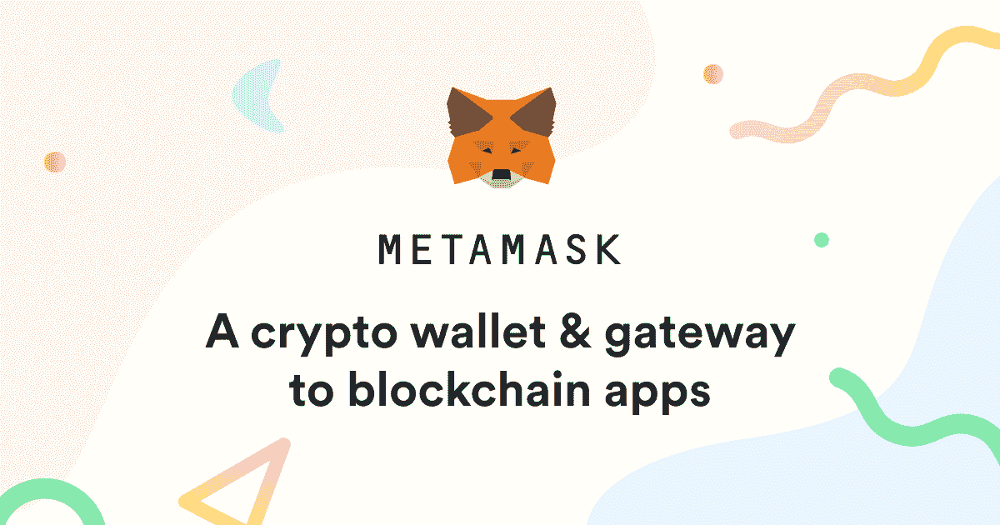
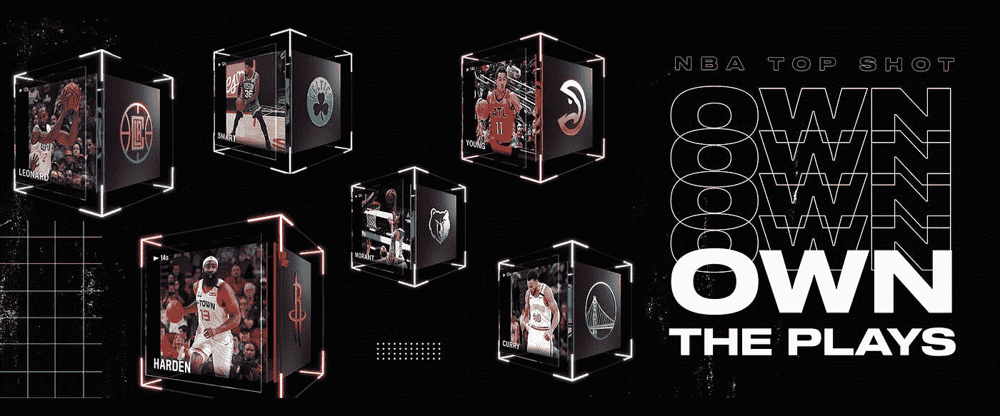
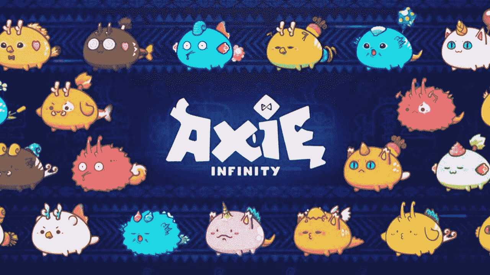
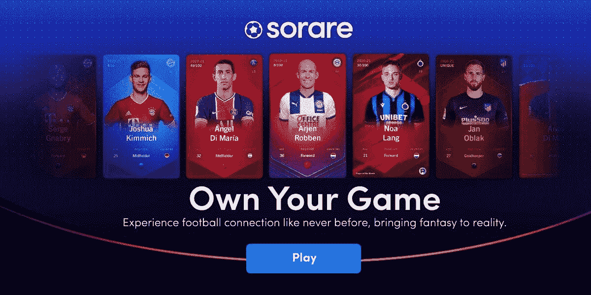
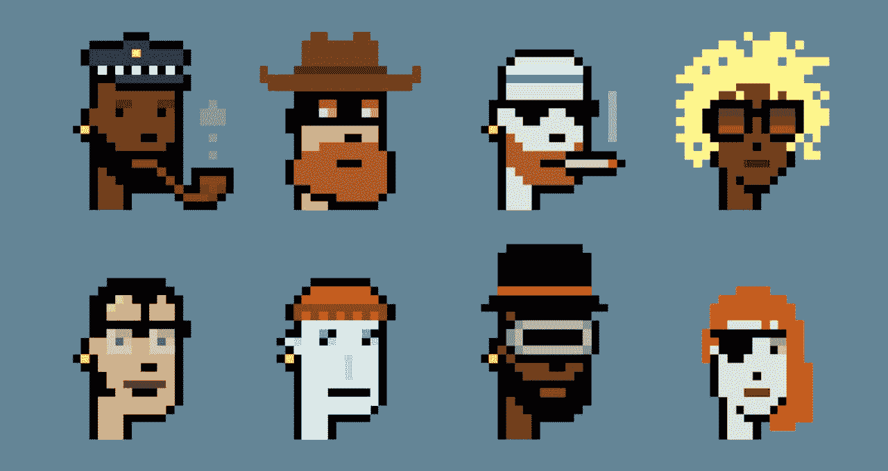
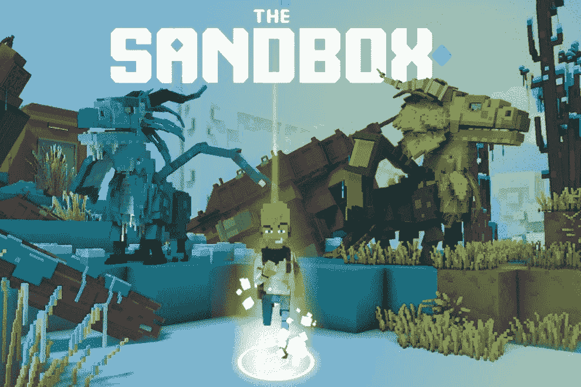
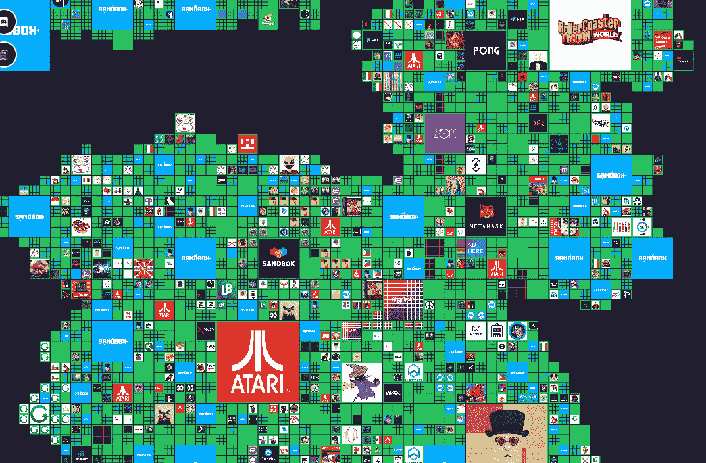

# NFTs 生态系统

> 原文：<https://medium.com/coinmonks/nfts-ecosystem-7bb75865fba5?source=collection_archive---------56----------------------->

现在，是时候展示当今 NFTs 生态系统中一些最重要的钱包了:

**元掩码**

这是世界上最著名的钱包之一，它通过浏览器扩展和移动应用程序工作。MetaMask 是专门为与以太坊区块链上的分散式应用程序交互而创建的。

**衣冠楚楚**

这个钱包是由 Dapper Labs 开发的，该公司是 Cryptokitties 和 NBA Top Shot 等项目的幕后公司。专门开发用于与 Dapper Labs，Flow 创建的区块链进行交互。

**彩虹**

这是一款专注于移动设备的钱包，旨在与以太坊应用程序进行交互，并以可视化方式展示您的非功能性桌面。

**幻影**

专为索拉纳·区块链设计的钱包。像 MetaMask 一样，它是浏览器的扩展。

**市场**

**OpenSea**

OpenSea 成立于 2017 年，是全球最大的 NFTs 市场。用户可以在 OpenSea 平台内创建和交易 NFT，以及导入他们自己的集合智能合约。OpenSea 保留其平台内所有交易的 2.5%。

**比特币基地 NFT 市场**

世界上最大的密码交易所之一比特币基地将于 2022 年推出一个市场。它有望变得更加社会化，拥有追随者和跟随者等选项。

**稀有**

一个非常直观的 NFT 市场，它有自己的令牌(RARI)供用户帮助管理平台。

**VeVe**

专注于移动的市场。它推出知名品牌的数字收藏品，如蜘蛛侠、侏罗纪公园和迪士尼。

**基础**

以太坊为基础的市场专注于更多的优质艺术。

FTX NFTs 市场

NFTs Marketplace 是美国最大的加密交易所之一，它对每笔交易收取 5%的费用，并支持来自区块链索拉纳和以太坊的 NFTs。

**俏皮网关**

Marketplace 专注于策划作品，它基于以太坊区块链，由双子座创建，双子座是由文克莱沃斯兄弟创建的美国加密交易所(是的，正是他们起诉马克·扎克伯格，声称他们创造了脸书)。

有成千上万的市场，在这里谈论每一个都是疯狂的。每个人都在寻找彼此的不同点，或者专注于特定的利基市场。例如，Twitch 的联合创始人之一贾斯汀·坎(Justin Kan)发布了 Fractal，专注于基于索拉纳·区块链的游戏资产 NFT。Magic Eden 现在是 Solana 最大的 NFT 市场，而 Hic et Nunc 使用 Tezos 的区块链。

抬价时间

我们在《不可避免》的使命是帮助数百万用户登陆 Web 3 和元宇宙，专注于高水平的内容和技术。如果你喜欢这堂课，记得点击这里邀请你的朋友和同事。

**去中心化、智能合同和区块链的重要性:Hic et Nunc 的案例**

当我们谈论区块链、权力下放等问题时，一切听起来都太抽象了。如果我们没有具体的案例，简单地说它们是创新技术可能毫无意义，对吗？

所以是时候带一个这样的病例了。

Hic et Nunc 是一个使用 Tezos 区块链构建的开源 NFT 市场。该市场于 2021 年正式推出，并呈指数级增长。它主要是由一个叫拉斐尔·利马的开发者创建的，由一群志愿贡献者维护。

不幸的是，2021 年 11 月 11 日，Hic et Nunc creator 决定关闭市场。一夜之间，许多收藏家和艺术家害怕失去他们的创作。

事实并非如此。

在不到一周的时间里，其他几个基于 Tezos 的 NFT 市场出现了，并且能够继续在 Hic et Nunc 上所做的工作。

由于在 Hic et Nunc 中创作的所有作品的数据都保存在 Tezos 区块链中，该网站对用户来说更像是一个购买和销售界面，而不是艺术品和智能合同的存储。

在不到一周的时间里，喜欢该平台工作的用户可以创建其他市场，并使它们与 Tezos 区块链兼容。创作者和收藏家的辛勤工作是安全的。

相比之下，今天的大平台，如 YouTube，Twitter，Instagram，脸书，抖音等。在这里，我们没有开放的协议，创作者的作品保存在由庞大的中央集权公司控制的中央服务器上。你可能听说过一些创作者，由于平台的单方面决定，他们的账户一夜之间被删除，作品丢失。

区块链解决了这个问题。

**大项目**

除了我们上面介绍的市场，还有一些集合和项目开发了它们自己的市场。以下是一些最大的问题:

**NBA TopShot**

这个项目是由 NBA 和 Dapper Labs 合作发起的，在“区块链之流”上运行。在这里，用户可以收集 NBA 时刻，并与其他用户进行交流。

**轴无穷大**

一个在头条出现过很多次的游戏，用户收集不同特性的生物，互相对战。它基于以太坊区块链，用户可以在游戏自己的市场中买卖物品和生物。

**索拉雷**

Sorare 于 2018 年推出，是一款梦幻足球游戏，玩家可以用数字球员卡购买、出售、交易和管理虚拟球队。这个游戏是基于以太坊区块链。

**隐朋克**

世界上最著名的 NFT 系列之一，由 10，000 个密码朋克头像组成。它于 2017 年推出，现在是加密社区的象征。Cryptopunks 是最早的 NFT 的例子之一，他们的技术启发了今天几乎所有 NFT 使用的技术标准的发展。

有趣的事实:密码朋克释放后可以免费认领。今天，它们被卖到数百万美元。

任何 NFT 项目都可以有自己的市场，这使得它在其他网站的服务器崩溃时更加安全。同时，出现在市场中会给项目带来可见性和更大的流动性潜力。

**虚拟世界**

2008 年的大金融危机始于房地产市场的泡沫。未来我们的虚拟房地产市场会有泡沫吗？很有可能。

自从脸书改名为梅塔，元宇宙越来越成为头条新闻。事实是，一些公司已经在虚拟世界项目上工作了很长时间，在 NFTs 和区块链的宇宙中，两个主要项目已经吸引了数百万用户、创作者、品牌和大量资金。

**沙盒**

沙盒是一个虚拟世界，玩家可以在其中构建和玩虚拟体验，同时他们通过 NFTs 拥有和货币化他们的创作，创建数字资产和其他体验。该公司将这个世界的土地出售给创造者和品牌。

下面，沙盒游戏地图的一部分。注意像雅达利和 MetaMask 这样的品牌是如何拥有一些土地的。

有趣的事实:最近，有人花了 45 万美元买下了说唱歌手 Snoop Dogg 隔壁的那块地。

**分权**

> *加入 Coinmonks* [*电报频道*](https://t.me/coincodecap) *和* [*Youtube 频道*](https://www.youtube.com/c/coinmonks/videos) *了解加密交易和投资*

# 另外，阅读

*   [3 商业评论](/coinmonks/3commas-review-an-excellent-crypto-trading-bot-2020-1313a58bec92) | [Pionex 评论](https://coincodecap.com/pionex-review-exchange-with-crypto-trading-bot) | [Coinrule 评论](/coinmonks/coinrule-review-2021-a-beginner-friendly-crypto-trading-bot-daf0504848ba)
*   [莱杰 vs n rave](/coinmonks/ledger-vs-ngrave-zero-7e40f0c1d694)|[莱杰 nano s vs x](/coinmonks/ledger-nano-s-vs-x-battery-hardware-price-storage-59a6663fe3b0) | [币安评论](/coinmonks/binance-review-ee10d3bf3b6e)
*   [Bybit Exchange 审查](/coinmonks/bybit-exchange-review-dbd570019b71) | [Bityard 审查](https://coincodecap.com/bityard-reivew) | [Jet-Bot 审查](https://coincodecap.com/jet-bot-review)
*   [3 commas vs crypto hopper](/coinmonks/3commas-vs-pionex-vs-cryptohopper-best-crypto-bot-6a98d2baa203)|[赚取加密利息](/coinmonks/earn-crypto-interest-b10b810fdda3)
*   最好的比特币[硬件钱包](/coinmonks/hardware-wallets-dfa1211730c6) | [BitBox02 回顾](/coinmonks/bitbox02-review-your-swiss-bitcoin-hardware-wallet-c36c88fff29)