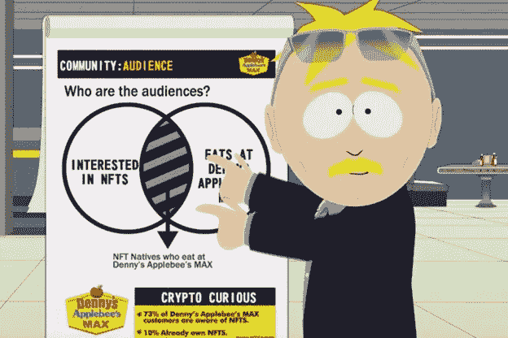

# NFTS:褪色的时尚还是有未来的时尚？

> 原文：<https://medium.com/coinmonks/nfts-fading-fad-or-a-fad-with-a-future-1a8e781cb051?source=collection_archive---------21----------------------->

我要告诉你一些会改变你一生的事情。你听说过 NFTs 吗？ …

*在那个房间里再呆 30 秒钟，你就会开始考虑把非功能性医疗作为一项可行的投资。*

几周前，我有幸看到南方公园“玷污”了非森林公园的概念。他们以一种引人注目的方式嘲笑它，将事情发展到极端时变得可能(和可能)的纯粹荒谬汇集在一起，以及如何通过正确的欺诈、布道和行为操纵，FOMO 结果可以成为现实，使一些人“快速”致富，而牺牲其他人的利益，变得更加天真和不及时。

在过去一个月左右的时间里，事情已经从去年第四季度和今年一月份的狂热中冷却下来，因此，我反思并回顾了过去 15 个月左右的发展，试图回答我自己关于非功能性测试的问题。

# 一些积极因素

对于帮助主要围绕数字或数字化创作构建知识产权的人的解决方案，有很多值得乐观的地方。这些人传统上缺乏对剽窃的有力保护，因此需要一个尊重和保护现有技术的可靠的认证过程。我记得早期的时候，嵌入式加密技术看起来可能是我们可能要走的路(顺便说一句，这是 20 多年前，当时我在电子出版行业(这还是一件事吗？)，所以通过区块链引入令牌化、加密和认证是一个更好的解决方案。

除此之外，可以公平地说，创意价值链对生产和分销人员的回报一直远远高于许多最成功的创作者。流媒体音乐解决方案创建了一个平台，理论上可以为更清洁、更少需求的分发模式铺平道路，但现实是，这些解决方案背后的商业模式并不擅长回报小众和主流。换句话说，对于那些有才华但也服务于边缘观众的人来说，在一个受欢迎程度仍然是衡量价值的最有价值的指标的海洋中，要想茁壮成长仍然很难。NFTs 不一定会引入一种解决方案设计，这种设计违背了人们作为“品牌本身”或“品牌作为影响者”的价值，但它确实为艺术家及其粉丝提供了一种更清洁的方式来建立一种价值机制，并为艺术家创造他们的艺术表达的独家演绎，以换取可交换的回报。

# 这座桥

NFTs 做的另一件事，也许是它最令人兴奋的方面，是提供一个连接元宇宙和物理世界的电子商务网关，反之亦然。现在，我不知道我自己是否对通过我的大脑在元宇宙“生活”有任何持续的兴趣(可能没有)，但我确实认识到“自我”“排他性”和“地位”(不管喜欢与否)是将在 RW 和 VR 之间传播的东西，并且 NFT 为已知和发展中的品牌和创意创造了一种理想的方式，为了双方及其虚拟化身客户端的利益而合作。当然，老牌 RW 品牌领导者在早期利用创造 NFT 的实物展示(在可能的情况下)方面拥有巨大的优势，但数字艺术家现在也有了一个新的出口，他们可以从自己的才华中受益，并创造可持续的财富。预计这将促使数字机构向更广泛的元宇宙机构扩展，以 Ether、Solana 和 Busd(例如)定价的 NFT 可以成为用于保留和利用知识产权的支付模式。

# 赌博

这些用例无疑表明，如果非可替代物背后的安全模型名副其实，那么非可替代物在数字电子商务中是有前途的。这当然延伸到了 NFTs 在游戏中的角色。代币的出现根本不是一个新的想法，各种各样的数字艺术品已经在许多免费的多人游戏世界中被买卖。然而，无论是在专为创意人士(比如模拟人生)打造的游戏环境中，还是在社区规则允许“授权修改的可能性”的情况下，迎合游戏玩家需求的 NFT 市场的增长都非常有意义，这两个市场都配备了 metamask 钱包以及其他可以轻松转移到游戏世界的交换手段(因此这是交叉链接互操作性的重要机会)。

# 提醒

这些积极因素肯定支持不可替代的代币作为通过区块链建立、保护和货币化知识产权的手段是有意义的，使用数字资产而不是传统货币作为交换手段也是如此。即便如此，正如所指出的，仅仅因为标记化的手段正在变得可扩展，并且许多不同类型的“品牌”确实拥有受众，这是否也意味着他们能够并且将能够通过创造和营销 NFT 来利用价值。

我对此的回答是否定的。正如品牌使用“免费”忠诚卡和忠诚积分作为激励措施一样，许多人将会意识到，非功能性营销代表着实现这一目标的另一种方式。数字原住民可能更喜欢将 NFT 嵌入到数字卡中，作为他们与激励互动的首选形式，并通过品牌增加他们的虚拟现实体验，但这并不一定意味着每一个符号化的实例都会像无聊的猿猴、网络朋克、蜜蜂等一样受到重视。在需求不断增长的时代，早期的标记移动者(幸运的他们)，通过正确的信息传递，当然可以利用(并拥有)“稀缺性”价值，但如果你看交易量的水平(而不是总价值)，你可以看到，能够(80 毫升以上)与 NFT 市场互动的人数，与拥有(sub <1ml) suggests that attempts at sustaining a FOMO effect to fuel demand across the huge spectrum (2000+ NFTS on coinmarketcap) of available options is not going to work any better than all of the ICO offerings for “unrealistic” or “absurd” projects.

# Conclusive Remarks

The technology underpinning use cases I can identify, and the e-commerce bridge across the RW and VR landscapes certainly gives me comfort that NFTs are a Fad with a Future, but that, as is the case with all types of investable assets, it will remain a challenge to identify those “yet undiscovered/under-appreciated) digital artists, and creative musicians and multi-media producers who truly are able to bridge the two worlds, and build sustainable value for themselves and those who invest in them.

As a final point, I would strongly encourage, as I have done with my own son, who is a creative across film, music and art (real and digital), all those with creative talents in the digital sphere to get themselves familiar with the technologies that facilitate and create certifiable non-fungibility and to look at ways of testing the appetite of the market for their talent. There is still a huge gap between the RW and VR in terms of bringing together these two ecosystems, and I do not anticipate those with firm leadership in the Digital world connected to the real world have any type of automatic lock when it comes to taking this presence into the metaverse and back out again. There are lots of very interesting platforms coming on stream that really are there for individuals with a true creative bent (not hobbyists) to showcase their talent in a way that keeps their IP intact, and I would hope that this blog encourages more to follow a path of enlightenment, familiarity and experimentation.

> Join Coinmonks[电报频道](https://t.me/coincodecap)和 [Youtube 频道](https://www.youtube.com/c/coinmonks/videos)了解加密交易和投资的人数相比

# 另外，阅读

*   [密码本交易平台](/coinmonks/top-10-crypto-copy-trading-platforms-for-beginners-d0c37c7d698c) | [Coinmama 审核](/coinmonks/coinmama-review-ace5641bde6e)
*   [印度加密交易所](/coinmonks/bitcoin-exchange-in-india-7f1fe79715c9) | [比特币储蓄账户](/coinmonks/bitcoin-savings-account-e65b13f92451)
*   [OKEx vs KuCoin](https://coincodecap.com/okex-kucoin) | [摄氏替代品](https://coincodecap.com/celsius-alternatives) | [如何购买 VeChain](https://coincodecap.com/buy-vechain)
*   [币安期货交易](https://coincodecap.com/binance-futures-trading)|[3 comas vs Mudrex vs eToro](https://coincodecap.com/mudrex-3commas-etoro)
*   [如何购买 Monero](https://coincodecap.com/buy-monero) | [IDEX 评论](https://coincodecap.com/idex-review) | [BitKan 交易机器人](https://coincodecap.com/bitkan-trading-bot)