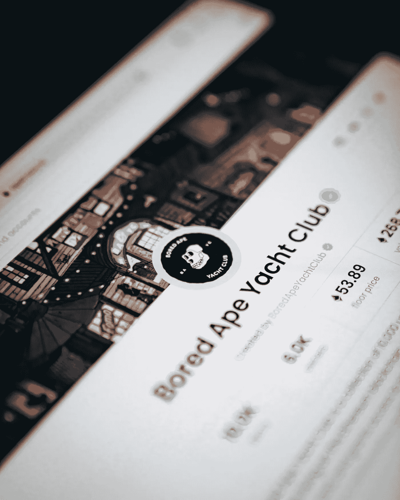

# 10 岁儿童非功能测试:什么是 NFT？解释了不可替换的令牌

> 原文：<https://medium.com/coinmonks/nfts-for-10-year-olds-what-is-an-nft-non-fungible-tokens-explained-f3b9369a038c?source=collection_archive---------11----------------------->

Photo by [Dylan Calluy](https://unsplash.com/@dylancalluy) on [Unsplash](https://unsplash.com/)

> NFT 席卷了整个世界，许多人已经证明 NFT 改变了他们的生活。尽管在这个领域很受欢迎并且有所增长，但是很多人仍然不知道他们是什么或者如何去做。
> 
> 这篇文章使用实际的场景简化了术语“NFT ”,帮助读者更好地理解这个术语和与之相关的其他术语。

首字母缩写“NFT”代表不可替换的令牌，在大多数情况下，它们通常是指复制现实生活中的对象的数字资产，如艺术、音乐、游戏内资产和电影。

不可替换令牌(NFT)是数字资产所有权的唯一证明。它们的主要区别特征是不可分割性和不可互换性，或者简单地说，[可互换性](https://www.investopedia.com/terms/f/fungibility.asp)。NFT 可以是任何数字的东西(图画、音乐、视频等)。)，但目前的热门话题是利用这项技术销售数字艺术。

我敢肯定，上面的 NFT 的定义仍然让你很困惑。尤其是如果你是一个没有区块链和加密货币基础的新手。然而，我建议，在你继续下去之前，如果你不知道区块链是如何运作的，你应该读一下[我写的关于区块链的文章来理解](/coinmonks/blockchain-for-10-year-olds-c2728b94e00e)。

NFT 只是指所有权的数字证明(更像是数字收据)，表明你拥有某物，并且该物不能被分解成更小的单元，比如你如何将 100 美元分解成 10 个 10 美元的单元，它仍然相当于 100 美元。

# NFT 简体；什么是 NFT，它们是如何工作的？

为了更好地解释这个概念，我们将使用现实生活中的实际场景，这将更好地帮助您理解什么是 NFT。

现在想象一下，你的社区有一家新的面包店。这家面包店宣布他们将烘焙 5000 种独特的面包。这些面包在外形和味道、大小、质地、成分等方面都各不相同，但都有一些共同的特征，这将使它们成为系列中的一个可见部分。

该面包店还宣布，这 5000 个面包将只出售给拥有唯一通行证的人。这种通行证可以让持有者在面包生产的当天，直接从面包店以预先确定的价格购买面包。

最后，面包店还宣布，在生产了 5000 个面包后，将不再生产这一系列的面包。

**第一个指针:**在第一段中，“面包店”指的是 NFT 项目背后的团队。通常，当项目诞生时，团队采取的第一个基本的和主要的决定之一是预先确定组成集合的 NFT 的数量。

每个 NFT 都有一些独特的特征[可以在他们的特征](https://cointelegraph.com/news/how-do-you-assess-the-value-of-an-nft)中找到。从神话的、传奇的、史诗的、罕见的、不寻常的和普通的特征。这些特征决定了 NFT 的价值。这些稀有程度是由携带特定稀有程度特征的 NFT 的数量决定的。这意味着，与其他类别的供应数量相比，属于"普通"级别的非功能性食物将有更多的供应。

需要注意的一件重要事情是，尽管有不同的特征，这些 NFT 有一个特定的特征，可以将它们识别为集合的一部分。

**第二个指针:**第二段强调面包店只卖给那些有独特通行证的人，这种通行证将使他们能够直接进入面包店并在面包生产的当天购买面包。

实际上，这在 NFT 空间中被称为“白名单”，而“购买面包”实际上被称为“[铸造 NFT](https://tokenizedhq.com/what-is-minting-nfts/) ”在 NFT 世界中，白名单是一组人，他们可以在指定的日期和时间提前进入铸币局，并得到保证。

一个人获得 NFT 的两种方式是铸造(直接从面包店购买)或者从像 Opensea 这样的二级市场购买(从直接从面包店购买面包的人那里购买)。

唯一一次 NFT 的价格由创造者决定是在造币厂之前。一旦 NFT 进入公开市场，价格完全取决于卖家(铸造它们的人)和买家(想从二级市场购买的人)的投机行为。

**第三个指针:**第三段简要提到，某一特定系列在铸造后不能再生产。这意味着，如果集合是“ABC 集合”，则该团队不可能制作另一个 ABC 集合。然而，就像在 [Bored Ape 游艇俱乐部(BAYC)](https://boredapeyachtclub.com/#/) 的情况下，混合系列可能会被引入并作为空投给第一批系列的持有者，或者以更低的价格卖给他们。

# 最后的想法

虽然本文试图简化什么是 NFT，但您可能仍然会发现其他方面的一些困难，比如构建不同的区块链 NFT，如何发现好的 NFT 项目，如何为 NFT 项目获得 WL(白名单)，等等。这些问题以及更多问题将在我们关于 NFTs 的下一篇文章中得到解答。

> 请留下评论，或者更好的是，如果有任何进一步的问题，直接在 Twitter 上给我发消息( [@lanre aderemi)](https://twitter.com/lanre_aderemi) ，我会尽快做出回应。感谢你的阅读，如果你喜欢这个故事，给我一些掌声，记得打开电子邮件通知，第一个知道我的下一篇文章何时发表！

不要忘记点击“关注”按钮，打开电子邮件通知，以获取更多像这样的故事；-)

> 加入 Coinmonks [电报频道](https://t.me/coincodecap)和 [Youtube 频道](https://www.youtube.com/c/coinmonks/videos)了解加密交易和投资

# 另外，阅读

*   [如何在 FTX 交易所交易期货](https://coincodecap.com/ftx-futures-trading) | [OKEx vs 币安](https://coincodecap.com/okex-vs-binance)
*   [OKEx vs KuCoin](https://coincodecap.com/okex-kucoin) | [摄氏替代品](https://coincodecap.com/celsius-alternatives) | [如何购买 VeChain](https://coincodecap.com/buy-vechain)
*   [ProfitFarmers 回顾](https://coincodecap.com/profitfarmers-review) | [如何使用 Cornix Trading Bot](https://coincodecap.com/cornix-trading-bot)
*   [如何匿名购买比特币](https://coincodecap.com/buy-bitcoin-anonymously) | [比特币现金钱包](https://coincodecap.com/bitcoin-cash-wallets)
*   [瓦济里克斯 NFT 评论](https://coincodecap.com/wazirx-nft-review)|[Bitsgap vs Pionex](https://coincodecap.com/bitsgap-vs-pionex)|[Tangem 评论](https://coincodecap.com/tangem-wallet-review)
*   [如何使用 Solidity 在以太坊上创建 DApp？](https://coincodecap.com/create-a-dapp-on-ethereum-using-solidity)
*   [币安 vs FTX](https://coincodecap.com/binance-vs-ftx) | [最佳(SOL)索拉纳钱包](https://coincodecap.com/solana-wallets)