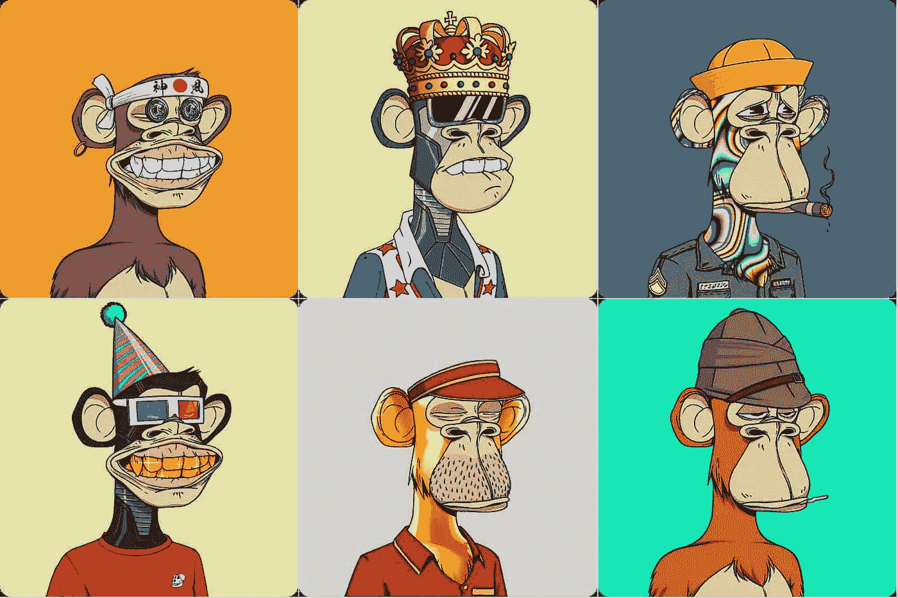

# 假人的非功能测试

> 原文：<https://medium.com/coinmonks/nfts-for-dummies-8c2d8c846183?source=collection_archive---------13----------------------->

## NFT，NFT，NFTs！不要害怕这个词，在这里了解它们！

The Bored Ape NFT collection is one of the most popular NFT collections.

上帝啊。好像每天都有新的东西冒出来。

NFT 代表不可替换令牌，这意味着每个 NFT 令牌都是不可替换的。这意味着一个 NFT 不等于另一个 NFT，不像一个比特币与另一个比特币具有相同的价值。NFT 是一种独特的数字资产，主要是数字艺术品，人们用一种叫做以太坊的加密货币来竞标。竞标的获胜者将获得 NFT，并成为正式所有者。现在，是的，任何人都可以在他们的浏览器中对 NFT 进行截图，然而，他们不是 NFT 的正式所有者，这意味着它不会有任何价值。这就像口袋妖怪卡，如果你打印出一张口袋妖怪卡的副本，没有人会想要它，因为它只是在普通的纸上。

所有 NFT 在[区块链](/coinmonks/everything-crypto-explained-2b4ddad7e6ac)上运行时都是安全的。 [OpenSea](https://opensea.io/) 是一个很受欢迎的 NFT 市场，可以浏览和购买 NFT。

# NFT 收藏

现在，这就是狂热开始的地方！NFT 集合就像它们听起来的那样:包含许多 NFT 的集合。这些 NFT 系列由几个基础层组成，如眼睛、头发、嘴巴、鼻子、衬衫等。然后，这些基层结合起来，使一个独特的 NFT。

但有趣的是，某些基层有不同的稀有性，比如某种稀有的头发。这种稀有性和稀缺性推动了 NFT 的价值。

这种独特的一代 NFTs 可以在 https://nft-generator.art/(非赞助)进行。或者，如果你有信心，你可以自己编码！

> 查看我的[个人网站](http://nagelia.com)。
> 
> 加入 Coinmonks [电报频道](https://t.me/coincodecap)和 [Youtube 频道](https://www.youtube.com/c/coinmonks/videos)了解加密交易和投资

# 另外，阅读

*   [CBET 评论](https://coincodecap.com/cbet-casino-review) | [库科恩 vs 比特币基地](https://coincodecap.com/kucoin-vs-coinbase)
*   [折叠 App 审核](https://coincodecap.com/fold-app-review) | [Kucoin 交易机器人](/coinmonks/kucoin-trading-bot-automate-your-trades-8cf0ca2138e0) | [Probit 审核](https://coincodecap.com/probit-review)
*   [如何匿名购买比特币](https://coincodecap.com/buy-bitcoin-anonymously) | [比特币现金钱包](https://coincodecap.com/bitcoin-cash-wallets)
*   [币安 vs FTX](https://coincodecap.com/binance-vs-ftx) | [最佳(SOL)索拉纳钱包](https://coincodecap.com/solana-wallets)
*   [比诺莫评论](https://coincodecap.com/binomo-review) | [斯多葛派 vs 3Commas vs TradeSanta](https://coincodecap.com/stoic-vs-3commas-vs-tradesanta)