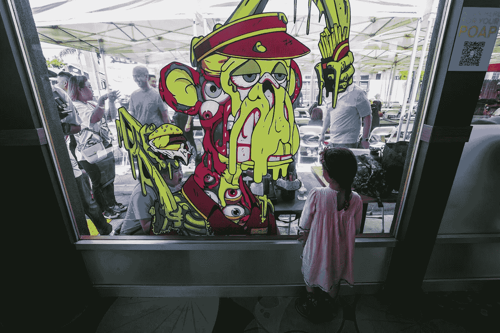

# 随着欺诈案件的增加，非功能性交易日益增多

> 原文：<https://medium.com/coinmonks/nfts-gain-ground-as-fraud-cases-rise-290ad190fec5?source=collection_archive---------36----------------------->

在一个不确定的世界里，不可替代令牌(NFT)应该通过保证唯一性带来一种稳定的表象。

代币能够不变地代表数字作品、虚拟房地产，甚至是视频游戏或元宇宙中的商品，这激起了希望通过出售非功能性交易来获利的爱好者和交易者的兴趣。

CryptoSlam 跟踪的整个 NFT 市场已经从 2021 年 1 月的月销售额 5400 万美元增长到 2022 年 5 月的 30 亿美元。

根据英菲尼迪研究有限公司旗下 TechNavio 的数据，从 2021 年到 2026 年，全球 NFT 市场规模预计将增长 1，470 亿美元，复合年增长率为 35.3%

这家总部位于英国的市场研究公司表示，约 43%的增长将来自亚太地区，新加坡、中国和菲律宾将成为主要市场。

在 6 月初的一起备受瞩目的内幕交易案件中，美国司法部(DOJ)指控 NFT 市场 OpenSea 的一名前员工涉嫌利用内幕信息交易 NFT 进行电信欺诈和洗钱。

据称，Nate Chastain 利用了关于哪些 NFT 将出现在平台主页上的内部知识，经常帮助净赚其原始价值的两到五倍。为了掩饰自己的行为，查斯坦据称使用了多个匿名钱包和 OpenSea 账户。

美国司法部长达米安·威廉姆斯(Damian Williams)当时在 DOJ 发布的一份新闻稿中说，“非功能性交易可能是新的，但这种类型的犯罪计划不是”。“今天的指控表明了我们办公室杜绝内幕交易的决心——不管它发生在股票市场还是区块链。”

3 月早些时候，Ethan Vinh Nguyen 和 Andre Marcus Quiddaoen Llacuna，这两名涉嫌 100 万美元 NFT 骗局的 20 岁创作者，被指控合谋进行电信欺诈和洗钱。

据称，他们是 Frosties NFT 收藏的幕后操作者，在投资者向卡通冰淇淋数字收藏品投入超过 100 万美元后，他们抽走了资金。

据称，这两人还准备出售第二套被宣传为“余烬”的非森林交易，这可能会产生约 150 万美元的收益。

即使是大牌投资者也可能被卷入其中；好莱坞喜剧演员赛斯·格林最近在一次网络钓鱼骗局中丢失了四个 NFT。

此后，格林在以太坊花了大约 30 万美元买下了价值不菲的 Bored Ape 游艇俱乐部(BAYC)第 8398 号，从而收回了其中一枚令牌。格林需要支付这么多来收回代币，因为它是一部即将上映的情景喜剧的主角，这部喜剧的未来令人怀疑，而格林不再是代币的所有者。

BAYC 联合创始人 Gordon Goner 最近批评了 Discord，这是一个受许多 Web 3.0 社区欢迎的平台，此前 BAYC 社区在 5 月初遭到黑客攻击。

Goner 说，在用户在 5 月初的一次黑客攻击中损失了大约 200 个 ETH 之后，该平台“不适用于 Web3 社区”。一旦骗子获得了访问服务器的权限，他们就会发送看似真实的链接，让社区成员跟随，而不知道他们正在将自己的钱包和资产连接到骗子。

即使是看似合法、备受瞩目的 NFT 系列也不能幸免。

Twitter 加密侦探 ZachXBT 最近报道了从“仅限玩家”NFT 项目背后的团队中取出的价值 140 万美元的地毯，该项目承诺独家获得 2021 年 11 月启动该项目的一群职业运动员的商品。

在大量商品没有出现和取消 Zoom 会议的报道后，创始人最近退出了该项目，理由是对该项目缺乏兴趣，但却侵吞了沿途获得的资金。

点击这里关注我们了解更多故事[。](http://t.me/etellworld)

> 加入 Coinmonks [电报频道](https://t.me/coincodecap)和 [Youtube 频道](https://www.youtube.com/c/coinmonks/videos)了解加密交易和投资

# 另外，阅读

*   [用信用卡购买密码的 10 个最佳地点](https://coincodecap.com/buy-crypto-with-credit-card)
*   [加拿大最佳加密交易机器人](https://coincodecap.com/5-best-crypto-trading-bots-in-canada) | [Bybit vs 币安](https://coincodecap.com/bybit-binance-moonxbt)
*   [阿联酋 5 大最佳加密交易所](https://coincodecap.com/best-crypto-exchanges-in-uae) | [SimpleSwap 评论](https://coincodecap.com/simpleswap-review)
*   购买 Dogecoin 的 7 种最佳方式
*   [最佳期货交易信号](https://coincodecap.com/futures-trading-signals) | [流动性交易所评论](https://coincodecap.com/liquid-exchange-review)
*   [用于 Huobi 的加密交易信号](https://coincodecap.com/huobi-crypto-trading-signals) | [Swapzone 审查](/coinmonks/swapzone-review-crypto-exchange-data-aggregator-e0ad78e55ed7)