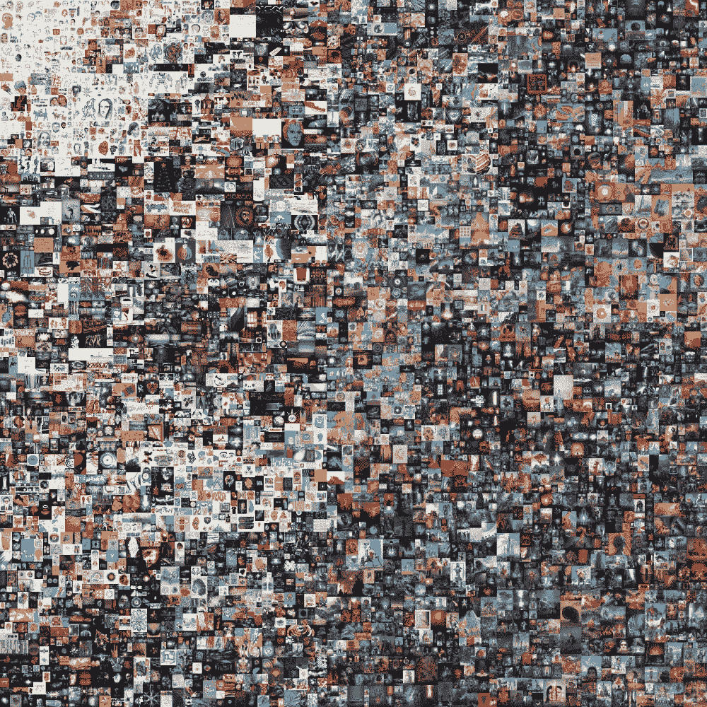

# 非功能性测试已经成为主流

> 原文：<https://medium.com/coinmonks/nfts-have-become-mainstream-4c086f6cff0f?source=collection_archive---------45----------------------->

First 5000 Days by Beeple

著名拍卖行佳士得一年前以 6900 万美元的价格卖出了一件艺术品。它不是失传已久的马蒂斯，也不是罕见的梵高。取而代之的是，它是彼尔的数字艺术的大杂烩，彼尔在当时是一个不知名的艺术家。

通过无聊猿游艇俱乐部的个人资料图片集，像阿姆和吉米·法伦这样的名人帮助提高了 NFTs 的知名度。这些收藏越来越受欢迎，用户现在可以使用他们的 NFT 作为他们在 Twitter 上的个人资料图片。

尽管 NFT 越来越受欢迎，但它仍然困扰着大多数人。这是由于我们对数字艺术所有权的概念不熟悉。难道我不可以直接右键点击一张图片，然后保存到我自己的电脑上吗？当然，我可以，但这样做就没有意义了(见[NFTs——只是复制它？由 NFT 世界新闻](/coinmonks/nfts-just-copy-it-f2844ab8f617)。

大众的关注并不总是一件好事。随着 NFTs 的普及，现金抢夺和诈骗的数量也在增加，特别是来自社交媒体影响者和 face 网站的现金抢夺和诈骗。

我们认为，从长远来看，非功能性测试将变得越来越重要，并将被更多的人所接受。然而，为了投资正确的 NFT 项目，必须仔细考虑每个项目的商业模式。如果 NFT 项目只是建立在炒作之上，从长远来看，它将会崩溃。这发生在每一个基于炒作的市场，也就是所谓的“泡沫”。

如果你想知道如何识别这样的项目，请随意阅读我们的文章[一个长期的 NFT 商业模式。真正有附加值的非技术产业](/@nftworldnews/a-long-term-nft-business-model-e1da7ca24d04)。

[→世界新闻](https://nft-world.news/#/)

> 加入 Coinmonks [电报频道](https://t.me/coincodecap)和 [Youtube 频道](https://www.youtube.com/c/coinmonks/videos)了解加密交易和投资

# 另外，阅读

*   [Bookmap 评论](https://coincodecap.com/bookmap-review-2021-best-trading-software) | [美国 5 大最佳加密交易所](https://coincodecap.com/crypto-exchange-usa)
*   最佳加密[硬件钱包](/coinmonks/hardware-wallets-dfa1211730c6) | [Bitbns 评论](/coinmonks/bitbns-review-38256a07e161)
*   [新加坡十大最佳加密交易所](https://coincodecap.com/crypto-exchange-in-singapore) | [收购 AXS](https://coincodecap.com/buy-axs-token)
*   [红狗赌场评论](https://coincodecap.com/red-dog-casino-review) | [Swyftx 评论](https://coincodecap.com/swyftx-review) | [CoinGate 评论](https://coincodecap.com/coingate-review)
*   [投资印度的最佳加密软件](https://coincodecap.com/best-crypto-to-invest-in-india-in-2021)|[WazirX P2P](https://coincodecap.com/wazirx-p2p)|[Hi Dollar Review](https://coincodecap.com/hi-dollar-review)