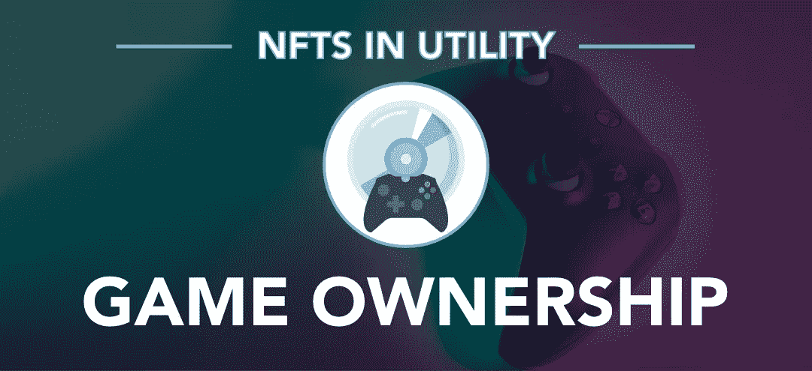

# 非功能性游戏:游戏所有权

> 原文：<https://medium.com/coinmonks/nfts-in-utility-game-ownership-df283062bc3b?source=collection_archive---------68----------------------->

这种想法表明，游戏项目和工作室可以寻求使用 NFTs 向他们的社区出售他们游戏的可访问内容，从而为个人所有者重新建立游戏所有权，可以转让、转售和持有游戏以获得其他额外好处。