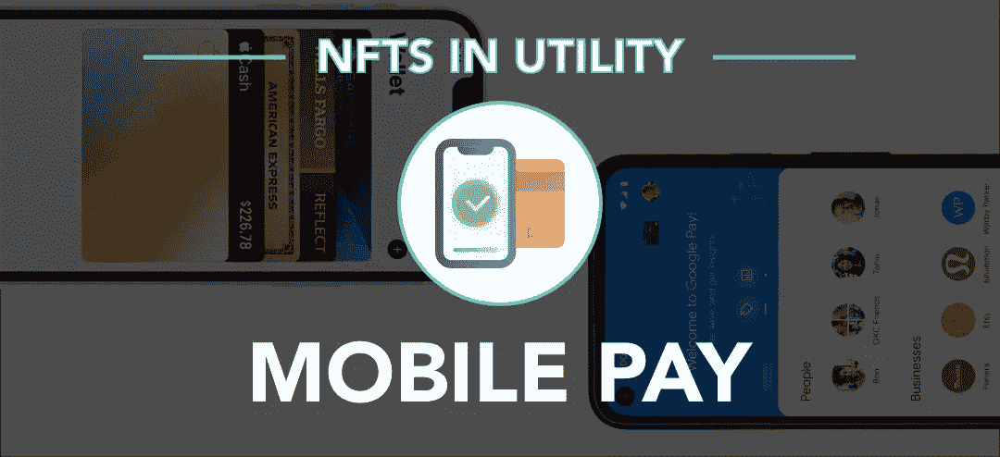

# 公用事业中的 NFTs:移动支付

> 原文：<https://medium.com/coinmonks/nfts-in-utility-mobile-pay-77c89effd9f2?source=collection_archive---------28----------------------->

# 手机钱包中的非功能性钱包

这个想法表明，移动钱包(即 Apple Pay 或 Google Pay)可以实现 NFT 功能，因此收款人可以在结账时检测到 NFT 的真正所有者，以附加大多数人不会收到的奖励和福利。

我们可能会看到信用卡本身采取非金融交易的形式，因为有些信用卡确实提供外部利益，如会员资格和…