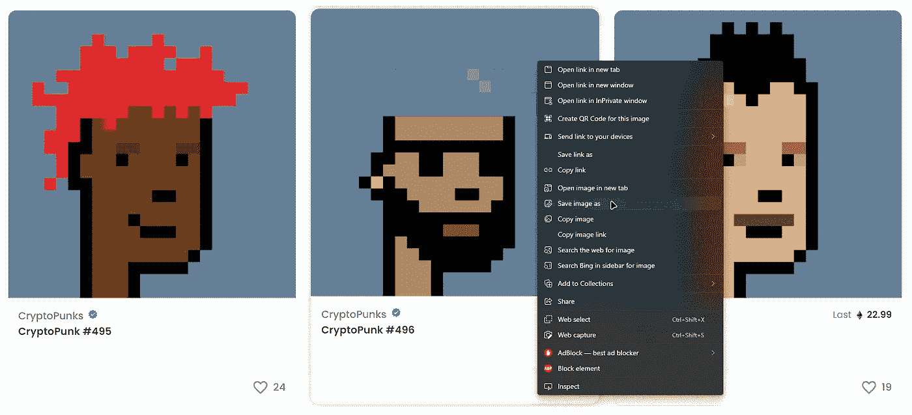
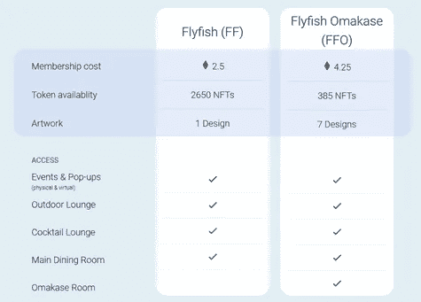

# NFTs —直接复制？

> 原文：<https://medium.com/coinmonks/nfts-just-copy-it-f2844ab8f617?source=collection_archive---------43----------------------->

Save image as…

对于这个问题:“我为什么应该购买 NFT？我可以直接复制图像，不是吗？”答案是，“如果你打印了一份蒙娜丽莎，你并不拥有它。NFTs 也是一样。”尽管这个答案很有描述性，也很容易理解，但它只代表了一半的事实。让我们诚实面对自己:你能想象有人为了一只无聊的猿而花费 769 ETH，仅仅因为他们想拥有这件艺术品吗？

Bored Ape #2087 from [OpenSea](https://opensea.io/assets/0xbc4ca0eda7647a8ab7c2061c2e118a18a936f13d/2087)

没有吗？我们也不能。NFTs 的真正价值可以通过以下标准的组合来很好地解释:

**1。名声/声明**

无聊猿游艇俱乐部又是一个很好的例子。各行各业的明星都有一只无聊的猿(如拉梅洛·鲍尔、斯蒂芬·库里、史蒂夫·青木、阿姆)。想要成为这个专属社区的一员很容易——只需购买一个即可。

更妙的是:Twitter 允许将 NFT 用作个人资料图片。通过这种方式，每个人都可以立即清楚地知道你是所有者，而不仅仅是复制了 NFT 的作品。顺便说一下，Meta 似乎正在为 Instagram 开发类似的功能。

**2。专属社区、活动或其他福利**

在社区内获得特殊便利也显示了非正规金融服务的可能性。一个非常突出的例子是加里·维纳查克等人创立的飞鱼俱乐部。飞鱼俱乐部是纽约市的一家餐厅，只有飞鱼令牌持有者才能使用。因此，只有经过严格挑选的一组用户才能访问。这也可以解释目前 OpenSea 上 4.25 ETH 的底价。

Flyfish Club Token Comparison from [flyfishclub.com](flyfishclub.com)

另一个例子是 META BILLIONAIRE 项目，它在迪拜为持有者租了一艘游艇。

**3。艺术本身(显然)**

当然，拥有一件美丽艺术品的愿望也可以成为一种驱动力。例如，对我们来说，看不见的朋友在美学上是非常美丽的。但在这里，人们的口味和他们自己一样不同。

Invisible Friends #3187 from [OpenSea](https://opensea.io/assets/0x59468516a8259058bad1ca5f8f4bff190d30e066/3187)

**结论和可能最重要的一点**

从前面的三点来看，当然，可能是最重要的一点:希望通过购买 NFT 来增加价值以产生利润。然而，只有当前面的几点至少部分实现时，价值才会增加。

对于这个问题:“我为什么要购买 NFT？我可以直接复制图像，不是吗？”

你可以回答，比如:

*   能复制名气吗？
*   能复制所有权吗？
*   你能复印独家活动的门票吗？
*   你是靠临摹图片赚钱的吗？

当然，这种考虑仅限于被大肆宣传的 NFT 市场，不包括其他有价值的应用领域，如高价值奢侈品的真实性证明。然而，考虑到这一点，对 NFTs 的大肆宣传就可以理解了。

NFT 项目经常困扰我们的是缺乏长期的商业模式。许多项目一天接着一天推出，然后很快就消失了。

这正是我们 NFT 世界新闻项目的切入点。看看我们的使命:

[NFT 的长期商业模式。《NFT 世界新闻报》2022 年 3 月| Medium](/@nftworldnews/a-long-term-nft-business-model-e1da7ca24d04)

> 加入 Coinmonks [电报频道](https://t.me/coincodecap)和 [Youtube 频道](https://www.youtube.com/c/coinmonks/videos)了解加密交易和投资

# 另外，阅读

*   [Exness 回顾](https://coincodecap.com/exness-review)|[moon xbt Vs bit get Vs Bingbon](https://coincodecap.com/bingbon-vs-bitget-vs-moonxbt)
*   [如何开始通过加密贷款赚取被动收入](https://coincodecap.com/passive-income-crypto-lending)
*   [BigONE 交易所评论](/coinmonks/bigone-exchange-review-64705d85a1d4) | [电网交易机器人](https://coincodecap.com/grid-trading)
*   [氹欞侊贸易评论](https://coincodecap.com/anny-trade-review) | [CoinSpot 评论](https://coincodecap.com/coinspot-review)
*   [新加坡十大最佳加密交易所](https://coincodecap.com/crypto-exchange-in-singapore) | [购买 AXS](https://coincodecap.com/buy-axs-token)
*   [投资印度的最佳加密软件](https://coincodecap.com/best-crypto-to-invest-in-india-in-2021) | [WazirX P2P](https://coincodecap.com/wazirx-p2p)