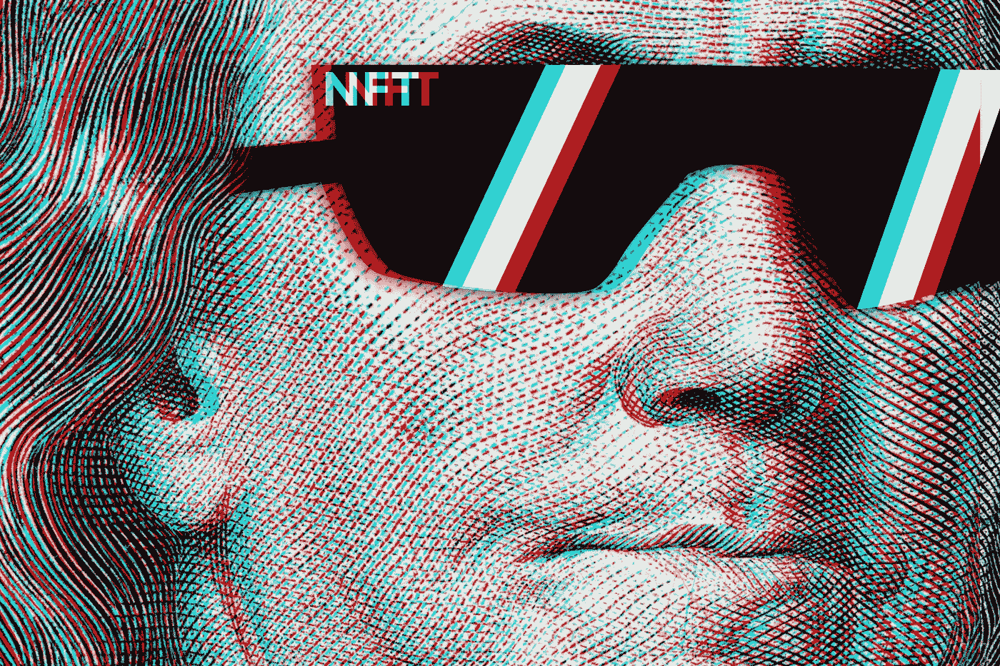

# NFTs:只是为什么？

> 原文：<https://medium.com/coinmonks/nfts-just-why-edfbb06c56dd?source=collection_archive---------63----------------------->

ilikeyellow / Shutterstock.com

很长一段时间，我甚至不知道什么是 NFT。我所能看到的是人们开始购买价格高达数百万的网络迷因。一旦我最终做了适当的研究来找出 NFT 实际上是什么，我仍然部分困惑于为什么它们首先是一个东西。

## NFTs:它们是什么？

NFT 代表“不可替代的令牌”我知道，那可能不能澄清事情。根据维基百科的定义，NFT 是“存储在区块链上的不可互换的数据单位，是一种可以出售和交易的数字分类账。”它们也是唯一可识别的，区别于比特币等加密货币，后者是可替代的。

可替代货币，如比特币，是一种当交易时，你得到另一个与你赠送的比特币相同的货币。然而，有了 NFTs，就像用你的 iPhone 换了一把伞。每一个 NFT 都是独一无二的，从技术上来说，没有其他的可以与之媲美。

## 它们真的独一无二吗？

[与实物艺术不同，在实物艺术中，原作和复制品很容易区分开来，而非实物艺术则是数字格式的。](https://www.theverge.com/22310188/nft-explainer-what-is-blockchain-crypto-art-faq)一个人花数百万美元购买的 NFT 图片(这不是打印错误)与某人从谷歌搜索中免费下载的图片是一样的。

就像我之前说的，人们支付几十万到几百万美元来购买图片或短视频，你只需点击它们就可以免费下载。那么，这些东西到底有什么吸引力呢？

## 每个相关人员的诉求是什么？

有人想买(或卖)NFT 的原因可能有几个。对于卖家来说，显而易见的动机是赚一笔惊人的钱，这比你在其他平台上卖东西赚的钱要多得多。

买家得到的是物品的所有权，给他们喜欢的艺术家经济支持的能力，以及向他们的朋友吹嘘的权利。即使在购买之后，他们获得的使用权仍然是有限的，因为原始艺术家仍然可以保留对该图像的某些权利。然而，有了使用权，你可以不受限制地将作品用于社交媒体帖子或你的个人资料图片。

该领域的其他人，如投资者和收藏家，都希望他们珍贵的 NFT 会随着时间的推移而升值，就像一套实物扑克牌一样。

## 谁在买这些东西？

工薪阶层的人可能会把购买更便宜、更合理的非功能性食品作为一种爱好。像马克·库班和 Jay Z 这样的名人也涉足了 NFT 空间。还有一些投机者试图通过倒卖他们购买的非金融资产来获利。

## 什么是作为非功能性测试出售的？

答案是这个问题相当简单——某种程度上。迷因也许是最畅销的 NFT。例如，“灾难女孩”迷因去年卖了 50 万美元。另一个例子是[“doge”迷因，去年 6 月以惊人的 400 万美元售出](https://www.businessinsider.in/investment/news/doge-meme-nft-increases-55-times-in-value-to-220-billion/articleshow/85899796.cms#:~:text=The%20most%20expensive%20meme%20non,now%20valued%20at%20%24220%20million.)(再次声明，这不是打印错误)。

> 【2021 年 3 月初，数字艺术家 Beeple 的一组 NFT 作品以超过 6900 万美元的价格售出。

是的，一组艺术品卖了超过 6900 万美元。这使得一个迷因 400 万美元的销售额听起来不那么奇怪了。

其他形式的作品也作为非功能性翻译出售，这无疑比迷因更令人困惑。

Twitter 创始人杰克·多西实际上以 300 万美元的价格出售了他的一条推文。 ***一条推文换 300 万美元*** 。自平台建立以来，任何 Twitter 用户都可以免费查看的推文。这基本上相当于花 300 万美元买一张签名。

我从未得到过任何人的亲笔签名，但我认为没有人会要求预付 300 万美元来亲自签名。

## 结论

销售 NFT 是我能理解为什么人们会参与这场混乱的唯一方法。为什么有人会为了一件简单的艺术品，甚至是一个已经在互联网上广泛免费分享的迷因，而放弃可能获得数千美元的机会？

**澄清一下**:不是所有的*NFT 都卖几千美元。许多卖得更合理的价格。但是售价高达数百万美元的 NFT 的数量让我头疼。*

在 NFT 空间里，我唯一能理解的另一方是鳍状肢。再说一次，我在这里看到的 NFTs 的唯一功能是短期和大量的货币收益。

希望随着时间的推移，NFTs 会变得更有意义。

> *加入 Coinmonks* [*电报频道*](https://t.me/coincodecap) *和* [*Youtube 频道*](https://www.youtube.com/c/coinmonks/videos) *了解加密交易和投资*

# 另外，阅读

*   [3 商业评论](/coinmonks/3commas-review-an-excellent-crypto-trading-bot-2020-1313a58bec92) | [Pionex 评论](https://coincodecap.com/pionex-review-exchange-with-crypto-trading-bot) | [Coinrule 评论](/coinmonks/coinrule-review-2021-a-beginner-friendly-crypto-trading-bot-daf0504848ba)
*   [莱杰 vs n 格拉夫](/coinmonks/ledger-vs-ngrave-zero-7e40f0c1d694) | [莱杰纳诺 s vs x](/coinmonks/ledger-nano-s-vs-x-battery-hardware-price-storage-59a6663fe3b0) | [币安评论](/coinmonks/binance-review-ee10d3bf3b6e)
*   [Bybit Exchange 审查](/coinmonks/bybit-exchange-review-dbd570019b71) | [Bityard 审查](https://coincodecap.com/bityard-reivew) | [Jet-Bot 审查](https://coincodecap.com/jet-bot-review)
*   [3 commas vs crypto hopper](/coinmonks/3commas-vs-pionex-vs-cryptohopper-best-crypto-bot-6a98d2baa203)|[赚取加密利息](/coinmonks/earn-crypto-interest-b10b810fdda3)
*   最好的比特币[硬件钱包](/coinmonks/hardware-wallets-dfa1211730c6) | [BitBox02 回顾](/coinmonks/bitbox02-review-your-swiss-bitcoin-hardware-wallet-c36c88fff29)