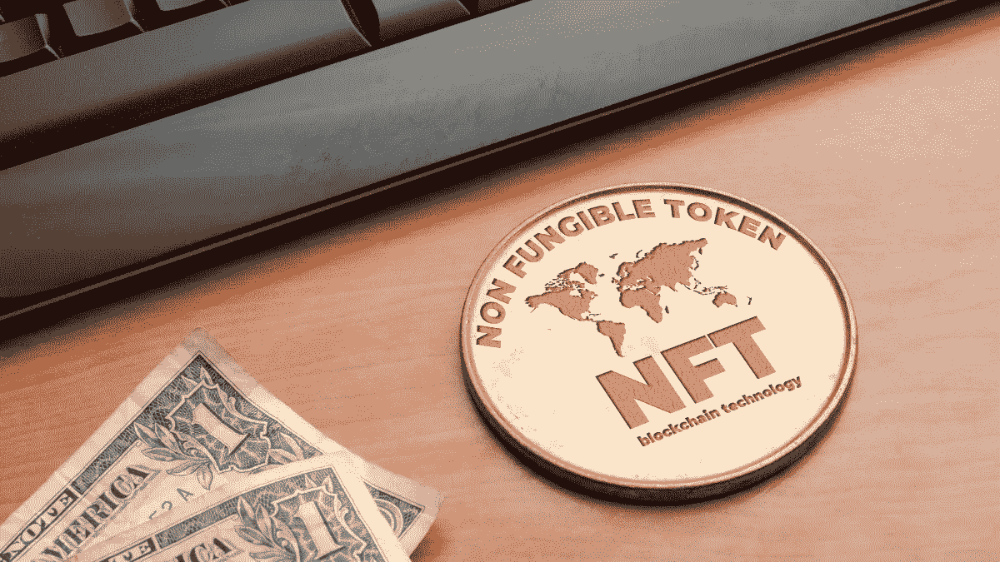
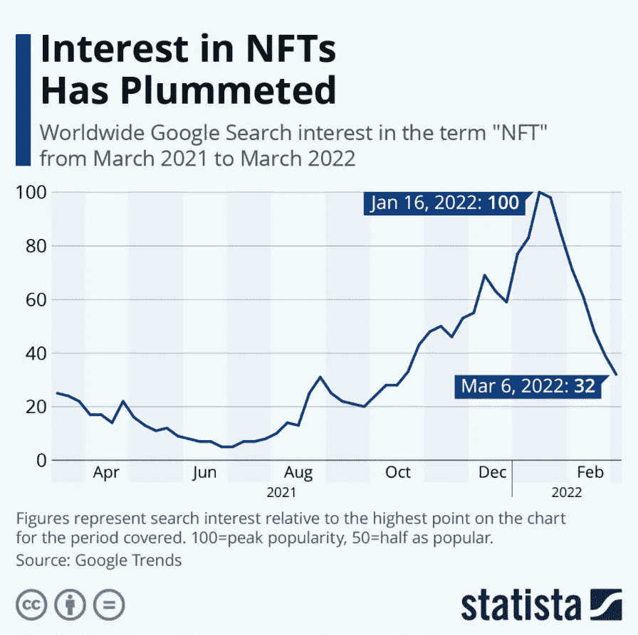
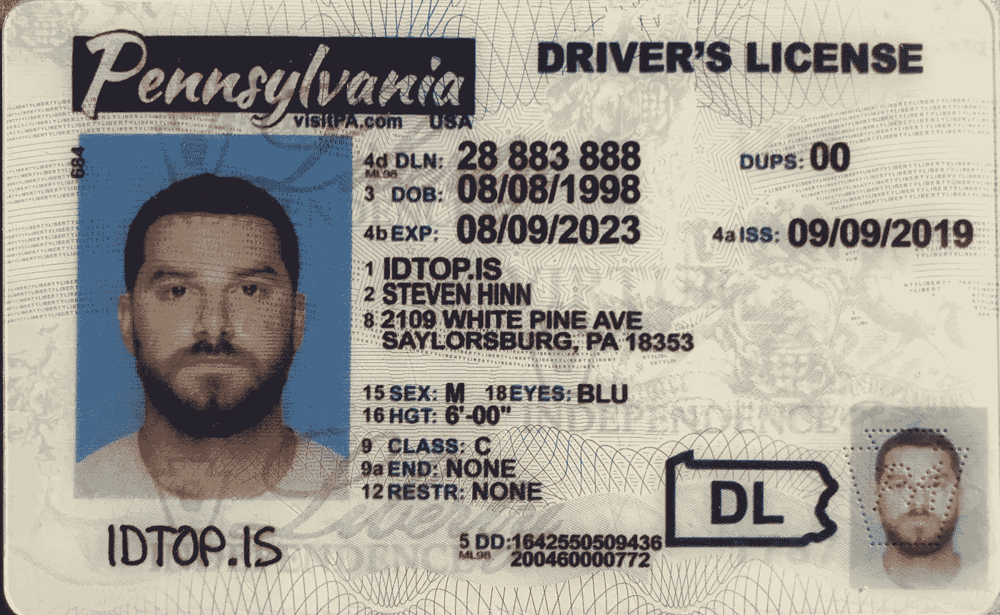

# NFTs:透过宣传展望未来用例

> 原文：<https://medium.com/coinmonks/nfts-looking-beyond-the-hype-to-future-use-cases-6ff334cc69cf?source=collection_archive---------14----------------------->

不可替代代币，或称 NFT，在过去的一年里越来越受欢迎。事实上，它们是区块链技术最广为人知的用途之一，并得到了名人和新闻网站的推广。然而，大多数现代 NFT 仅仅是艺术作品或随机生成的图像，几乎没有真正的用例，这导致了批评。让我们来看一些真正有用的、有助于将区块链带给每个人的非功能性测试的可能用例。

非功能性测试是一个非常有争议的话题，主要是由于他们的公众看法。现代 NFT 的支持者表示，它们是具有严肃的现实世界价值的艺术作品，并具有不断增值的潜力。另一方面，更多的人认为 NFTs 是一种时尚，价格高得令人难以置信，几乎没有效用。在很大程度上，NFT 的反对者是正确的，因为 NFT 似乎存在泡沫，艺术 NFT 的价值和参与度在过去几个月里大幅下降。

与流行的观点相反，NFT 的潜力远不止是拥有数字艺术的一种方式。让我们来看看这些革命性的使用案例，看看为什么 NFT 比看起来要多得多，以及它们如何用于打击欺诈、增加透明度和加强安全性。

第一个例子是地契。现在，购买、销售和转让的系统非常陈旧。比方说，比如你选择买房。一旦你和买家就价格达成一致，托管过程就开始了。当这种情况发生时，你实际上是把你用来买房的资金锁在了一个托管账户中，而所有其他与过户相关的活动，比如最后的走查、购买保险和检查都会发生。

与此同时，这笔钱被闲置在银行账户中，为银行赚取利息，或者如果银行将托管账户视为他们提供的一项服务，可能会花费你的利息。

整个过程可能长达两个月，只有在完成后，你才能拿到房子，买家才能拿到钱。

使用区块链，地契可以被政府市政当局铸造成 NFT，成为证明你拥有一栋房子的数据。当你想把它转让给另一个人时，你可以通过一个位于区块链的托管程序，这将大大降低成本，提高效率。此外，利用像 Aave 这样的借贷平台，购房者可以在托管过程中通过将资金存入分散的货币市场来赚钱。

最近，阿尔法·罗密欧宣布，他们的一款新 SUV 将配备 NFT，它将随着时间的推移记录与汽车相关的数据。这将包括许多重要的信息，如维护记录、所有权信息以及来自汽车系统的更多信息。

这实质上创建了 CarFax 的分散版本，并创建了与汽车相关的所有信息的完整记录。这比 CarFax 之类的东西更不可信、更透明、更高效。它还降低了(如果不是消除的话)人们伪造里程表或其他测量数据的欺诈风险。

NFTs 还将解决许多与欺诈性身份识别相关的问题。假身份证今天如此有效的原因是没有真正的数据库允许人们查找身份证。

但是，如果政府将 id 作为区块链上的 NFT 来发布，那么只需很少的工作就可以证明它们是可验证的。人们只需看到某个人拥有某个以太坊钱包，政府发给他们一张 NFT，上面有他们的出生日期和照片。它的验证几乎是不可避免的。

最后，非功能性疗法在医疗保健领域也有好处，比如在处方方面。现代处方充斥着欺诈和腐败，还有假冒处方的问题。如果处方是由医生作为 NFT 发出的，那么用户将完全控制他们的处方，同时仍然拥有可证明合法的脚本。这将从本质上允许人们拥有他们的医疗保健信息，并以他们想要的任何方式使用它，为系统提供完全的灵活性和安全性。

尽管 NFT 市场目前被过度宣传和误解，但在不久的将来，非功能性食物有巨大的潜力成为日常生活中的常见事物。

林肯·穆尔

> 加入 Coinmonks [电报频道](https://t.me/coincodecap)和 [Youtube 频道](https://www.youtube.com/c/coinmonks/videos)了解加密交易和投资

# 另外，阅读

*   [3 商业评论](/coinmonks/3commas-review-an-excellent-crypto-trading-bot-2020-1313a58bec92) | [Pionex 评论](https://coincodecap.com/pionex-review-exchange-with-crypto-trading-bot) | [Coinrule 评论](/coinmonks/coinrule-review-2021-a-beginner-friendly-crypto-trading-bot-daf0504848ba)
*   [莱杰 vs n rave](/coinmonks/ledger-vs-ngrave-zero-7e40f0c1d694)|[莱杰 nano s vs x](/coinmonks/ledger-nano-s-vs-x-battery-hardware-price-storage-59a6663fe3b0) | [币安评论](/coinmonks/binance-review-ee10d3bf3b6e)
*   [Bybit 交易所评论](/coinmonks/bybit-exchange-review-dbd570019b71) | [Bityard 评论](https://coincodecap.com/bityard-reivew) | [Jet-Bot 评论](https://coincodecap.com/jet-bot-review)
*   [3 commas vs crypto hopper](/coinmonks/3commas-vs-pionex-vs-cryptohopper-best-crypto-bot-6a98d2baa203)|[赚取加密利息](/coinmonks/earn-crypto-interest-b10b810fdda3)
*   最好的比特币[硬件钱包](/coinmonks/hardware-wallets-dfa1211730c6) | [BitBox02 回顾](/coinmonks/bitbox02-review-your-swiss-bitcoin-hardware-wallet-c36c88fff29)