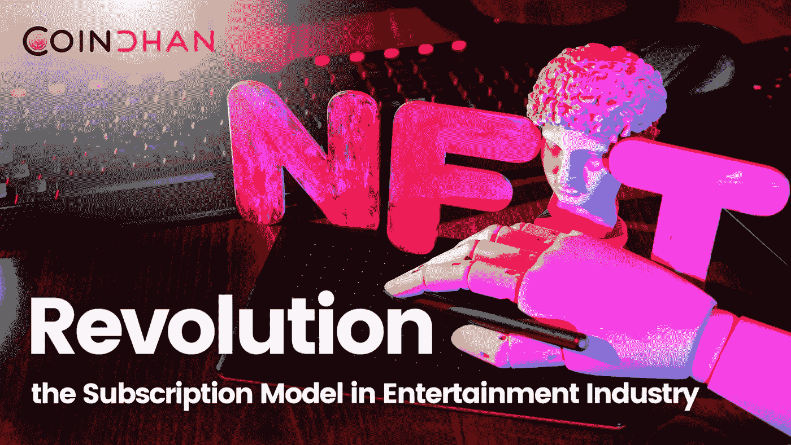

# NFTs 革新了娱乐业的订阅模式

> 原文：<https://medium.com/coinmonks/nfts-revolutionizes-the-subscription-model-in-entertainment-industry-ca0e0f627002?source=collection_archive---------57----------------------->

NFT，NFT 和 NFT，不，我们没有吸毒，但这就是 NFT 在过去几年里如何改变了数字世界。从最初不起眼的 700 万开始，[NFT](https://en.wikipedia.org/wiki/Non-fungible_token#:~:text=A%20non%2Dfungible%20token%20(NFT,photos%2C%20videos%2C%20and%20audio.)价值超过 410 亿美元，而且还在增加。

**话虽如此，我们确实看到一种新的模式正在形成 NFT 的潮流，以进行更深入的渗透。我们讨论的是 NFTs 的订阅模式。**

2022 年，随着 [Web 3.0](https://blog.coindhan.com/2022/03/10/polkadot-poised-to-explode-in-2022-as-the-demand-for-parachains-rise-in-web-3-0/) 时代的到来，NFTs 将赋能一个新的领域，基于订阅的内容可以直接与观众联系，并消除中间人。在这个过程中，我们最有可能见证一种低调的 OTT 模式，在这种模式下，与过去相比，你最喜欢的节目、电影和收藏品的价格甚至只有一小部分。

> 加入 Coinmonks [电报频道](https://t.me/coincodecap)和 [Youtube 频道](https://www.youtube.com/c/coinmonks/videos)了解加密交易和投资

# 另外，阅读

*   [OKEx vs KuCoin](https://coincodecap.com/okex-kucoin) | [摄氏替代品](https://coincodecap.com/celsius-alternatives) | [如何购买 VeChain](https://coincodecap.com/buy-vechain)
*   [ProfitFarmers 点评](https://coincodecap.com/profitfarmers-review) | [如何使用 Cornix Trading Bot](https://coincodecap.com/cornix-trading-bot)
*   [如何匿名购买比特币](https://coincodecap.com/buy-bitcoin-anonymously) | [比特币现金钱包](https://coincodecap.com/bitcoin-cash-wallets)
*   [瓦济里克斯 NFT 评论](https://coincodecap.com/wazirx-nft-review)|[Bitsgap vs Pionex](https://coincodecap.com/bitsgap-vs-pionex)|[Tangem 评论](https://coincodecap.com/tangem-wallet-review)
*   [如何使用 Solidity 在以太坊上创建 DApp？](https://coincodecap.com/create-a-dapp-on-ethereum-using-solidity)