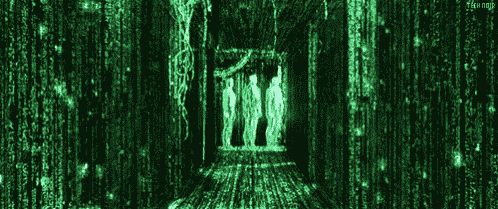
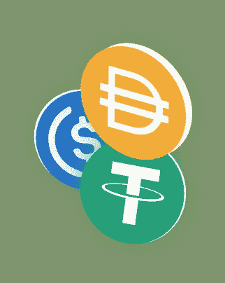
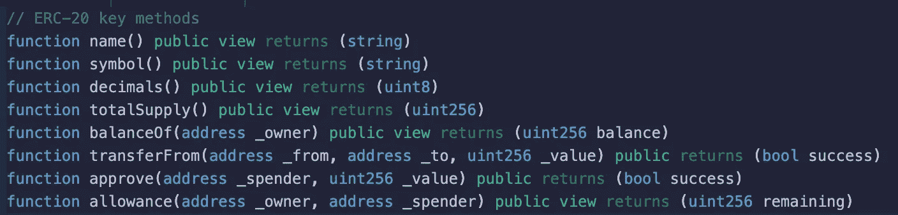
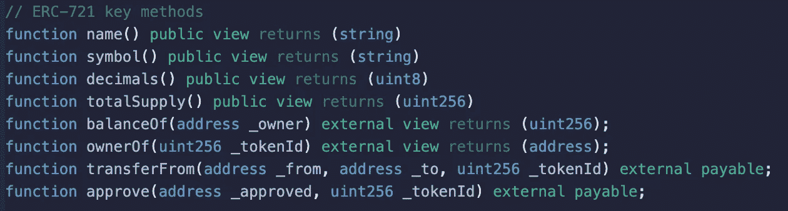
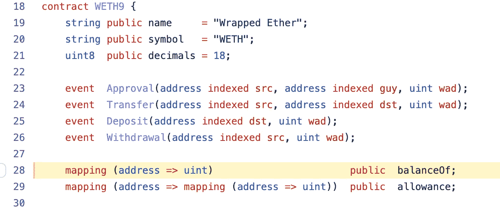
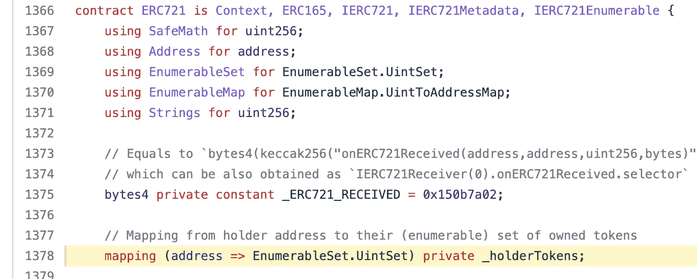
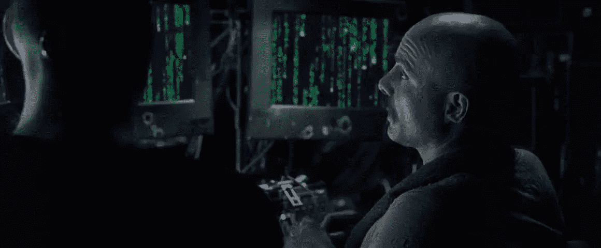

# NFTs:看穿代码

> 原文：<https://medium.com/coinmonks/nfts-seeing-through-the-code-377ddb64f8ff?source=collection_archive---------18----------------------->

非功能性词汇通常是作为一种完全独立的现象出现的，与许多人更熟悉的“可替代”词汇不同。

人们试图通过现实世界的类比来解释它们是什么，将它们比作“收藏品”，或“艺术品”，或“真品证书”。这些都是不错的类比，但它们是对一个高度多面的潜在现象的简略解释。

对我来说,“啊哈”的时刻来自于看底层代币合同的代码。

## **可替代与不可替代令牌的技术入门**

在技术层面上，NFT 和它们的“可替换的”对应物(以下简称为“令牌”)几乎是相同的(下面我们将介绍这在以太坊上是如何工作的，但在其他智能合约区块链上基本上是一样的)。

这两种令牌都是使用智能合约实现的。每一个标志，每一个 NFT 系列，都是一份合同。令牌和 NFT 之间的唯一区别是契约必须实现的标准方法集(对于可替换的令牌，[ERC-20](https://ethereum.org/en/developers/docs/standards/tokens/erc-20/)； [ERC-721](https://github.com/ethereum/ethereum-org-website/blob/dev/src/content/developers/docs/standards/tokens/erc-721/index.md) 用于非功能性测试)。

## **ERC-20(用于可替代代币)**

Fungible token API

## ERC-721(用于非功能性测试)

Non-Fungible Token API

## 公共

我们看到两种令牌和 NFT 都包含许多共同的契约方法:

*   取**名**(如柴犬)
*   获得**符号**(如 SHIB)
*   获取**小数**(例如 18)
*   获得**总** **供应量**(如 100000000)
*   获得**余额**(对于可替换代币，这意味着钱包“x”持有多少单位；对于 NFTs，它表示集合钱包“x”中有多少个项目)

## 差异

实际上只有两个区别:

*   **金额 vs id
    -**对于代币，钱包可以持有或转移一个连续的**单位“金额】
    -** 对于 NFTs，钱包可以持有或转移**特定物品 id**。
*   **元数据:**NFT 有一个方法来获得关于特定项目的附加信息(“元数据”)。这些信息也是标准化的，包含如下内容:
    -项目名称
    -项目描述
    -图片 URL / YouTube URL
    -属性列表(属性是任意文本属性，例如 Eyes = " Bored 耳环=“黄金耳钉”等)。

## **在区块链上刻写所有权**

当你购买一个(可替换的)代币时，你钱包的账户地址被存储到代币合同中的某个*状态变量*中，该变量将账户映射到余额(例如，下面 WETH 合同中的 [balanceOf](https://github.com/gnosis/canonical-weth/blob/0dd1ea3e295eef916d0c6223ec63141137d22d67/contracts/WETH9.sol#L28) )。这些状态变量的任何变化都会永久记录在区块链上。

There’s your WETH! Stored in the “balanceOf” variable

当你买 NFT 时，也是同样的情况。您钱包的帐户地址存储在一个状态变量中，该变量将帐户映射到一组 id。(如下面无聊猿游艇俱乐部合同中的 [_holderTokens](https://gist.github.com/JofArnold/bf2c4a094fcdd4aee2f52983c7714de8#file-boredapeyachtclub-sol-L1378) ):

There’s your ape! Stored in the “_holderTokens” variable

I don’t even see the contract code anymore. I see Bored Apes, CryptoPunks…

## **含义**

后退一步，缩小。忘记你所知道的今天可替换和不可替换令牌是如何使用的。想象一下，这是第一天，我们把这两个基本要素都给了全世界的企业家和建筑商，让他们以他们认为合适的方式创造价值。

**为什么你会看好通过第一种机制构建的资产，而不是第二种？那没有意义。**

都是你竞拍的同一个街区。在这两种情况下，当你购买资产时，你正在把你的账户地址输入以太坊的国家数据库。

第一种机制(对于可替换的代币)便于创建可分割的价值连续体；第二个(对于 NFT)给我们的是离散的“点”。此外，那些离散的“点”几乎可以存储我们想要的任何附加信息，因此它们是极其信息密集的。

这就好像，在 NFTs 最近开始流行使用之前的几年里，**智能契约网络使用的表达能力还不到令牌的一半**。

加密资产类别中的 NFT 子空间开发得非常不足。看到它以明显更快的速度增长，一点也不奇怪。

对于投资者来说，试图预测资本和价值将在这个子空间的何处以及如何沉淀，这将是一项令人沮丧且看似随机的工作，但毫无疑问，相对流入将继续到来。

所以称它们为“收藏品”、“艺术品”——是的，这些非常有道理，但这些只是洞壁上的影子。它们只是我们使用一个强大的底层原语的设计模式的例子，这个原语有一个巨大的、完全开放的设计空间可以探索。

> 加入 Coinmonks [电报频道](https://t.me/coincodecap)和 [Youtube 频道](https://www.youtube.com/c/coinmonks/videos)了解加密交易和投资

# 另外，阅读

*   [Bookmap 点评](https://coincodecap.com/bookmap-review-2021-best-trading-software) | [美国 5 大最佳加密交易所](https://coincodecap.com/crypto-exchange-usa)
*   最佳加密[硬件钱包](/coinmonks/hardware-wallets-dfa1211730c6) | [Bitbns 评论](/coinmonks/bitbns-review-38256a07e161)
*   [新加坡十大最佳加密交易所](https://coincodecap.com/crypto-exchange-in-singapore) | [购买 AXS](https://coincodecap.com/buy-axs-token)
*   [红狗赌场评论](https://coincodecap.com/red-dog-casino-review) | [Swyftx 评论](https://coincodecap.com/swyftx-review) | [CoinGate 评论](https://coincodecap.com/coingate-review)
*   [投资印度的最佳密码](https://coincodecap.com/best-crypto-to-invest-in-india-in-2021)|[WazirX P2P](https://coincodecap.com/wazirx-p2p)|[Hi Dollar Review](https://coincodecap.com/hi-dollar-review)