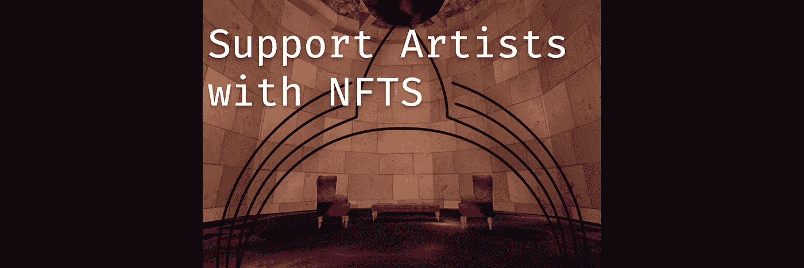
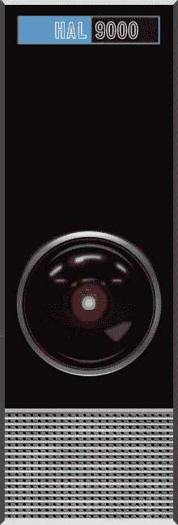

# NFTS 辅助艺术家

> 原文：<https://medium.com/coinmonks/nfts-supporting-artists-f51bd8b973d2?source=collection_archive---------48----------------------->

## 一个比投机投资持续时间更长的市场

## 好人

加密技术时好时坏，但艺术总是有需求的。

不可替代的代币创造了一种新的在线买卖艺术品和其他数字资产的方式，这种方式超越了国家货币、边界和特定地区的版权保护。怎么可能呢？因为价格历史、所有权和验证都内置在智能合约中，内置在 NFT 本身中。

创作者现在可以进入国际市场，而不需要通过一个中央机构研究数字权利或版权，他们只需要信任区块链。

NFTs 使得在任何地方用支持区块链钱包和互联网连接的设备购买艺术品成为可能。想象一下，在 Instagram 上，你可以点击一件你真正喜欢的艺术品，直接从艺术家那里购买，并在几分钟内获得高分辨率图像。这就是 NFTs 平台如何在你的网络浏览器中创建数字艺术市场。

## 坏事

任何在加密领域呆得够久的人都知道区块链不是绝对可靠的，加密货币有一段短暂而多事的诈骗史，ICO 地毯甚至[**疑似假死**](https://www.vanityfair.com/news/2019/11/the-strange-tale-of-quadriga-gerald-cotten) 。鉴于所有这些问题，应该说普通用户不会遇到这些问题，因为加密货币只是存储和发送价值的另一种方式。

我们所知道的那些该死的猴子。我们这些在 crypto-dream؟生活过一段时间的人知道，与怀疑加密的人交谈就像被困在只能发射曲线球的击球笼中。猿 NFT 是一个涂满油的小球，不断向我们的头部射击，分散了我们支持 NFT 的真正原因——加密货币很酷，艺术很好。区块链开放、分散的本质意味着任何人都可以做任何事，包括制作定价过高、过度宣传的艺术品。但人们购买它们的确是为了娱乐、投资或名声。如果你分享了一堆嘲笑类人猿的文章，你可能会增加它们的价值，并分散了从开放市场中受益的个人的注意力。我们意识到这里的讽刺意味。

为什么不通过 NFTs 找到你最喜欢的艺术家，并分享他们的社交媒体[而不是](https://knownorigin.io/alexis-olin)？**再做关于艺术的 NFTs。**

## 一般中立的

把加密钱包想象成一个银行应用程序，大多数用户对投资或股票交易不是很认真；他们想买东西和管理他们的钱。

炒作的地毯和被广泛嘲笑的猴子投机市场不应该阻止人们花几美元购买艺术、音乐或写作，这些构成了非功能性交易的绝大部分。大多数艺术家根据创作他们的作品所花费的时间和金钱来给他们的作品定价，通常大约是一张专辑或艺术印刷品的成本。

你可以在像 [**OpenSea**](https://opensea.io/) 、 [**Rarible**](https://rarible.com/) 和 [**仿植物怪兽佐拉**](https://zora.co/) 这样的平台上找到更广泛的 NFT 市场的证据，这些平台支持艺术家和开发者的大型社区，在那里他们让每个人都了解情况——特别是在出现问题时。就像我们在秘密空间吹捧去中心化和个性化一样；使用大型、长期(相对而言)和开放的 NFT 平台所带来的安全性是难以匹敌的。
没有一个系统是完美的，但是**在一个大的平台上有帮助和责任。**

如果你听说过的有关非金融交易的事情仅仅包括骗局、估值过高的资产和类人猿，那么你只是看到了一小块腐烂的蛋糕。

那里有更多的蛋糕，它更大、更多样、更美味，你可以用它去参加音乐会。这块蛋糕是用来在全球开放的市场上分享、提供艺术、音乐和其他任何东西的。

你是想进 NFTs 却不知道从何下手的艺人吗？
加入我们的 [**不和**](https://discord.gg/e9pvb8A85f)
平我们上 [**推特**](https://twitter.com/lunifty) 或
DM 我们上 [**Instagram**](https://www.instagram.com/luniftyart/?hl=en)