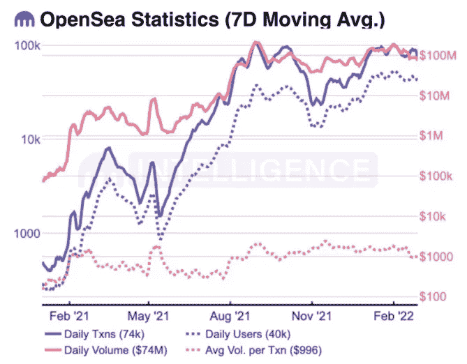
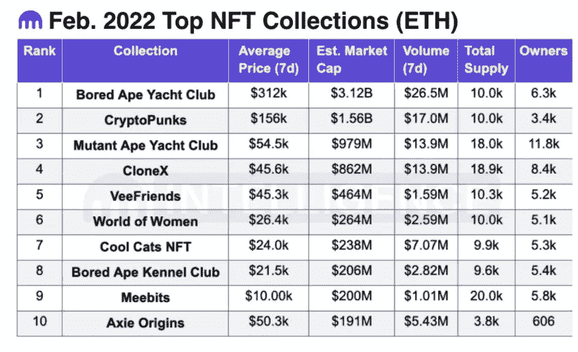

# NFT 在二月短暂休息——效用是未来的关键

> 原文：<https://medium.com/coinmonks/nfts-take-a-short-break-in-february-utility-is-the-key-to-future-906f8668b266?source=collection_archive---------66----------------------->

2 月份的 NFT 市场似乎短暂休息了一下。

比特币(BTC)和以太坊(ETH)等加密货币的价格一直在稳步上涨，尽管价格在 1 月份普遍下降。然而，2 月份，一些关键指标显示交易活动停滞不前。

(每天的交易数量(紫色实线)、每天的用户数量(紫色虚线)、每天的交易量(红色实线)、每笔交易的平均交易量(红色虚线) )

相比一个月前，日均用户数-24%，日均交易数-26%，日均交易量-60%，平均每笔交易量。是-46%。

今年 2 月，摩根大通在元宇宙的一个非中心化的地方开设了一个休息室。据透露，麦当劳已经为元宇宙的产品和服务，以及餐馆和咖啡馆申请了商标。

此外，crypto asset management Arca 已经为一个专门从事 NFTs 的投资基金筹集了 5000 万美元。

下表显示了 2 月份 NFT 收藏的市值排名。

2 月 NFT 交易金额较大:

> ⦁密码朋克# 5822 8000ETH
> 
> ⦁密码朋克# 8620 375ETH
> 
> ⦁东部号码 4682 214347 马纳
> 
> ⦁无聊猿# 7488 148.005ETH
> 
> ⦁无聊猿# 6327 144.01eth
> 
> ⦁密码朋克# 7895 140

从上面可以看出，大部分 NFT 都是 CryptoPunk、Bored Ape 等 PFP(个人资料图像)收藏 NFT，分散地等元宇宙 NFT，Axie Origins 等游戏 NFT。

**效用是未来的关键**

NFT 市场的停滞可能意味着一个过渡时期，投资者正在寻找新的趋势。例如，公用事业 NFT 是业内期望很高的流派之一，尽管交易量还不大。

自 2021 年以来，PFP 收集系统一直是推动 NFT 市场的一个流派，其吸引力和社区力量支撑了价格。基本上策略就是买便宜卖高(叫翻转)来获得回报稻田。

另一方面，公用事业系统的特点是拥有一个 NFT，就可以与创作者和艺术家一起做一些事情，并且可以用 NFT 作为抵押获得贷款。想法是，长期持有的原因不仅仅是“因为我喜欢画画”，而是持有 NFT 可以获得的特权。

根据 Nonfungible.com 的数据，公用事业的月活跃钱包数量约为 56000 个，约为收藏的五分之一。但在 2 月份，收藏的活跃钱包数量从 299184 个向右减少，最终减少了 15%。

另一方面，公用事业系统从 53，461 件开始，并一度增加到 63，000 件左右，这是有史以来的最高水平，然后以 6%的增幅结束。

> *加入 Coinmonks* [*电报频道*](https://t.me/coincodecap) *和* [*Youtube 频道*](https://www.youtube.com/c/coinmonks/videos) *了解加密交易和投资*

# 另外，阅读

*   [3 商业评论](/coinmonks/3commas-review-an-excellent-crypto-trading-bot-2020-1313a58bec92) | [Pionex 评论](https://coincodecap.com/pionex-review-exchange-with-crypto-trading-bot) | [Coinrule 评论](/coinmonks/coinrule-review-2021-a-beginner-friendly-crypto-trading-bot-daf0504848ba)
*   [莱杰 vs n 格拉夫](/coinmonks/ledger-vs-ngrave-zero-7e40f0c1d694) | [莱杰纳诺 s vs x](/coinmonks/ledger-nano-s-vs-x-battery-hardware-price-storage-59a6663fe3b0) | [币安评论](/coinmonks/binance-review-ee10d3bf3b6e)
*   [Bybit Exchange 审查](/coinmonks/bybit-exchange-review-dbd570019b71) | [Bityard 审查](https://coincodecap.com/bityard-reivew) | [Jet-Bot 审查](https://coincodecap.com/jet-bot-review)
*   [3 commas vs crypto hopper](/coinmonks/3commas-vs-pionex-vs-cryptohopper-best-crypto-bot-6a98d2baa203)|[赚取加密利息](/coinmonks/earn-crypto-interest-b10b810fdda3)
*   最好的比特币[硬件钱包](/coinmonks/hardware-wallets-dfa1211730c6) | [BitBox02 回顾](/coinmonks/bitbox02-review-your-swiss-bitcoin-hardware-wallet-c36c88fff29)