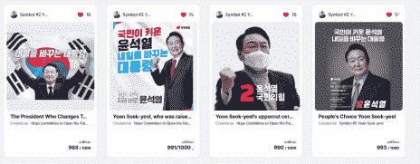
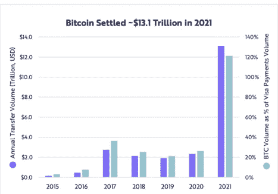
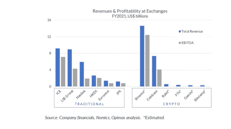

# 赢得选举和政治选择的非政府组织

> 原文：<https://medium.com/coinmonks/nfts-that-win-elections-and-political-choices-b2bd3d1f5ffa?source=collection_archive---------60----------------------->

随着对加密货币实施监管，政治家的决定现在已经成为市场动态之一。市场的快速增长导致了更严格的监管和政治家对市场更大的兴趣，无论是积极的还是消极的。因此，影响政治家的动态也开始间接影响加密货币市场。为了获得足够的选票，政治家们需要很好地调整这些规定，否则将面临失去年轻选民的风险。这种平衡是基于选民的反应形成的，在每个国家都有不同的结果。

在这种背景下，国家之间的差异并不是因为选民的要求而出现的，而是因为政治家的无知或错误预测。换句话说，一些国家实施的禁止性政策并不是因为公众对加密货币缺乏需求或兴趣；这些政策之所以付诸实施，是因为政客们试图保护传统市场，或者不愿意了解加密市场。做出反加密决定的另一个关键原因可能是加密货币不在人民的优先考虑范围之内，因为熟悉加密货币的年轻选民并不占多数。尽管如此，市场上的普遍观点是，年轻人在每次选举中都有投票权，在未来的选举中变得更具主导地位，对政治家的决策也有更大的影响。这方面最具体的例子发生在最近的韩国选举中。

在本文中，我们将研究在韩国大选中获胜的 Yoon Seok-yeol 的加密货币政策，以及有关该主题的一些数据。

**密码总裁**

韩国新总统尹硕益以非常微弱的优势赢得了选举:只有 1%。选举一开始是一场势均力敌的竞争；竞选经理希望获得犹豫不决的年轻选民的选票，因此他们将加密货币置于竞选承诺的中心。他们用下面的 4 个 NFT 作为尹硕的捐款和宣传工具。因此，这些国家森林公园现在有了一些历史意义。

毫不奇怪，得票最高的两位候选人都有对加密货币友好的政策。前总统文在寅(Moon Jae-in)实施的针对加密货币的严格规定阻碍了国内市场的发展，并引起了公众的一些质疑。前总统面临的最大障碍可以分为三类:

● **税收**

税收法规设想对收入 2000 美元或以上的加密货币个人征收 20%的税。然而，由于缺乏基础设施和公众的不良反应，该法规不得不多次推迟。

新总统承诺将 2000 美元的下限提高到 4 万美元。如果这一规定得以实施，所得税将由富人缴纳，而不是收入相对较低的人。

● **加密货币交易所**

在前总统任期内，关于加密货币交易所的法规规定必须向韩国金融情报机构登记，与银行合作，并从韩国互联网和安全局(KISA)获得证书。因此，60 多家交易所被迫关闭，只有 4 家主要交易所能够继续营业。

新总统没有对交易所做出具体承诺，尽管在他的任期内可能会有新的监管规定，让加密货币市场变得更容易。

● **ICO**

直到 4-5 年前，加密货币公司还相当广泛地使用初始硬币发行(ICO)系统来筹集资金；然而，在频繁的欺诈尝试后，这一系统在包括韩国在内的许多国家被禁止。自那以后，更安全的方法出现了，如首次交易所发行(IEO)，这涉及到通过在交易所出售象征性的东西来融资。然而，严格的政策在韩国仍然有效，这是生态系统发展的一个主要障碍。

新总统的承诺之一是将 ICO 式的融资系统与银行整合，确保安全监管。与其他法规相比，由于欺诈行为增加，前总统禁止 ICO 似乎是正常的。也就是说，他未能采用替代方法，这是新总统候选人的竞选承诺。

**制胜策略**

韩国有 5170 万人口，据估计，近 840 万韩国人(占人口的 16%)拥有加密货币。这些人中有 60%被认为是 20 多岁或 30 多岁。840 万选民听起来可能是很高的投票比例，但他们并不代表大多数人。尽管如此，两位顶级候选人都做出了加密货币友好承诺的事实表明这是一项“获胜政策”。这个概念指的是实用主义方法造成的两极分化。两极分化无处不在，加密货币也不例外，这说明韩国社会一部分人支持加密货币，另一部分人不支持。在这种情况下，我们可以预期总统候选人会采取两种务实的方法之一，要么支持加密，要么反对加密。然而，看到两个候选人都遵循友好的策略，证明了加密友好的方法更有利可图，因为反加密策略不会给候选人带来任何好处。鉴于更多的年轻选民将在下一次选举中投票，未来的候选人也很可能遵循友好的政策。

**必选项**

正如我们在韩国的例子中看到的那样，政治家们开始陷入两难境地，他们越来越有必要做出选择。一方意味着采取反加密的立场，重点是传统的经济游说；另一方的意思是寻找将加密货币融入现有体系的方法。我们可以预测，加密货币市场在游说活动中相当疲软。尽管如此，一些 2021 年的统计数据为政客们提供了强有力的证据，证明他们会放弃游说支持，转向更年轻的选民和这种新经济。现在让我们来看看 2021 年加密货币的两个关键统计数据。

2021 年，比特币网络上的转账总额达到 13.1 万亿美元，首次超过了 Visa 同年的转账量。一年前，比特币网络的总交易量约为 2.5 万亿美元，是 Visa 当年交易量的 25%。此外，请注意，该图表不包括其他加密货币。这种仅在一年内的快速增长对于展示市场潜力至关重要。

此外，2021 年加密货币市场的收入设法超过了一些其他巨头的收入，如纽约证券交易所(NYSE)、纳斯达克、洲际交易所和德意志交易所。

鉴于韩国政治家为年轻人做出的承诺以加密货币为中心，并考虑到上述两项统计数据，我们可以预计政治家最终会做出支持加密货币的决定。

**结论:不可阻挡的供应和交叉点**

今天，金融界向我们消费者提供了两种主要的供给流。一部分是传统金融领域，另一部分是创新金融，包括加密货币。另一方面，消费者需求正迅速从传统金融转向创新金融，如上图所示。因此，我们可以预期反加密政策制定者试图通过切断供应来保护当前的平衡，换句话说，通过禁止或封锁该部门并通过游说活动支持传统金融。然而，比特币的去中心化特性和行业的激进增长使其无法禁止。因为密码市场基本上是不可阻挡的。另一个阻碍的方法是压制选民的要求，但是这在政治上是非常昂贵的，只会导致失去更多的选票。换句话说，考虑到不可阻挡的供应，制定反加密政策的成本远远高于从加密友好政策中获得的收益。对于实用主义处于最高水平的政治领域，我们可以很容易地猜测，当他们可以获得利益时，没有人会愿意承担成本。因此，当谈到对加密货币做出选择时，政治家们基本上被迫采取积极的态度。

总之，我们有两个交叉点。首先，我们在上面的图表中看到，经济收益正在从传统市场转移到加密货币，其次，加密货币友好政治开始提供比禁止加密政治更高的政治利益。到目前为止，韩国最近的选举是这一转变最具体的例子。

编制人:Berkay Aybey

*此处表达的观点和评论归 BV Crypto 所有。BV Crypto 不能对基于此帖子的任何金融交易负责。每一次投资和交易都有风险。当你做决定时，你应该自己做调查。*

> 加入 Coinmonks [电报频道](https://t.me/coincodecap)和 [Youtube 频道](https://www.youtube.com/c/coinmonks/videos)了解加密交易和投资

# 另外，阅读

*   [分散交易所](https://coincodecap.com/what-are-decentralized-exchanges) | [比特 FIP](https://coincodecap.com/bitbns-fip) | [Pionex 评论](https://coincodecap.com/pionex-review-exchange-with-crypto-trading-bot)
*   [用信用卡购买密码的 10 个最佳地点](https://coincodecap.com/buy-crypto-with-credit-card)
*   [最好的卡达诺钱包](https://coincodecap.com/best-cardano-wallets) | [Bingbon 副本交易](https://coincodecap.com/bingbon-copy-trading)
*   [印度最佳 P2P 加密交易所](https://coincodecap.com/p2p-crypto-exchanges-in-india) | [柴犬钱包](https://coincodecap.com/baby-shiba-inu-wallets)