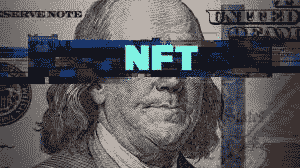
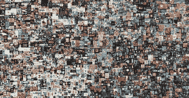

# NFTs:大问题

> 原文：<https://medium.com/coinmonks/nfts-the-big-problem-ae329ced81c8?source=collection_archive---------13----------------------->

多亏了 NFT，人们才能够把可笑的东西卖出去换钱。举个例子，一个叫做“最初的 5000 天”的数字拼贴画，由迈克·温克尔曼创作，他的作品以 69，000，000 美元的价格售出，69，000，000 美元(我从来没有为一幅拼贴画付过这么多钱…因为我没有那么多钱。考虑到花了 13 年才完成，这多少是可以理解的。直到今天，它还是最有价值的单一数字资产。

Created by Mike Winkelmann, known professionally as Beeple. Everydays: the First 5000 Days

另一个例子是勒布朗·詹姆斯的官方扣篮，它作为 NFT 的交易卡卖了 208，000 美元。有趣的是这个视频已经在网上免费发布了！

Monstrous dunk by LeBron James which sold as a trading card NFT

在整个加密空间的存在中，没有一个单一的趋势像 NFT 那样流行，甚至比特币也没有。所以，这是

*   什么是 NFT
*   优势
*   大问题

> 什么是 NFT

这些是不可替代的数字资产，也称为“NFT”。通常，加密收藏品被视为现实生活中的物品，如宠物、棒球卡和豆豆娃。把钱花在非功能性测试上的想法和花在其他事情上的想法没有太大的不同，因为非功能性测试只是一种扭曲。这是因为人们活着就是为了拥有别人没有的东西。随着区块链的发明，我们的购买正在从实物商品转向数字商品。现在，数字商品比实物商品更难赚钱，原因是真实性和所有权的问题。绘画和雕塑(艺术品)等实物商品。想想蒙娜丽莎的艺术。它不能与礼品店的蒙娜丽莎海报或其他蒙娜丽莎画作交换，因为这种差异可以从艺术的笔触和年龄看出。因为海报的价值与原作不同。至于数字商品/产品，这仍然不能提供足够的保护或认证，因为简单的 Ctrl C + Ctrl V 可以改变和创建原始照片的新的和多个版本。我相信这就是 NFT 试图解决的问题！创作者的权利和所有权。

*你可以去这里阅读更多关于* [*NFTs*](https://kaizerjerry.medium.com/defi-c61490904c)

> 优势

NFT 终结了长期无法解释的无聊合约(除非你理解长期无聊合约)，而是被指导 NFT 如何运作的智能合约所取代。和其他指导行动的合同一样，但更聪明。

有疯狂的人(其实不是疯了，是疯了)从炫耀自己稀有的东西中获得快感。通过 NFTs 和万无一失的认证系统，收藏家们现在作为一件数字作品的唯一拥有者有了一种兴奋感。NFTs，给人们(所有者)一种归属感，给人们一个感觉他们是某个事物的一部分的理由(也许是一个邪教或一个俱乐部或社会，谁知道呢？！也许更像是一种崇拜。嗯嗯……)。一个例子是拥有 4200 个独特猴子图像的[*hazemonkey society*](https://hazemonkeysociety.com/)(我个人的最爱)，以及拥有 10000 个猿图像的流行的[*BoredApeYatchClub*](https://boredapeyachtclub.com/)，最便宜的价格为 10000 美元。拥有这些 NFT 的人几乎在任何地方都使用它们，大多数是作为 PFP。随着 Twitter 的出现，NFT 的所有者可以在他们的 Twitter 账户上炫耀他们昂贵的 NFT 作为个人资料图片。

那种属于一个排外团体的自豪感(又是邪教 LOL)。最重要的是，这些 NFT 的创作者例如 HazeMonkeySociety 给予持有者特权来评估基于 NFT 的独家动画系列，组织虚拟聚会，以及对其 NFT 的知识产权。BoredApes 还为持有者组织聚会场所。

> *大问题*

随着 NFT 空间的繁荣，我们几乎可以同意(如果你喜欢或不喜欢)，它被投机商人作为一种非常快速的赚钱方式。我们可以说，大多数 NFT 都是大规模生产的现金攫取的产物。当我们看到一些名人如何使用 NFT，以及我们心爱的 Twitter 如何被用来放弃 NFT，向购买 NFT 的粉丝提供激励，就像 meetup 一样，事情变得更糟。

但我们可以看出这是一次现金抢劫。但是通过大肆宣传，这些人要为这些付出很多。非正规金融市场也充斥着非法活动。人们接受一个已经有版权的作品，并把它们像素化(让它们看起来复古)。说了这么多，如果你还想结账或者拥有一辆 NFT(不是财务建议。也许它也可以)，这里有一些你应该记住。

如果你真的想支持社区或艺术家，就买一件艺术品。如果市场崩溃，你仍然会很高兴拥有一些有价值的艺术品。记住久而久之人的注意力肯定会转移。

这股 NFT 热是一个即将破灭的泡沫

加入 Coinmonks [电报频道](https://t.me/coincodecap)和 [Youtube 频道](https://www.youtube.com/c/coinmonks/videos)了解加密交易和投资

# 另外，阅读

*   [如何匿名购买比特币](https://coincodecap.com/buy-bitcoin-anonymously) | [比特币现金钱包](https://coincodecap.com/bitcoin-cash-wallets)
*   [瓦济里克斯 NFT 评论](https://coincodecap.com/wazirx-nft-review)|[Bitsgap vs Pionex](https://coincodecap.com/bitsgap-vs-pionex)|[Tangem 评论](https://coincodecap.com/tangem-wallet-review)
*   [如何使用 Solidity 在以太坊上创建 DApp？](https://coincodecap.com/create-a-dapp-on-ethereum-using-solidity)
*   [币安 vs FTX](https://coincodecap.com/binance-vs-ftx) | [最佳(SOL)索拉纳钱包](https://coincodecap.com/solana-wallets)
*   [如何在 Uniswap 上交换加密？](https://coincodecap.com/swap-crypto-on-uniswap) | [A-Ads 审查](https://coincodecap.com/a-ads-review)
*   [加密货币储蓄账户](/coinmonks/cryptocurrency-savings-accounts-be3bc0feffbf) | [YoBit 评论](/coinmonks/yobit-review-175464162c62)
*   [Botsfolio vs nap bots vs Mudrex](/coinmonks/botsfolio-vs-napbots-vs-mudrex-c81344970c02)|[gate . io 交流回顾](/coinmonks/gate-io-exchange-review-61bf87b7078f)