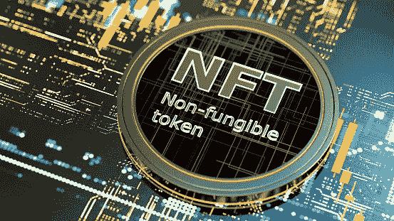

# NFT——筹集资金和赢得狂热粉丝的创造性方法

> 原文：<https://medium.com/coinmonks/nfts-the-creative-way-to-fundraise-and-gain-raving-fans-6696ce16cc3a?source=collection_archive---------68----------------------->

ABBA 是 20 世纪 70 年代的流行歌手，唱的是“金钱、金钱、金钱和富人的世界”金钱和财富的定义随着时间的推移而扩大。快进到 21 世纪 20 年代，我们都很熟悉这句话，“财富存在于利基市场。”不可替代的令牌是 Web 3.0 世界中的一个技术利基。Web 3.0 是互联网的最新版本。本质上，它是一个全球网络，由人、软件和设备之间的智能交换推动。它不依赖第三方中介来验证交易，事实上，区块链技术是一个关键组件，它将信任引入到关系中，而这在以前是不存在的。

区块链是一种数据结构，它提供了在计算机上存储数据的不同方式。这是通过与网络中的独立用户共享的数字账本来完成的。因此，他们创造了一个安全和不可辩驳的记录发生了什么。这包括记录身份、资产所有权、合同协议和任何其他有价值的东西。

不可替代令牌(NFT)扩展了最初与比特币和加密货币相关的区块链的使用和定义。非森林交易引入了消费者和商业方面，可以产生可观的财富、所有权和社区。这方面的一个例子是迈克·温克尔曼，又名毕普。他是一名数字艺术家和平面设计师。2021 年，他以 6900 万美元的价格出售了他的数字艺术收藏《每一天:前 5000 天》。他的 JPEG 作品是一种数字资产，被记录为以太坊区块链上的 NFT。

此类资产的交易由智能合约管理，智能合约只是物理合约的数字表示。这是一个储存在区块链中的微型计算机程序。一旦它被创建，就几乎不可能被篡改。除了艺术品，NFT 和智能合约可以代表一系列的东西。例如，出生、结婚和死亡证明。或者房契，像奥运会和温布尔登网球公开赛的门票。直至获得您最喜爱的音乐会的入场券，并接触音乐家。这同样适用于商务活动和会议。

上周末，按捺不住的商界领袖加里·维纳查克召开了首届 VeeCon 大会。只有事先买了一个 NFT 角色的 v 星朋友，才能进去。NFT 成了入场券。Gary 通过设计一组反映他所关心的属性的角色开发了独特的知识产权。比如同理心，善良，友情。提前几个月预售这些创意资产，为 2022 年、2023 年和 2024 年的年会提供了资金。

通过一次会议，Gary 将收藏艺术和社区经验结合起来。特别是，他创建了不同层次的访问权限。例子包括:教练会议、团体聚餐、VIP 体验等等。总的来说，这是一个如何建立公平的极好例子。例如，它扩大品牌知名度，创造狂热的品牌拥护者，引入可转让所有权，建立遗产和创收。最后一项有几个受益者:

*   NFT 创建者、最初的 NFT 持票人以及最初持票人将票出售给的任何人。如果最初的购买者参加了第一次会议，并决定将他们的门票转售给其他人以获利，就会发生这种情况。

这件事的美妙之处在于，在创造者、卖家和买家的链条中，任何人都能赚钱。每次 NFT 被售出，创作者都会收到一笔版税，永久有效。因此，NFTs 和智能合约的力量将原创艺术和收藏品从纪念品变成了实用工具，再变成了资产。

所有类型的创造者、企业家和组织都在尝试这种新的收入来源。另一个例子是 CogX Festival，它专注于人工智能、区块链、元宇宙和周边技术。今年，主办方推出了 CogX 赞助计划。好处包括可收藏的艺术品、参与性的利益相关者关系、终身通行证等等。

随着夏天的临近，现在是你评估自己努力的好时机。有没有一种方法可以让你的商业模式重新焕发活力，将 NFTs 和智能合同结合起来？想想你可能拥有的所有需要被激活的懒惰资产。他们真的可以创造有意义的价值。

> 加入 Coinmonks [电报频道](https://t.me/coincodecap)和 [Youtube 频道](https://www.youtube.com/c/coinmonks/videos)了解加密交易和投资

# 另外，阅读

*   [最佳比特币保证金交易](/coinmonks/bitcoin-margin-trading-exchange-bcbfcbf7b8e3) | [萝莉点评](/coinmonks/lolli-review-e6ddc7895ad8) | [比特币保证金交易](https://coincodecap.com/bityard-margin-trading)
*   [创造并出售你的第一个 NFT](https://coincodecap.com/create-nft) | [密码交易机器人](https://coincodecap.com/best-crypto-trading-bots)
*   [如何在 CoinDCX 上购买柴犬(SHIB)币？](https://coincodecap.com/buy-shiba-coindcx)
*   [CBET 回顾](https://coincodecap.com/cbet-casino-review) | [库币 vs 比特币基地](https://coincodecap.com/kucoin-vs-coinbase) | [拜比特 vs 比特币基地](https://coincodecap.com/bybit-vs-coinbase)
*   [折叠 App 回顾](https://coincodecap.com/fold-app-review) | [本地比特币回顾](/coinmonks/localbitcoins-review-6cc001c6ed56) | [Bybit vs 币安](https://coincodecap.com/bybit-binance-moonxbt)