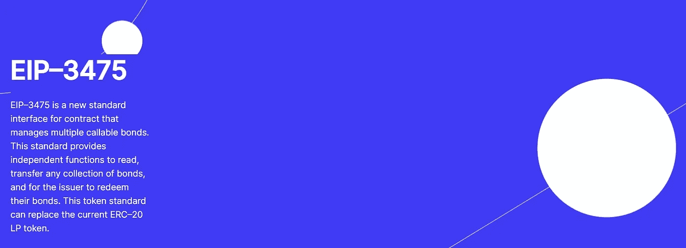

# NFTs:他们对 Cryptoverse 的承诺和对你有什么好处

> 原文：<https://medium.com/coinmonks/nfts-their-promise-to-cryptoverse-and-whats-in-it-for-you-5709eec2826f?source=collection_archive---------4----------------------->

你认为你已经看到了新兴的[不可替代令牌(或 NFT)](https://www.theverge.com/22310188/nft-explainer-what-is-blockchain-crypto-art-faq) 空间吗？好吧，再想想。从艺术到体育，甚至债券，关于这些储存在不变的区块链技术上的独特的数字资产，还有更多需要了解的。

> 让这一点坚持下去:权利和所有权从来没有像这样被任何技术如此破坏过。

这是第一次，区块链系统可以使 NFTs 代表所有权的证明。这是一个看似基本的陈述，实际上是一个大问题:区块链有能力确保每一个 NFT 都是真实的，这使它成为黄金。越来越多的人意识到了这一点。

这种新形式的数字所有权正在催生一种建立在区块链基础上的新经济。从初创公司到成熟的密码交易所，商业模式都在被修改。它也使品牌和用户能够识别假冒和原装商品。

现在，一些世界上最大的奢侈品牌如[杜尔西&加巴纳现在制造 NFTs](https://www.dolcegabbana.com/en/redeem/) 。吸收量如此之大。这在一定程度上要归功于脸书对 Meta 的更名。宣布这个在 2021 年初开始加速的新领域是至关重要的。

在大肆宣传之前，NFT 现象在 2021 年 3 月 12 日公开化了。此前有消息称，区块链企业家 Vignesh Sundaresan，又名 MetaKovan，以超过 6900 万美元的价格购买了数字艺术作为[的 NFT。谷歌上对 NFTs 的搜索兴趣当天达到了历史最高水平。消息在秘密社区内外迅速传播。](https://www.cnbc.com/2021/04/07/buyer-of-69-million-dollar-beeple-art-metakovan-on-nfts.html)

在一篇博客文章中，Sundaresan 说他透露了自己的身份，以表明印度人和有色人种也可以成为艺术赞助人。当他引用加密货币作为[“平衡西方和其他国家之间的力量”时，这是一个相当深刻的共鸣信息这次破纪录的毕普作品销售成为了 NFT 产业的分水岭。这次拍卖揭开了面纱，让人们认识到 NFTs 在艺术领域的能力。今天我们在这里。](https://metapurser.substack.com/p/nfts-the-first-5000-beeples?s=r)

**NFT 市场真的增长了**

根据 Chainalysis 的数据，[的最新数据](https://www.ft.com/content/e95f5ac2-0476-41f4-abd4-8a99faa7737d)显示，截至 2021 年底，近 410 亿美元已用于非金融交易。在过去的一年里，NFT 领域取得了巨大的进步，尽管许多个人和平台——包括收集了许多项目的加密交易所——尚未充分探索市场。

是的，NFT 的概念开始有点粗糙和艰难。种种迹象表明，在过去的 12 个月里，NFT 的科技趋势已经发生了变化。除了游戏领域的公司(其收入模式也代表了非功能性桌面游戏的一个使用案例)之外，发展趋势表明 NFT 市场的增长还没有真正开始。每天都有更多来自娱乐行业的玩家、艺术家、政治家，甚至你的小侄女——都来自加密王国之外——加入进来。

> 这才是重点。风险敞口已经全面增加(并且仍在增加)。因此，你需要重新考虑你在这个迅速发展的空间中的位置。

据报道，今年消费电子展(CES)的大多数与会者都希望看到每个人都谈论旗舰主题，包括 [NFTs 和元宇宙](https://eu.usatoday.com/story/tech/2022/01/03/ces-2022-nfts-metaverse-covid-virtual/8984145002/)。根据市场评论员的说法，这是全球同类活动中规模最大的一次，超过 2，200 家公司亲自参加了此次活动。NFT 也在那里。

期待看到更多的梅拉尼娅特朗普和 Eminems 和顶级政党[像在朝鲜](https://forkast.news/headlines/nft-south-korea-presidential-candidate/)，和 Snoop Doggs，名字，在 NFT 空间。或者更多的三星，巴黎希尔顿。NFT 现在比我们想象的离我们越来越近。

**体育、债券……非金融信托日益增长的重要性**

像加密货币一样，NFT 也存在于区块链，但不可互换。它们帮助使用者和收藏者对非实物物品产生情感依恋。以至于当它们离我们越来越近时，它们在某种程度上推动了分散式商业的兴起。他们正在把权力还给人民，并在从数字到物质的救赎过程中取消中介。

例如，在体育运动中，NFT 被证明是一种强有力的新媒体，让团队和球员与他们在全球的粉丝互动。像传统的体育纪念品一样，它们提供了一种创造性的新方式来保持球迷的体验。它们也为品牌提供了赚钱的机会。事实上，名人的支持被认为是一种新型商业化战略的原因，这一点在 NFTs 在数字资产的[未来中可能扮演的角色中显而易见。](https://www.pwc.com/us/en/tech-effect/emerging-tech/nfts-the-future-of-digital-assets-in-sports.html)

债券市场也是如此。一个新的[分散债券系统](https://debond.org/assets/docs/pitch.pdf)，D/Bond，正在引入一种金融工具，将任何形式的数字债务或资产证券化为一种债券类别，这种债券类别运行一种高能效的流程，允许贷款债券拆分和捆绑，用于交易 NFT 债券和 ERC20 令牌债券。

这种不可替代性使得 NFT 抵押贷款效率低下。但对于分散债券平台提供的证券化贷款，在贷款发放给债权人之前，可以更好地确定最佳估值。

因此，仅仅把 NFTs 看作一个 buzz 是不够的。它不能(也不会)像 2017 年的加密热潮(特别是[初始硬币发行——或 ICOs](https://www.investopedia.com/news/what-ico/) )一样在一夜之间消失。相反，它们应该被看作是将许多以前从未拥有过 crypto 的人带入这个领域的工具。或者被视为提供了一种方式，以满足寻求投资和管理财富新途径的加密投资者的强烈需求。或者 NFTs 应该激励你为即将到来的事情正确定位自己。比如向你提出一个商业建议。

这可以解释为什么 NFTs 被吹捧为区块链杀手级产品，加密行业一直在等待它的进一步采用。可能是因为它们有潜力让主流用户进入加密生态系统变得简单明了。

因为看起来，虽然有些人可能知道他们使用加密和区块链进行 NFT 交易，但其他人可能不知道。例如，对于后者来说，购买 NFT 艺术品或债券可能只是购买他们喜欢的东西的另一种方式。尽管如此，密码的使用正在增长。

**NFTs 仍在增长**

因此，可以有把握地说，NFT 预示着转型的开始。他们在 2021 年像风暴一样来了。随着越来越多的品牌进入 cryptoverse，他们预计将在 2022 年继续保持上升趋势，这些品牌将服务于他们现有的客户群，同时奖励忠诚度。

众所周知，NFT 代币市场仍由以太坊主导，交易仍限于各自的铸造网络。举例来说，当更多的人在区块链以太坊造币时，事情会变慢，它会变得前所未有的拥挤。这为替代方案留下了空间。这也表明 NFT 市场在某种程度上仍然受到限制。

然而，当这一点被克服时，一旦它们可以在网络间自由移动，对 NFT 的使用将会显著增加。一些市场内部人士已经呼吁在 2022 年推动这一进程，但尚不清楚这是否会发生。

如果实现了更多的用例，将会引发更多的关注和兴趣来探索全新的 NFT 领域。随着 NFT 的吸引力延伸到无数行业，它的生态系统还在继续增长。去中心化的艺术、体育、债券和其他事物的未来将会得到加强。这反过来将为更多的用户进入加密领域铺平道路。

显而易见，NFT 鼓励创新。这是容易获得的，可以非常有利可图。尽管它仍然是一个新生的空间，但它已经引起了加密社区内外的兴趣。它的稳步增长充分说明了未来的参与水平。

**PS:查看 D/Bond 的更新网站，了解团队和公司的详细信息。**

 [## 脱粘

### 为您的财务提供单一平台，无需编程。D/EXCHANGE 和 D/WALLET 为您提供简单的一站式服务，以…

debond.org](https://debond.org) 

**以下是最新版本的项目文件:**

***球场甲板:***[***https://shorturl.at/ozBT1***](https://shorturl.at/ozBT1)

***白皮书:***[***https://shorturl.at/yWZ03***](https://shorturl.at/yWZ03)

***one pager:***[***https://shorturl.at/lqHQ2***](https://shorturl.at/lqHQ2)

***问&答:***[**【https://shorturl.at/bBDE4】**](https://shorturl.at/bBDE4)

***平台前端在 GitHub 上的演示:***[***【https://palexs.github.io/debondfront】***](https://palexs.github.io/debondfront)***(请将钱包连接到 Ropsten testnet)***

**疑问？在此与团队预约电话:**

[***https://calendly.com/mate-debond***](https://calendly.com/mate-debond)

 [## 30 分钟联盟-艾伦·米肖

### 编辑描述

calendly.com](https://calendly.com/allan-debond/30min) 

> 加入 Coinmonks [电报频道](https://t.me/coincodecap)和 [Youtube 频道](https://www.youtube.com/c/coinmonks/videos)了解加密交易和投资

# 另外，阅读

*   [加密货币储蓄账户](/coinmonks/cryptocurrency-savings-accounts-be3bc0feffbf) | [加密交易机器人](https://coincodecap.com/best-crypto-trading-bots)
*   [BigONE 交易所评论](/coinmonks/bigone-exchange-review-64705d85a1d4) | [CEX。IO 审查](https://coincodecap.com/cex-io-review) | [交换区审查](/coinmonks/swapzone-review-crypto-exchange-data-aggregator-e0ad78e55ed7)
*   [最佳比特币保证金交易](/coinmonks/bitcoin-margin-trading-exchange-bcbfcbf7b8e3) | [比特币保证金交易](https://coincodecap.com/bityard-margin-trading)
*   [加密保证金交易交易所](/coinmonks/crypto-margin-trading-exchanges-428b1f7ad108) | [赚取比特币](/coinmonks/earn-bitcoin-6e8bd3c592d9)
*   [WazirX vs CoinDCX vs bit bns](/coinmonks/wazirx-vs-coindcx-vs-bitbns-149f4f19a2f1)|[block fi vs coin loan vs Nexo](/coinmonks/blockfi-vs-coinloan-vs-nexo-cb624635230d)