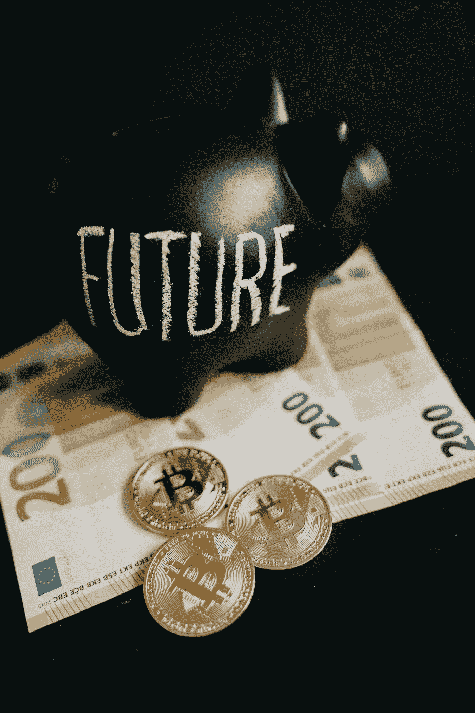
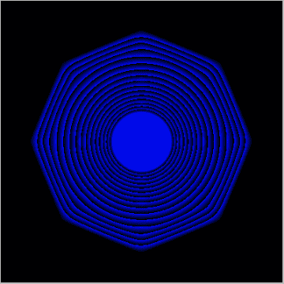
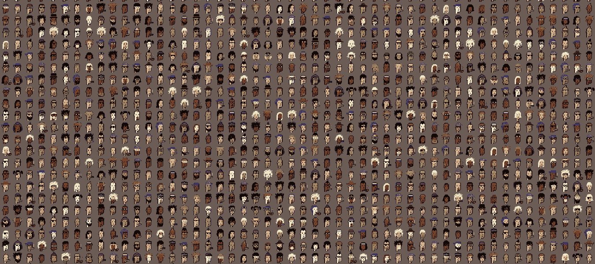
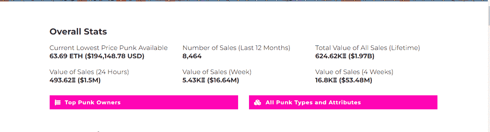
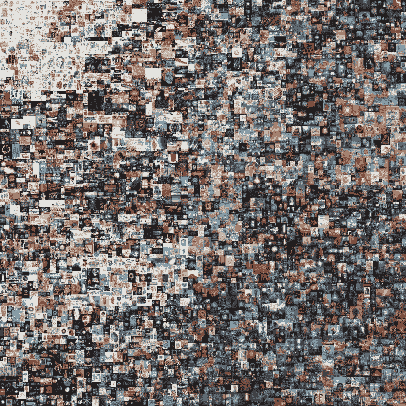
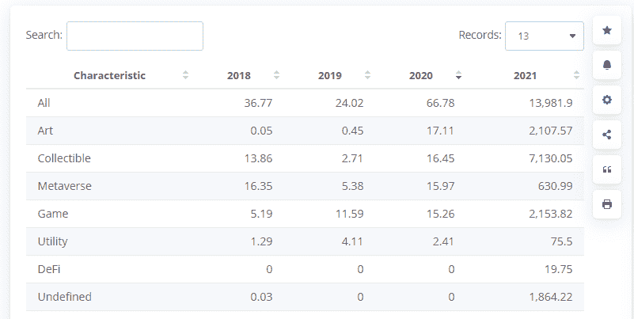

# NFTs——垃圾还是技术

> 原文：<https://medium.com/coinmonks/nfts-trash-or-tech-11280fc7cff4?source=collection_archive---------35----------------------->

Twitter 的创始人杰克·多西以 290 万美元的天价出售了他作为 NFTs 的第一条推文，NFT 最近被拍卖，最高出价为 250 美元。

问题是，NFT 市场是富人挥金如土的地方，还是未来真正的交易场所？

"*本文对所有这些进行了分解，并为读者提供了视角"*

NFT 已经变得非常流行，许多人认为 Crypto 和 NFT 是未来。虽然这可能是真的，但许多人仍然对 NFT 以及为什么它们如此受欢迎感到困惑。

未来主义者声称，艺术创作者和收藏家可以拥有他们的作品，出售或铸造，这将很快成为虚拟世界的关键。许多人希望这将为每个人打开拥有部分数字资产的大门。

本文将剖析 NFT，看看 NFT 是否只是被夸大了，还是艺术和技术的未来。

什么是 NFT？

不可替换的令牌。

分解一下。

我有一张自拍照，我正在卖一份给你。另一张照片不能代替我的自拍照片，因为这张照片是不可替代的。

比特币是可替换的，我可以用一个硬币替换另一个，但不能用 NFTs。

不可替代的代币是诸如艺术、书籍、音乐、旧的硬币收藏以及许多其他价值无法量化的资产。

# NFT 的崛起

量子是凯文·麦考伊在 2014 年创造的第一个 NFT。Quantum 是一个八边形的像素化图像，用较大的形状包围较小的形状来填充指示圆。

截至今日，Quantum 的售价为 700 万美元。这件创作于 2014 年的艺术品已经获得了惊人的声誉，我们可能会问它是否只是被夸大了，还是你应该把钱花在这件事情上。

# 金钱抢劫

在 2018 年 NFTs 破网之前，赛博朋克 NFTs 是由约翰·沃特金森和马特·霍尔在 2017 年创建的，并且是免费提供的。

一万个 NFT 被创建并提供给公众，目前，它们都被认领了。

完整的文档。找到它[这里](https://www.larvalabs.com/cryptopunks)。

今天最便宜的赛博朋克 NFTs 价格【194,148.78 美元

这种像素化的图片怎么会比理性思考者想象的要贵这么多，为什么？

most expensive CyberPunk NFT

# 世卫组织的未来？

2018-2019 年见证了 NFTs 交易市场的崛起。

许多艺术家开始创作他们的 NFT，并在不同的市场出售。NFT 的全球交易量增长了 200%，超过 500 亿美元。

虽然许多人认为他们可以用他们的 photoshopped 图像变现，但现实证明，像杰克·多西这样的人将能够以 300 万美元的价格出售他的第一条推文，但我猜是你的或我的。不会。

铸造 NFT 的成本和它的目的创造了一个新的维度，来解释为什么 NFT 不再是普通人的竞技场。

一些销量最高的非功能性食物包括

*   [隐朋克](https://www.larvalabs.com/cryptopunks)——**889784.68 ETH**
*   [无聊猿游艇俱乐部](https://boredapeyachtclub.com/#/)—**498420.13 ETH**
*   变异猿游艇俱乐部—**315960.27 ETH**
*   [志那都红豆](https://www.azuki.com/)—**184372.32 ETH**
*   [克隆 X](https://www.rtfkt.com/) — **174，129.14 ETH**

这是一个即将破灭的大气球，还是会引领我们走向未来？

我发现这个来自 [thepourquoipas](https://www.thepourquoipas.com/post/nfts-are-just-another-way-for-the-rich-to-get-richer) 的摘要非常有趣。

只有当你把它们视为富人的玩物时，它们才有意义。它们只不过是价值储存手段，是孩子们很快就会厌倦的玩具。”

以下是一些顶级的 NFTs 市场。

*   [**NFT 发射台**](https://tradingplatforms.com/visit/nftlaunchpad) —面向交易者和创作者
*   [**魔幻伊甸园**](https://tradingplatforms.com/visit/magic-eden) —为索拉纳 NFT 市场
*   [**OpenSea**](https://tradingplatforms.com/visit/opensea)——NFT 交易的最佳平台，也是历史最悠久的平台，拥有 60 万用户，已处理价值超过 100 亿美元的 NFT
*   **——摄影师和图像交易平台，2021 年，皮普尔的 NFT 以 6900 万美元成交**

****

*   ******——NFT 艺术家平台已经处理了价值超过 2.7 亿美元的 NFT。******
*   ******[**Crypto.com**](https://tradingplatforms.com/visit/crypto.com)—最佳 NFT 音乐平台******
*   ******—最佳 NFT 游戏平台******
*   ******[**币安商场**](https://tradingplatforms.com/visit/binance)——一切尽在一个平台******
*   ****面对如此庞大的数据量，非功能性测试的未来会如何？****

****这是一个非常棘手的尖锐问题，但答案和问题一样令人心痛，未来将只关注富人变得更富，因为他们将是唯一有资金维持下去的人。****

1.  ****会不会成为某个顶级内圈的入口？是的，我想是的。俱乐部将只允许你进入，如果你有一个收藏作为通行证。****
2.  ****会不会像实物艺术品一样作为收藏品流通回富人手中？****

****你的猜测和我的一样好。****

# ****浑浊的水****

****除了炫耀你拥有一辆 NFT，你还会用它做什么？****

****虽然你可能不知道如何对待一个演员，但许多其他演员都知道，以下是你可能不知道的。****

****虽然有合法交易者，但也有非法交易者，他们的唯一目的是通过这些平台进行诈骗和洗钱。****

****一个骗局是，用户抬高 NFT 的价格，使用另一个账户来竞标这种工作，从而使收益合法化，因为区块链为网络增加了一层安全。****

****虽然这些平台是分散的，跟踪起来很复杂，但资金会被送到 tornado cash 这样的平台，这是一种防止区块链跟踪地址的混合服务。****

****了解更多关于[龙卷风现金](https://beincrypto.com/learn/tornado-cash/)的信息。****

# ****今后****

****NFT 的未来是不确定的，取决于很多可能性，取决于人类是否会进入元宇宙。****

****虽然我认为人类还没有准备好迎接这样的飞跃，但在目前的状态下，NFT 造币业已经一飞冲天，当前的轨迹显示出对采用的巨大推动。****

****这是 2018 年 NFT 交易的图表，来自 Statista [的文件在这里](https://www.statista.com/statistics/1221400/nft-sales-revenue-by-segment/)****

********

****我相信市场将很快被那些能够购买和铸造 NFT 的极其富有的人所接管，但对于日常创造者来说，这似乎是一个艰难的旅程，当 100 年后没有人出价购买他们的 NFT 时，许多人将很快变得厌倦。****

> ****加入 Coinmonks [电报频道](https://t.me/coincodecap)和 [Youtube 频道](https://www.youtube.com/c/coinmonks/videos)了解加密交易和投资****

# ****另外，阅读****

*   ****[印度的加密交易所](/coinmonks/bitcoin-exchange-in-india-7f1fe79715c9) | [比特币储蓄账户](/coinmonks/bitcoin-savings-account-e65b13f92451)****
*   ****[OKEx vs KuCoin](https://coincodecap.com/okex-kucoin) | [摄氏替代度](https://coincodecap.com/celsius-alternatives) | [如何购买 VeChain](https://coincodecap.com/buy-vechain)****
*   ****[币安期货交易](https://coincodecap.com/binance-futures-trading)|[3 commas vs Mudrex vs eToro](https://coincodecap.com/mudrex-3commas-etoro)****
*   ****[如何购买 Monero](https://coincodecap.com/buy-monero) | [IDEX 评论](https://coincodecap.com/idex-review) | [BitKan 交易机器人](https://coincodecap.com/bitkan-trading-bot)****
*   ****[CoinDCX 评论](/coinmonks/coindcx-review-8444db3621a2) | [加密保证金交易交易所](https://coincodecap.com/crypto-margin-trading-exchanges)****
*   ****[红狗赌场评论](https://coincodecap.com/red-dog-casino-review) | [Swyftx 评论](https://coincodecap.com/swyftx-review) | [CoinGate 评论](https://coincodecap.com/coingate-review)****