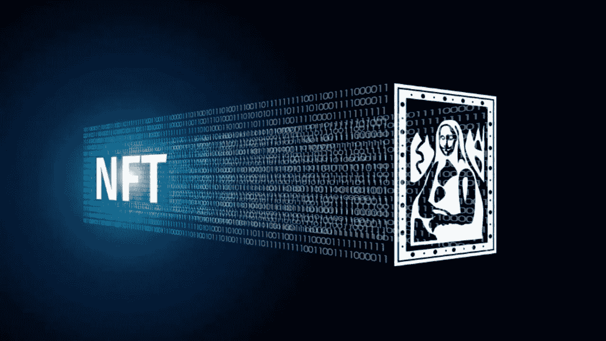

# NFTs |什么是 NFT |谁拥有 NFT | 2022 年 NFT 的一切

> 原文：<https://medium.com/coinmonks/nfts-what-is-nft-who-owns-nft-everything-about-nft-in-2022-afa3cb61d97c?source=collection_archive---------73----------------------->

现代金融为不同类型的用户收集了不同类型资产的高度复杂的交易选项。这些资产包括从各种设计和数字艺术到房地产和智能合同。资产的唯一标识与区块链技术和智能合约相结合的想法，使这些复杂的交易选项(如 NFTs)成为 Web 3.0 演进和发展中一股极其强大的变革力量。那么，什么是 NFT 呢？

# 关于 NFTs

NFT 是目前通过 storm 全球数字化的虚拟艺术品和收藏品。数字艺术家正获得一个从全新的秘密观众那里赚取大笔收入的机会。名人正积极成为其中的一员，因为他们发现了一种全新的与粉丝互动的可能性。虚拟艺术品是作为非艺术作品出售的最常见的商品。

它们还被用来象征对任何特定资产的占有，比如虚拟或现实世界中某个物品的合同。NFTs 和加密货币的可替代性功能使加密货币成为虚拟经济中一种合适的稳定交易媒介。

NFT 通过使每个令牌都具有独特性和不可替代性来改变加密范式，从而使一个 NFT 不可能与其他任何一个完全相同。它们只不过是物品的虚拟表示，由于上述事实，它们被炒作成虚拟护照。NFT 也是可扩展的，这意味着它们可以将一个 NFT 与另一个集成起来“繁殖”。

# 非功能性测试的好处

NFT 是可以用来象征拥有任何特定物品的令牌。它们允许我们将艺术品、收藏品甚至房地产等事物符号化。它一次可以有一个合法的所有者，他们通过以太坊区块链得到保护。没有人可以修改占有文件或伪造 NFT 的存在。

物理商品的数字表示的想法不是新的，唯一标识的想法也不是新的。然而，当它与智能合约和防篡改区块链的优势相结合时，make NFTs 是一股强大的变革力量。NFT 最隐含的优势是市场效率。将物理资产转换为数字资产简化了流程并减少了中介。NFTs 在区块链上表现虚拟或实物艺术品，消除了对代理的需求，使艺术家能够直接与观众联系。它们还可以改进业务流程。

NFTs 和以太坊解决了当今互联网上存在的相当多的问题。随着一切都变得数字化，有必要复制物理项目的属性，如稀缺性、唯一性和所有权证明。此外，有必要提及的是，数字项目通常只在其产品的上下文中起作用。例如，你不能转售你刚刚购买的 iTunes mp3，或者你不能用一家公司的忠诚度积分交换另一个平台的信用积分，即使它有市场。

# 当你购买 NFT 时，你实际上拥有什么？

一个主要的问题是，围绕非功能性食物的常见混淆是涉及的权利。一些买家认为他们拥有这件艺术品及其所有权利。然而，实际上，您只是购买了元数据，或者仅仅是与 NFTs 相关的程序。混乱的部分原因可以归咎于代币的花费。如果 pixel art 的售价超过 100 万美元，很容易猜测买家购买了多个代码序列。的主流报道

NFT 的销售使它更加令人困惑。记者通常认为作品本身已经售出，但事实并非如此。因此，很难理解为什么 NFT 买家会在元数据文件上花很多钱，这些元数据文件是具有艺术价值的短串数字和字母。

# 史上最贵的 NFT

*   **The Merge:** The Merge 是由一位名叫 Pak 的匿名数字创作者创作的数字艺术品。NFT 于 2021 年 12 月 6 日以 9180 万美元的价格在分散市场 Nifty Gateway 出售。然而，这件艺术品被分成了 312，686 件，分发给 28，983 名买家。这里的问题是，合并是一个单一的艺术作品，由只有用户才能购买的“大众”集合组成。这些单位可以被储存起来，形成一个更大的群体，可以在二级市场上进一步出售。拍卖结束时，帕克总共获得了 9180 万美元的收入，成为迄今为止最昂贵的 NFT 作品。
*   **第一个 5000 天:**第一个 5000 天是由数字艺术家 Michael Winkelmann 创作的虚拟艺术品，他也被称为 Beeple。这件艺术品在佳士得以 NFT 的名义拍卖，最初的出价约为 100 美元。密码爱好者很快提出了更高的出价。Beeple 在加密艺术社区中作为一名创造者而闻名，他的销售额达到了六位数，就像 Crossroads 一样。因此，只用了一个小时，NFT 的价格就飙升至 100 多万美元。最后，这幅完成于 2021 年 2 月 21 日的 NFT 以 6900 万美元的价格售出。《最初的 5000 天》是 NFT 社区中一个重要的虚拟艺术作品，因为它为主流观众探索可替代资产开辟了道路。

*原载于*[*https://financialanswers . in*](https://financialanswers.in/nfts-everything-you-need-to-know/)*2022 年 03 月 02 日*