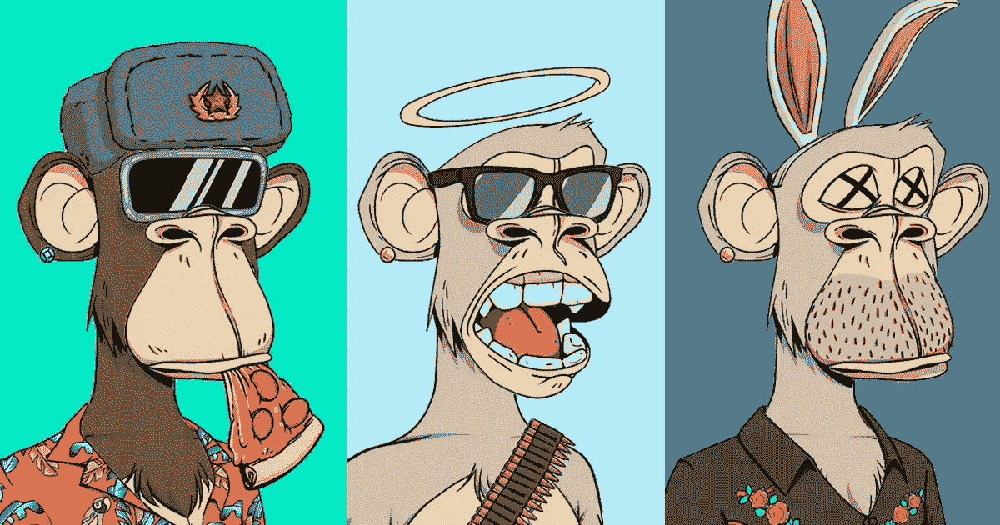
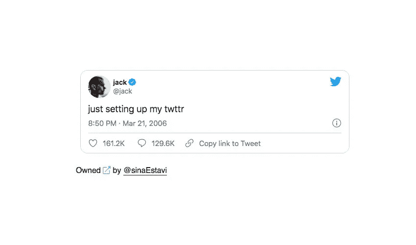
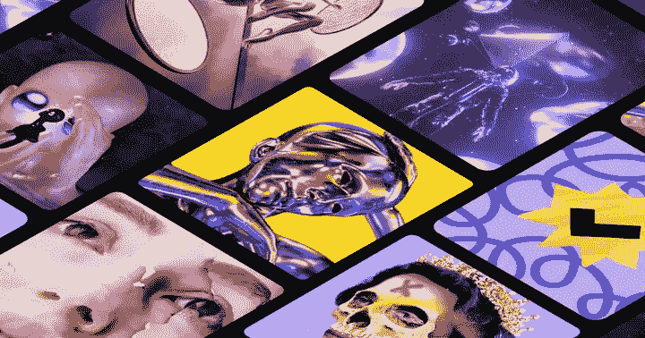

# NFTs &为什么它们价值连城

> 原文：<https://medium.com/coinmonks/nfts-why-theyre-worth-millions-a8664177ba97?source=collection_archive---------59----------------------->

## 什么是 NFT(不可替换令牌)？

NFT 是一种数字资产，代表被认为是独一无二的真实生活对象，例如一件艺术品。当令牌化时，基础代码提供对特定 NFT 的所有权，类似于你在现实世界中收到的土地契约。这份所有权记录随后被存储在一个使用区块链技术的共享账本上，这是无法伪造的，因为世界各地有数千台计算机在维护它。

相比之下，可替换令牌是一种可互换的资产。这意味着你可以向某人发送一个可替代的令牌，如比特币，如果他们将它寄回给你，它将不是你收到的同一枚比特币，尽管它的价值是相同的。

NFT 是在线买卖的数字代币，通常使用加密货币。根据福布斯的数据，由于每个独特的 NFT 都有识别码，这是数字令牌行业自 2017 年以来积累了惊人的 1.23 亿美元销售额的主要原因。NFTs 的稀有性和稀缺性是它的价值所在，所以这个数字并不令人惊讶。

## NFTS 是用来做什么的？

NFTs 背后的技术允许内容创作者将他们的作品货币化并出售。以这种方式将项目货币化的一个巨大优势是，NFT 还可以包含 **smartcontracts** 。这些智能合同的作用与音乐行业的版税相同。如果一个项目被出售给其他人，那么最初的内容创建者将会收到该代币未来销售的分成。

NFTs 还可以用作筹集慈善资金的一种方式，创建汽车、土地或财产等有形物品的所有权契约，以及将推文等无形物品货币化。亿万富翁首席执行官兼 Twitter 联合创始人杰克·多西于 2021 年 5 月发布了他的第一条推文，价值 290 万美元。

## 如何购买 NFTS

如果你想亲身体验 NFTs 的世界，并开始自己的收藏，这里有一个你需要开始的快速指南:

●您将需要购买一些加密货币，即以太，这取决于您的 NFT 提供商接受什么

●在考虑平台选项时，牢记费用。大多数交易所收取一定比例的交易费来处理交易。

●你需要一个数字钱包来存储你的非功能性交易和加密货币

●将您的钱包连接到 NFT 市场，开始购物！

## 时尚还是未来？

对于一些人来说，非功能性食物的概念仍然是一个谜，因为你实际上是在购买一些“不存在”的东西。然而对其他人来说，NFT 代表数字社区。大多数人听说过 CryptoPunks 和 Bored Apes，并想知道为什么它们如此受欢迎——这是因为它们所伴随的社区，在那里人们分享他们对其他 NFT 的看法，并讨论如何建立内容创作者的社区，这些内容创作者从他们的产品中获得应有的价值。由于这是 NFT 社区发展的主要驱动力之一，社区的力量一般是无与伦比的，因此 NFT 很可能会在数字世界的持续发展中继续存在并蓬勃发展。

> 加入 Coinmonks [电报频道](https://t.me/coincodecap)和 [Youtube 频道](https://www.youtube.com/c/coinmonks/videos)了解加密交易和投资

# 另外，阅读

*   [OKEx vs KuCoin](https://coincodecap.com/okex-kucoin) | [摄氏替代品](https://coincodecap.com/celsius-alternatives) | [如何购买 VeChain](https://coincodecap.com/buy-vechain)
*   [币安期货交易](https://coincodecap.com/binance-futures-trading)|[3 comas vs Mudrex vs eToro](https://coincodecap.com/mudrex-3commas-etoro)
*   [如何购买 Monero](https://coincodecap.com/buy-monero) | [IDEX 评论](https://coincodecap.com/idex-review) | [BitKan 交易机器人](https://coincodecap.com/bitkan-trading-bot)
*   [CoinDCX 评论](/coinmonks/coindcx-review-8444db3621a2) | [加密保证金交易交易所](https://coincodecap.com/crypto-margin-trading-exchanges)
*   [红狗赌场评论](https://coincodecap.com/red-dog-casino-review) | [Swyftx 评论](https://coincodecap.com/swyftx-review) | [CoinGate 评论](https://coincodecap.com/coingate-review)