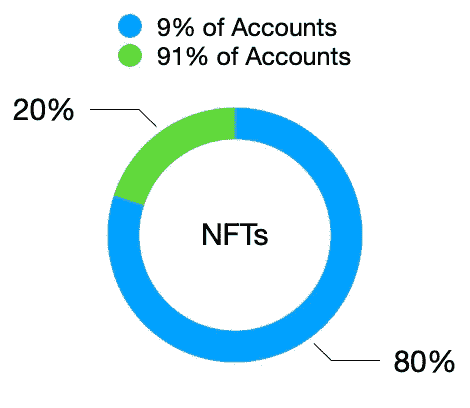
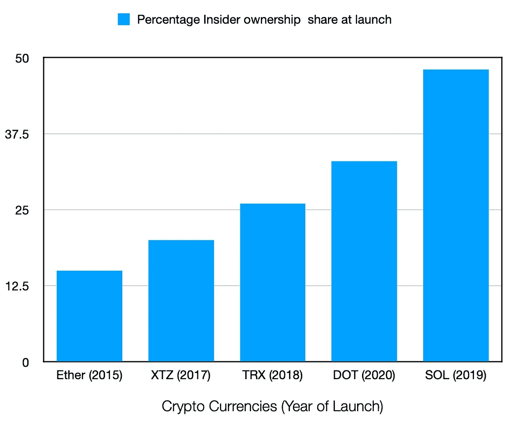

# NFTs 不会让你变得富有，Web3 可能也不会去中心化

> 原文：<https://medium.com/coinmonks/nfts-wont-make-you-rich-and-web3-is-probably-not-decentralised-f501a39ba834?source=collection_archive---------5----------------------->

我发现很多人都在努力理解 web3 将如何取代互联网，或者 NFTs 将如何让你变得富有。这是我对这个话题的看法，他们可能不会。在你开始鼓掌或掏出枪之前，让我解释一下。我很难理解区块链作为一种技术的前景和价值——如今围绕区块链的大多数讨论都集中在 NFTs 和 web3 上。我在 Instagram 上看到一堆青少年吹嘘他们是如何赚了几千(他们中的一些人声称赚了几十亿！)的美元翻转 NFT。NFT 不会创造任何奇迹，它们只是记录下是谁创造了它们，迄今为止它们已经转手了多少次和谁的手——对于艺术家和创作者来说，这可能是一个非常方便的协议，可以为创造任何形式的数字艺术声称所有权和信用，但这并不是一幅猴子的肖像价值数百万美元的理由。

**为什么非正规金融服务不会让你变得富有:**

NFT 的根本问题是每个人都购买它们并以更高的价格出售——没有人(好吧，可能有一些例外)购买它们来使用它们。因此，我不把热衷于 NFT 的人视为投资“最新技术”的人，而是把从事 NFT 交易的人视为试图转手或试图以高于购买价格的价格转售艺术品的人。此外，价值 400 亿美元的 NFT 市场的 80%由 9%的账户持有——所以价格似乎不是由市场决定的，而是由一群有钱人支配的。

我遵循一种观点，如果资产有潜在价值，就值得购买-

*   公司股票的价值源于其基础业务及其当前和潜在的利润。
*   商品之所以有价值，是因为大部分被用作各种行业的原材料。
*   房地产之所以有价值，是因为你实际上拥有一块土地——耕种它、建造一栋房子或建造一个商业综合体，只要你有资本，你就被分类了。
*   贵金属和加密货币的价值源于它们的稀缺性和需求——这决定了它们的价格。
*   法定货币之所以有价值，是因为它们受到政府完全主权的支持，其价值由各种宏观经济因素决定。

是什么赋予了 NFTs 价值？你不能用非正规金融工具创造价值，也没有政府支持非正规金融工具成为法定货币。任何人都可以创造它们——因此，它们不是很好的价值储存手段。使用 NFT，任何人都可以证明谁拥有它们，谁创建了它们。这一特征是否足以让一张猴子的数码照片价值 100 万美元？我不这么认为。你或许可以用 NFTs 来证明某人拥有一块土地或一块黄金，甚至是一件艺术品——这将使 NFTs 更像是一份证明所有权的合同，而不是可以拥有和出售的资产。

**为什么 Web3 可能不会带来我们期待的互联网民主化:**

毫不夸张地说，互联网现在被少数公司所拥有。随着区块链的出现及其进行交易的能力，人们认为我们最终可以使互联网民主化，将集中在少数公司手中的权力转移到使用互联网的用户手中。风投们争先恐后地资助去中心化的自治组织(Dao ),这些组织本来就应该是民主的。现在让我们后退一步，看看区块链的这些道拥有什么样的民主。

大多数 Dao 倾向于遵循以下模式-

*   一群人试图用区块链解决一个问题
*   他们要么用自己的加密货币创建一个新的链，要么在现有的区块链上创建一个令牌，如以太坊
*   一旦产品构建完成，项目的大量加密令牌/货币就会分配给为项目提供资金的风投和致力于创建 DAO 的开发人员。通常，大多数 DAO 都有一个叫做“治理令牌”的东西，它将用于投票决定 DAO 的未来更新。这些令牌通常由 DAO 的创建者和资助该项目的风投拥有——这与公司的股票没有太大区别(除了股票可能受到监管，不像当前的加密状态)
*   在它们之间分发之后，这些加密代币/货币被分发给公众——这些公共代币的供应或需求将决定代币的价格，并使一批创始人和风投获得了数百万美元。

正如你在下面的图表中所看到的，web3 组织的治理权力正在向内部人士久而久之倾斜。

**别误会**

虽然很难给艺术品定价，但艺术品收藏家和卖家的市场一直是一个利基市场，直到 NFTs 的出现。由于像绘画、音乐或数字艺术这样的艺术已经作为 NFT 在互联网上销售，市场已经扩大，来自世界各地的更多用户能够购买这样的艺术。创作音乐和数字艺术的艺术家能够直接将他们的作品作为 NFT 销售给用户。但人们需要思考，购买音乐(或数字艺术)是为了听，还是因为它是 NFT 而以更高的价格出售。

另一方面，正如我在本文前面提到的，Web3 在组织的透明和良好治理方面有着惊人的潜力。与其将治理权力集中在一群创始人和资助者手中的 Web3 上的组织视为“民主化的”，不如将它们视为拥有透明的技术强制治理政策的组织。

**为什么这不会影响区块链作为技术的承诺:**

在一次采访中，埃隆·马斯克说了一些让我产生共鸣的话——如今的工程师倾向于解决错误的问题，并试图让错误的事情变得更有效率。这可能是因为我们的教育体系，在这个体系中，我们只被教导回答问题，却不被鼓励质疑我们是否问了正确的问题。

几十年来，人们一直试图使用被创建来传送信息的互联网来传送价值和货币，并且几十年来，人们一直试图使经由互联网的价值传送过程高效。现在，随着区块链技术的出现，我们有办法在不使用互联网的情况下将价值从一个地方转移到另一个地方。这可以使全球支付的底层技术更加透明和高效。人们可以说，以太坊在目前的状态下比互联网上的数字电子支付系统 visNet(web 2)具有更高的交易成本、更低的吞吐量和更长的交易时间。但这是因为以太坊是去中心化的(正如我们所说的，以太坊社区正在努力使其更加有效)。这就提出了一个问题——分权真的有必要吗？就我个人而言，只要有透明度，我不介意中央集权。我们可以在国家之间转移价值，将其储存在合同中，甚至可以在几秒钟内买卖股票和债券等资产，如果这些资产是使用区块链进行买卖的话——可能会有一个我们必须与之打交道的中间实体，但我们将有更好的结算时间和更大的透明度，并更容易管理交易。

鉴于区块链的发展方向，在不久的将来，我们可能会通过去中心化获得非常高的交易时间和低吞吐量，但我个人认为，只有当去中心化是我们正在解决的问题的必要解决方案，而不是一个听起来很酷的附加功能时，才应该实施去中心化。盲目地分散应用程序(如分散的优步)从长远来看可能不会持续，但我们将能够使用区块链来分散不信任应该是一个必要的功能，如电子投票系统或个人信息存储库。当谈到区块链的资产时，我认为更有意义的是跟踪区块链资产的所有权和创造者的详细信息——这是我们可以创造的价值。

本文最初发表于[https://blockchainseasy . in](https://blockchainiseasy.in/false-promise-of-nfts-and-web3/):
[https://blockchainiseasy.in/false-promise-of-nfts-and-web3/](https://blockchainiseasy.in/false-promise-of-nfts-and-web3/)

> 加入 Coinmonks [电报频道](https://t.me/coincodecap)和 [Youtube 频道](https://www.youtube.com/c/coinmonks/videos)了解加密交易和投资

# 另外，阅读

*   [7 大最佳零费用密码交易平台](https://coincodecap.com/zero-fee-crypto-exchanges)
*   [氹欞侊贸易评论](https://coincodecap.com/anny-trade-review) | [霍比保证金交易](/coinmonks/huobi-margin-trading-b3b06cdc1519)
*   [分散交易所](https://coincodecap.com/what-are-decentralized-exchanges) | [比特 FIP](https://coincodecap.com/bitbns-fip) | [Pionex 评论](https://coincodecap.com/pionex-review-exchange-with-crypto-trading-bot)
*   [用信用卡购买密码的 10 个最佳地点](https://coincodecap.com/buy-crypto-with-credit-card)
*   [最好的卡达诺钱包](https://coincodecap.com/best-cardano-wallets) | [Bingbon 副本交易](https://coincodecap.com/bingbon-copy-trading)
*   [印度最佳 P2P 加密交易所](https://coincodecap.com/p2p-crypto-exchanges-in-india) | [柴犬钱包](https://coincodecap.com/baby-shiba-inu-wallets)
*   [八大加密附属计划](https://coincodecap.com/crypto-affiliate-programs) | [eToro vs 比特币基地](https://coincodecap.com/etoro-vs-coinbase)
*   [最佳以太坊钱包](https://coincodecap.com/best-ethereum-wallets) | [电报上的加密货币机器人](https://coincodecap.com/telegram-crypto-bots)