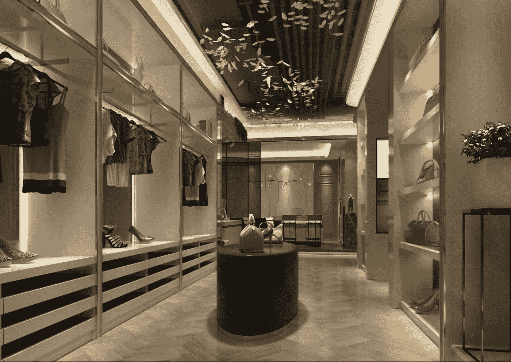
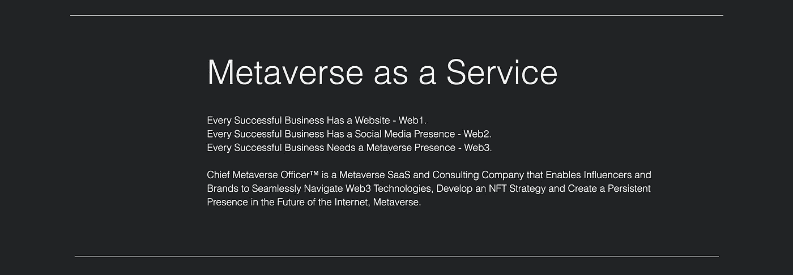
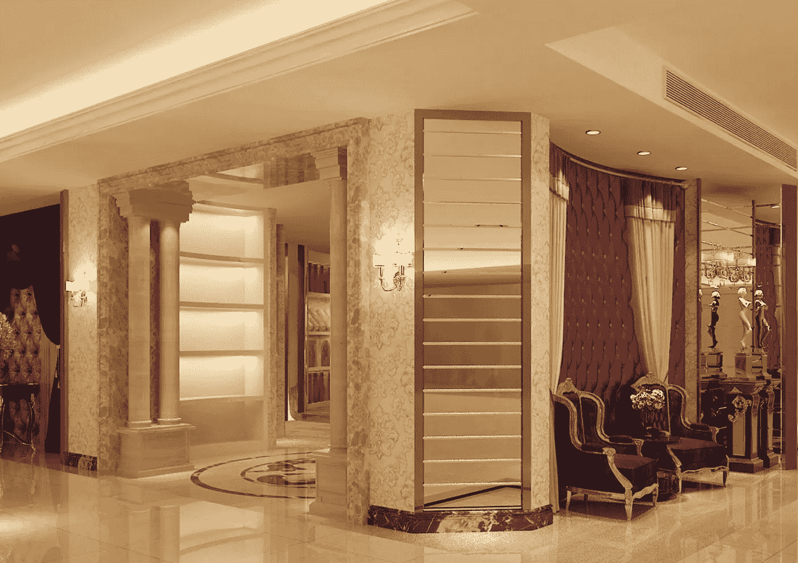
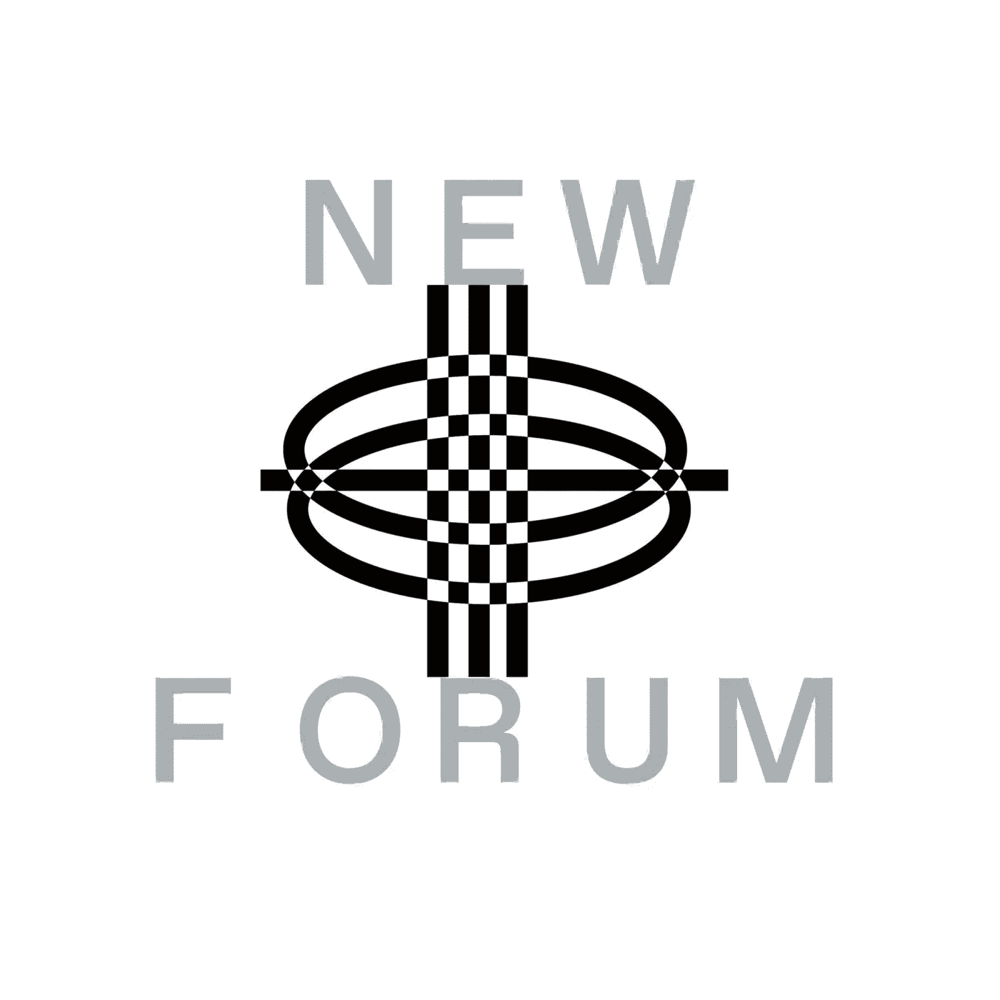

# 尼科法拉解释了为什么数字时尚和元宇宙为时尚产业提供创新的解决方案

> 原文：<https://medium.com/coinmonks/nico-fara-explains-why-digital-fashion-the-metaverse-offer-innovative-solutions-to-the-fashion-9fe89179d3f6?source=collection_archive---------31----------------------->

Nico Fara | Founder & Leader of The Fashion DAO & Chief Metaverse Officer

在这一集的 NEWFORUM 中，我们请到了时尚道的创始人兼首席元宇宙官 Nico Fara。我们就区块链和新兴技术的本质以及它们如何通过元宇宙和数字时尚提供更可持续、多样化、包容性和无障碍的时尚产业进行了深入的对话。她还分享了更多关于她与元宇宙首席执行官的工作以及他们对 Web3 的影响。

# Nico 首先向我们讲述了她的背景以及她为什么要进行 Web3 迁移？

> “我的背景是工科，学的是工科。我开始在这些领域工作了几年，这给了我解决问题的不同视角，所以我以批判的眼光看待不同的行业，我一直非常热爱的行业之一是时装业……”—Nico

她开创了自己的时尚事业，专注于利用技术改进流程和解决方案，以应对时尚界普遍存在的可持续发展挑战。她最初的想法是专注于创建虚拟试穿软件、尺寸建议和风格建议，以增强客户体验。她补充说，主要是被称为互联网电子商务平台的 Web1。

> “当我们与这些零售商和品牌合作时，我们意识到，通过疫情，他们对创建更多的虚拟商店或使用更多的数字时尚技术越来越感兴趣，因为他们可以更广泛地接触更多的观众，并且在所有事情上更高效，所以这是我们进入 Web3 领域的开始……”—Nico

Chief Metaverse Officer Creation

Nico 解释说，过渡到 Web3 是一种方式，可以让他们了解如何使用最新的技术以多种方式增强客户体验；

*   让虚拟环境和商店更容易被每个人全天候访问。
*   通过区块链技术赋能设计师和品牌，给他们 NFT 的选择；利用这些 NFT 忠诚度因素(在奢侈品行业，他们不提供折扣或免费产品，所以 NFT 有助于这一点，她解释道)。

Nico 认为，区块链和新兴技术似乎为时尚行业的大多数挑战提供了优秀的解决方案。

这些技术对可持续时尚产业的潜力促使她和她的团队通过为行业量身定制解决方案来填补空白。她补充说，这就是他们如何开始，但更侧重于元宇宙。

> “我们意识到，大多数元宇宙环境都是噱头和块状的；具体来说，它们达不到这些时尚品牌或奢侈品牌的期望，甚至消费者也不一定喜欢这些块状环境，然后另一部分是关于可访问性。我们如何确保我们有大量的采用或有更多的观众？它只来自于创造更符合他们口味的体验、环境和视觉，所以我们带来了不同的视角；让更多的女性和少数民族设计师和创作者参与进来，给他们工具，让他们从一个非常不同的角度创造这些类型的体验……”——Nico

Chief Metaverse Officer Creation

观看她的完整采访，了解更多关于 Nico 的背景和经历，以及为什么她受到启发，要在元宇宙创造虚拟且美观的环境和体验。Nico 甚至有一个她和她的团队建造的逼真的元宇宙作为她的背景。

她解释说，他们从一开始就建立了环境，创造了一个元宇宙时装秀，人们可以带着定制的头像进来。他们可以随心所欲地打扮自己的虚拟形象，化妆，做头发，做任何事情，然后像在真正的时装秀上一样四处走动，甚至更好。

> “因为没有任何限制，它是全球可访问的，它可以在任何时间任何地点，当你在这个环境中时，你可以在每个露台上行走；展示每一个设计师或品牌产品，当你在这种类似物理体验的环境中时，你将能够 360 度全方位地了解产品；靠近并查看信息，甚至购买它作为 NFT 就在那里……”—Nico

在这一集 NEWFORUM 中，听她深入解释她和她的团队在创新环境中创造的用户体验。

# 首席元宇宙官背后的使命和愿景是什么？

“主要的重点是给品牌、零售商和企业一个无缝进入元宇宙并吸引观众的选择。在 Web1 或互联网中，每个成功的企业或品牌都有一个网站，然后是 Web2 每一个好的品牌或企业都有社交媒体的存在，所以这是一个自然的演变。在 Web3 中，我们将拥有人们联系的地方，以及使用元宇宙存在的事物……”—Nico

根据 Nico 的说法，有些人认为分散管理是元宇宙唯一的选择，但她会说不

**为什么？**

> “因为类似于在亚马逊上销售一些商品，但你仍然可以拥有自己的网站，并控制他们在你的网站或社交媒体上的体验，你需要在元宇宙有类似的东西，这样我们就可以创造出来；有点像定制设计的白色标签和元宇宙环境的创建，企业和品牌基本上可以放在他们的网站上并与他们的观众互动，然后他们将对他们的数据和客户的体验有更多的控制，他们可以从中学习和迭代……”—Nico

Chief Metaverse Officer Creation

她总结了自己的想法，表示不仅仅是去别人的元宇宙。

Chief Metaverse Officer Creation

# 元宇宙、数字时尚和时尚产业的可持续发展之间有什么联系？

> “因此，创造数字时尚或数字服装的可持续性，其本身产生的排放比物理物品少 97%，因此，就其本身而言，这是我们可以实现的巨大进步……”—Nico

她表示，大多数人购买服装不一定是为了保暖等功能性或其他需求，而是主要是为了让他们感觉如何。尼科阐述了她的想法，这是关于他们如何让我们感觉和我们如何表达自己-我们试图传达的身份。

她认为，通过数字时尚，我们将能够更好地表达这些情感。

**为什么？**

> “因为你字面上没有任何限制，你可以穿火，你可以穿瀑布，你可以是任何东西，所以这种多功能性是强大的，然后你还有很多其他方面；就像你可以包容性别一样，你也可以包容身体……”—Nico

从尼科的角度来看，可持续发展只是数字时尚和元宇宙的好处之一。根据尼科的说法，他们可以；

*   即使是生产服装也要有成本效益，因为这样可以节省生产不必要的原型或样品的费用。
*   它减少了进入垃圾填埋场的垃圾量。
*   允许人们在不产生有害后果的情况下表达自己。
*   它赋予创作者权力，其他人可以自由表达自己。

Nico 深入探讨了这个话题，并从她的角度分享了为什么数字时尚和元宇宙是创新工具，为我们所知的时尚产业带来解决方案的许多原因。Nico 分享了建设元宇宙所需的技巧。她还讨论了她对时装业在多样性、包容性和可及性方面的差距的看法；并分享了新兴技术如何帮助弥合差距，就像我们在 Web3 中看到的那样。

她还谈到了 Web3 对创造者经济的影响。

在本期 NEWFORUM 节目中，我们很高兴听到她解释她的公司——元宇宙首席执行官——的愿景和使命。

[加入社区](https://twitter.com/newforum_nco)了解 [@NicoFara_](https://twitter.com/NicoFara_) 并在 web3 社区中发现其他创始人和远见者！

✨follow·尼科·法拉！✨

推特:[@尼科法拉 _](https://twitter.com/NicoFara_) LinkedIn: [尼科法拉](https://www.linkedin.com/in/nicofara/)网站:[www.chiefmetaverse.co](http://www.chiefmetaverse.co)

#新论坛#网络 3 #数字时尚#元宇宙#区块链#创造经济

爱 x 新论坛

# Twitter @newforum_nco

不和谐[@加入](https://discord.gg/DHepA4WTkN)

# 新论坛

[NEWFORUM](https://newforum.notion.site/newforum/Welcome-to-NEWFORUM-48f9661398ec4ec6a1af37fcc96dc926) 由 [Newcoin Foundation](https://newcoin.org/) 提供支持，专注于促进分散化社交应用的扩展，也称为 Social 3.0，形成一个生态系统和一个由远见者、创造者和投资者组成的社区。它为思想者提供了一个安全的交流、传播和分享思想的空间，以确保一个新网络的自觉和道德发展，嵌入关怀、自由和创造力的价值观。✨每周新集！在 [Twitter](https://twitter.com/newforum_nco) 、 [Newlife](https://newlife.io/) 、 [Youtube](https://www.youtube.com/channel/UCWvHyau1nIJBffmaaj6FmbQ) 和 [LinkedIn](https://www.linkedin.com/showcase/newforum/) 上关注我们，了解 web3 的更多信息，认识生态系统！加入生态系统[不和](https://discord.gg/DHepA4WTkN)！

> 加入 Coinmonks [电报频道](https://t.me/coincodecap)和 [Youtube 频道](https://www.youtube.com/c/coinmonks/videos)了解加密交易和投资

# 另外，阅读

*   [如何在 FTX 交易所交易期货](https://coincodecap.com/ftx-futures-trading) | [OKEx vs 币安](https://coincodecap.com/okex-vs-binance)
*   [CoinLoan 评论](https://coincodecap.com/coinloan-review) | [YouHodler 评论](/coinmonks/youhodler-4-easy-ways-to-make-money-98969b9689f2) | [BlockFi 评论](https://coincodecap.com/blockfi-review)
*   [XT.COM 评论](https://coincodecap.com/profittradingapp-for-binance) | [币安评论](https://coincodecap.com/xt-com-review)
*   [SmithBot 评论](https://coincodecap.com/smithbot-review) | [4 款最佳免费开源交易机器人](https://coincodecap.com/free-open-source-trading-bots)
*   [比特币基地僵尸工具](/coinmonks/coinbase-bots-ac6359e897f3) | [AscendEX 审查](/coinmonks/ascendex-review-53e829cf75fa) | [OKEx 交易僵尸工具](/coinmonks/okex-trading-bots-234920f61e60)