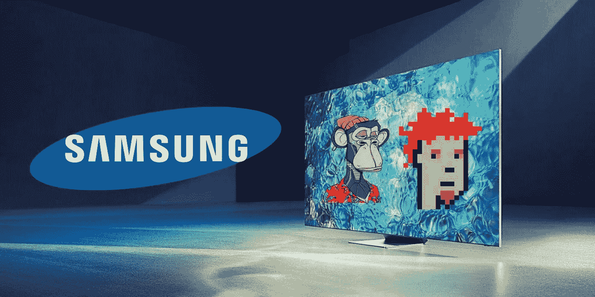

# Nifty gateway 与三星在 NFT 智能电视市场合作。

> 原文：<https://medium.com/coinmonks/nifty-gateway-collaborates-with-samsung-on-the-nft-marketplace-for-smart-tvs-e9fda61619da?source=collection_archive---------11----------------------->

NFT 已经成为一种像野火一样蔓延的趋势。它让人们惊叹不已，并进入了数字发明的世界。但是，如果你是一个密码爱好者，现在对你来说是个好消息。著名品牌**三星**现在已经跃入了密码世界。这个消息现在到处都可以听到。是吗？有什么新闻，他们现在在做什么？

## **公告**

在 1 月的第一周，三星宣布它正在投资不可替代的令牌(NFT)技术，并将在其电视中使用 NFTs。另一方面，三星当时没有提供很多细节，只是说它将是第一家提供具有 NFT 功能的智能电视系列的企业。

仅仅两个多月后，双子座拥有的 Nifty Gateway NFT 市场宣布与三星建立合作关系。“**建立第一个智能电视 NFT 平台**，用于浏览、获取和交换数字艺术和收藏品，”该合作的使命声明称。根据新闻发布会，Nifty Gateway 已经包含在三星 2022 年的优质电视产品线中，包括 QLED 和 Neo QLED 智能电视。

## **俏皮网关和三星**

[**Nifty Gateway**](https://niftygateway.com/)**NFT 平台将被纳入三星新的 2022 年高端电视系列，包括其 QLED 和 Neo QLED 电视，而三星的 Frame 和 Micro LED 电视的所有者可以下载 Nifty Gateway 应用程序来访问。**

**在一月份的 CES 贸易展上，三星首次宣布打算在其新电视中使用 NFT 技术。**

**用户将能够在 Nifty Gateway 平台上看到所有的艺术品，无论是来自 Nifty 自己的策划收藏还是从其他市场收购的 NFT。10 月份，除了自己精选的商品外，该平台开始向客户提供更多 NFT 商品选择。**

****有什么大不了的****

**NFT 已经遍布各地，每个人都试图拥有一个。领先的品牌已经进入了 NFTs 的世界，Nifty Gateway 是它的宿主。只是要清楚，启动你的 [**NFT 市场就像俏皮的网关**](https://bit.ly/3Lnwvnm) 一样来达成一笔大交易。这个过程很简单，雇用一个像 Nifty Gateway NFT 市场的市场开发公司，赚取大。**

> **加入 Coinmonks [电报频道](https://t.me/coincodecap)和 [Youtube 频道](https://www.youtube.com/c/coinmonks/videos)了解加密交易和投资**

# **另外，阅读**

*   **[CBET 点评](https://coincodecap.com/cbet-casino-review) | [库币 vs 比特币基地](https://coincodecap.com/kucoin-vs-coinbase)**
*   **[折叠 App 审核](https://coincodecap.com/fold-app-review) | [Kucoin 交易机器人](/coinmonks/kucoin-trading-bot-automate-your-trades-8cf0ca2138e0) | [Probit 审核](https://coincodecap.com/probit-review)**
*   **[如何匿名购买比特币](https://coincodecap.com/buy-bitcoin-anonymously) | [比特币现金钱包](https://coincodecap.com/bitcoin-cash-wallets)**
*   **[币安 vs FTX](https://coincodecap.com/binance-vs-ftx) | [最佳(索尔)索拉纳钱包](https://coincodecap.com/solana-wallets)**
*   **[比诺莫评论](https://coincodecap.com/binomo-review) | [斯多葛派 vs 3Commas vs TradeSanta](https://coincodecap.com/stoic-vs-3commas-vs-tradesanta)**