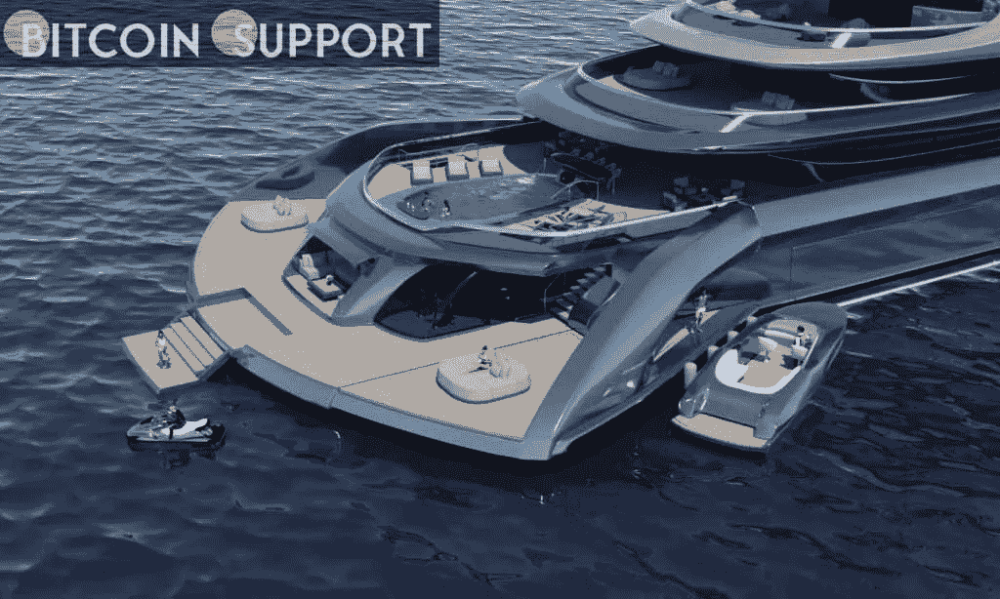

# 俏皮的消息:索拉纳 NFT 销售额达到 16 亿美元，看起来清洗交易发生，等等

> 原文：<https://medium.com/coinmonks/nifty-news-solana-nft-sales-surpass-1-6-billion-looksrare-wash-trading-and-more-2fa9392e9e94?source=collection_archive---------69----------------------->

**Visit our website:-** [**https://bitcoinsupports.com/**](https://bitcoinsupports.com/)

索拉纳的第一层区块链网络在 NFT 的总销售额方面已经攀升至历史第三位，仅次于 Ronin 和 Ethereum，这两家公司都占据主导地位。

CryptoSlam 数据证实 Solana 的整体销量已经达到里程碑。索拉纳在交易员中的受欢迎程度显而易见，因为它在过去 30 天的总销售额中排名第二，仅次于以太坊(ETH)。

虽然 Axie Infinity 游戏以太坊的 Ronin sidechain 以 40 亿美元的总销售额一直稳居第二，但该网络的每周和每月计数受到了最近 Ronin bridge 黑客攻击的影响。虽然以太坊以 210 亿美元的总销售额遥遥领先，但 Solana 正在缩小与第二名的差距，同时扩大与竞争对手的差距。

随着 NFT 市场 OpenSea 本月整合 Solana，Solana 的交易量预计将会增加。

**这似乎是一桩洗盘交易。按交易量计算，LooksRare 是 NFT 第二大市场，它的大部分流量似乎仍是通过 wash 交易产生的。

彭博 4 月 5 日报道，NFT 追踪公司 CryptoSlam 的数据表明，约 180 亿美元，即该平台整个交易量的 95%，是通过 wash 交易产生的。

当交易平台的操作者或用户执行一系列来回交易，以人为地提高看似有机的交易量时，就会出现洗盘交易。有了 LooksRare，由于平台的奖励系统，交易者因清洗交易而获得奖励。

在 LooksRare 上押代币的投资者，按照市场交易量的比例赚取 LOOKS 代币和包装乙醚(WETH)。大量的 wash 交易似乎掩盖了整个 NFT 行业的下滑，因为 Dune Analytics 的数据显示，自 1 月份以来，领先的 NFT 市场 OpenSea 的交易量每月都在下降。然而，根据 DappRader 高级分析师 Pedro Herrera 的说法，LooksRare 上的有机交易正在逐渐增加。

**杰·鲁正在出售 Fyre 艺术品。说唱歌手杰·鲁卖出了一幅来自臭名昭著的 Fyre 事件的画作的无框版本。带有 fyre 节会徽和 Fyre 字样的 NFT 在 Flipkick NFT 拍卖平台上拍出了 12.2 万美元。

[https://twitter.com/jarule/status/1374749904438956038](https://twitter.com/jarule/status/1374749904438956038)

买家将同时收到 NFT 和实际画作。杰·鲁目前正在 Flipkick 上拍卖另外四件 Fyre festival 艺术品，其中一件起价为 60 万美元。制片人比利·麦克法兰想要在 2017 年推出一个热带岛屿派对。他委托包括杰·鲁在内的一些有影响力的人和歌手制作宣传内容。然而，电影节辜负了人们的期望——甚至没有遵守提供适当设施的基本承诺——麦克法兰被迫支付数百万美元的罚款，因为欺骗了购票人。

**世界上最昂贵的 NFT**

元宇宙游艇公司 Cyber Yachts 想出售世界上最昂贵的 NFT，其中包括一艘名为“Indah”的虚拟 120 米巨型游艇，售价高达 4 亿美元。NFT 不会向客户提供完整的价值主张，因为购买者还会收到一艘基于相同设计、由知名豪华游艇制造商制造的 394 英尺长的超级游艇。

NFT 游艇将是安装在季风区块链公司 NFT 平台上的实体游艇的精确虚拟复制品。

**其他有用信息**

莱杰已经与元宇宙平台和 NFT 游戏《沙盒》联手，鼓励虚拟世界教育。根据 Ledger 首席体验官 Ian Rodgers 的说法，该联盟也可能增加沙盒中的安全性。NFT 公司的开发商 Skey Network 已经启动了一轮 500 万美元的战略投资，以进一步扩展 Go2NFT 平台。这个平台将为寻求保护其产品免受假冒的企业提供 NFT 解决方案，假冒产品占全球贸易的 2.5%。

**访问我们的网站:-**[**https://bitcoinsupports.com/**](https://bitcoinsupports.com/)

**免责声明:以上为作者观点，不应视为投资建议。读者应该自己做研究。******

> 加入 Coinmonks [电报频道](https://t.me/coincodecap)和 [Youtube 频道](https://www.youtube.com/c/coinmonks/videos)了解加密交易和投资

# 另外，阅读

*   [瓦济里克斯 NFT 评论](https://coincodecap.com/wazirx-nft-review)|[Bitsgap vs Pionex](https://coincodecap.com/bitsgap-vs-pionex)|[Tangem 评论](https://coincodecap.com/tangem-wallet-review)
*   [如何使用 Solidity 在以太坊上创建 DApp？](https://coincodecap.com/create-a-dapp-on-ethereum-using-solidity)
*   [币安 vs FTX](https://coincodecap.com/binance-vs-ftx) | [最佳(SOL)索拉纳钱包](https://coincodecap.com/solana-wallets)
*   [如何在 Uniswap 上交换加密？](https://coincodecap.com/swap-crypto-on-uniswap) | [A-Ads 审查](https://coincodecap.com/a-ads-review)
*   [加密货币储蓄账户](/coinmonks/cryptocurrency-savings-accounts-be3bc0feffbf) | [YoBit 评论](/coinmonks/yobit-review-175464162c62)
*   [Botsfolio vs nap bots vs Mudrex](/coinmonks/botsfolio-vs-napbots-vs-mudrex-c81344970c02)|[gate . io 交流回顾](/coinmonks/gate-io-exchange-review-61bf87b7078f)