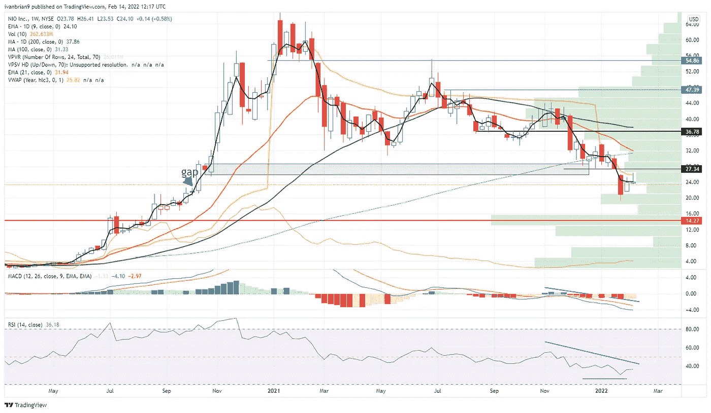

# NIO 股票新闻和预测:NIO 继续下跌，因为避险心态持续存在

> 原文：<https://medium.com/coinmonks/nio-stock-news-and-forecast-nio-continues-to-fall-as-the-risk-off-mentality-persists-8c605b898fdd?source=collection_archive---------38----------------------->

Source photo TradingView

周一，NIO 股票继续下跌，因避险情绪领跌。另外两只电动汽车股票 Rivian 和 Lucid 也遭受了重大损失。
行业已经失宠，如果宏观经济原因变得过于主导，这种情况可能会持续下去。