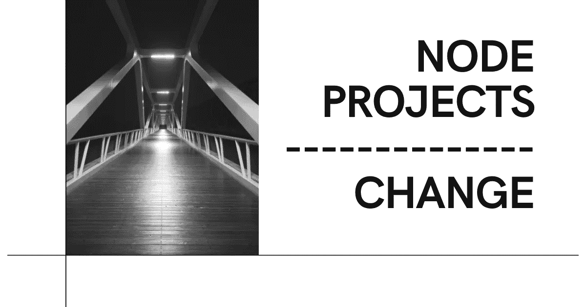

# Node 项目创始人遗漏了一些东西…而且是很大的东西。

> 原文：<https://medium.com/coinmonks/node-project-founders-are-missing-something-and-its-big-3bca13d70c1?source=collection_archive---------44----------------------->

我像 2021 年的每个人一样，用道的…反射令牌…节点项目…赚钱又赔钱

你明白了。

我赔钱的每个项目都有一些重大的潜在问题。

1.  价值主张是他们的固有标记。

声称你将使用庞兹经济学直到你能为你的代币创造足够的效用是**大胆**和**不合理**。我不会把什么项目叫出来，但是很多投资人还是在资助这样的项目。

修正:项目应该有一个项目愿景和实现该愿景的详细行动步骤。(Z=X+Y)

2.你正在创建一个企业

开发+营销不等于**和牛**。如果你想建立一些有意义的东西，它需要建立在坚实的基础上。

这意味着无聊的东西..会计、税务策略、法规遵从性等。

这是发布前或发布后需要解决的众多问题之一。把这个弄对了还是 **NGMI。**

3.改变文化

我要在这里取暖。

我相信那 1%的长期项目将会是 doxxed 团队。

你能想象如果一群匿名人士经营大通银行吗？他们不可能成功的。

如果你想让它长期存在，dox。当规则之锤敲响的时候，不固定的队伍就完蛋了。

如果你觉得 doxxing 不舒服，你需要改变一些东西。

结论。

通常这些项目感觉像是抢钱，我希望改变这种说法。我们有很多工作要做，但我对 node/nft 领域的未来感到兴奋。

关注我— [Braden Bennett](https://medium.com/u/94efe158450f?source=post_page-----3bca13d70c1--------------------------------) 从我建议的项目中获得更多见解

谢了。

> *加入 Coinmonks* [*电报频道*](https://t.me/coincodecap) *和* [*Youtube 频道*](https://www.youtube.com/c/coinmonks/videos) *了解加密交易和投资*

# 另外，阅读

*   [有哪些交易信号？](https://coincodecap.com/trading-signal) | [Bitstamp vs 比特币基地](https://coincodecap.com/bitstamp-coinbase) | [买索拉纳](https://coincodecap.com/buy-solana)
*   [ProfitFarmers 回顾](https://coincodecap.com/profitfarmers-review) | [如何使用 Cornix Trading Bot](https://coincodecap.com/cornix-trading-bot)
*   [十大最佳加密货币博客](https://coincodecap.com/best-cryptocurrency-blogs) | [YouHodler 评论](https://coincodecap.com/youhodler-review)
*   [MyConstant 点评](https://coincodecap.com/myconstant-review) | [8 款最佳摇摆交易机器人](https://coincodecap.com/best-swing-trading-bots)
*   [MXC 交易所评论](/coinmonks/mxc-exchange-review-3af0ec1cba8c) | [Pionex vs 币安](https://coincodecap.com/pionex-vs-binance) | [Pionex 套利机器人](https://coincodecap.com/pionex-arbitrage-bot)
*   [我的加密副本交易经历](/coinmonks/my-experience-with-crypto-copy-trading-d6feb2ce3ac5) | [比特币基地评论](/coinmonks/coinbase-review-6ef4e0f56064)