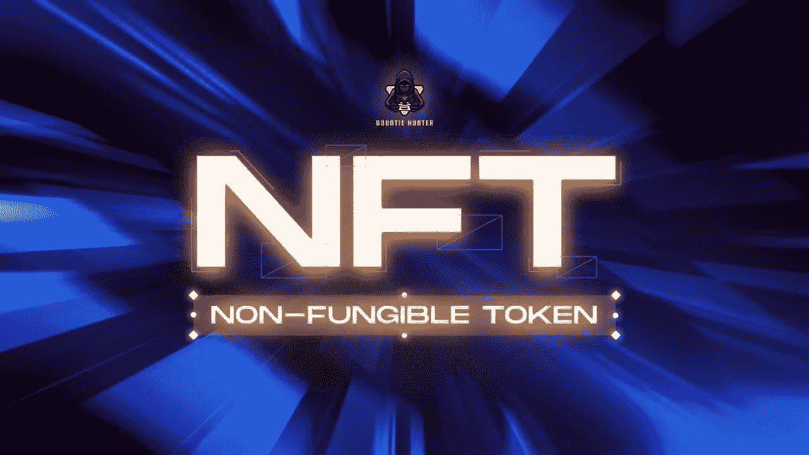

# 不可替代令牌(NFT):你需要知道的一切——边界百科

> 原文：<https://medium.com/coinmonks/non-fungible-token-nft-all-you-need-to-know-bountiepedia-b07cc01e1e4b?source=collection_archive---------41----------------------->

*不可替代令牌，那是什么？NFT 为什么能受欢迎？值得拥有一个 NFT 吗？*

最近，NFT 已经成为全世界互联网用户的热门话题，甚至最近 Twitter、脸书和 Instagram 也宣布将为 NFT 交易创建一个市场。目前，脸书及其姐妹公司正在开发一项功能，允许用户将 NFT 作为个人资料图片的一部分。也许你们中的一些人还不知道 NFT 是什么，所以我们将向你们解释 NFT。

**什么是 NFT？**

NFT(不可替代的代币)是一种不可替代的代币，其中在该 NFT 上拥有的每一项资产都是唯一的，并且每一个代币都是不同的，因此即使该对象是真正虚拟的/数字的，每一个 NFT 都可以以受约束或受限制的方式出售。不可替换的令牌是连接到区块链的数字资产，这些数字资产可以是图像、声音、视频、动画文件，

为了能够理解不可替换的令牌，我们应该理解可替换令牌的概念。可替代的是具有相同价值的东西。可替代资产可以交换，因为这些资产具有相同的价值。例如，你有一个 10 美元的美元，然后你把它换成两个 5 美元的，你拥有的物品已经改变了，但仍然有相同的价值。

与可替代物不同，不可替代物是不能交换的东西。这个不可替代的概念本身成为一个经过验证的独特身份。不可替代令牌的概念本身与身份有关。

**NFT 是如何工作的？**

就像有证书并受国家保护的房子一样，NFT 本身也受到区块链系统的保护，该系统维护其所有权。NFT a 是加密货币进化的结果，但 NFT 本身具有不同于比特币或以太坊的功能，具有价值，可以兑换。

如果一个拥有 NFT 的人把他的 NFT 卖给了另一个用户会怎么样？要知道 NFT 本身就是一个被区块链系统监控的对象，但是如果 NFT 的所有权从 A 转移到 B，那么所有的计算机都会在所有权上达成一致，B 对 NFT 的所有权已经被区块链系统认可

**利弊。NFT 的**

使用 NFT 或区块链作为一个整体的第一个后果是技术的环境成本。环境是最近争论的热门话题。任何进入以太坊区块链的记录都需要大量的计算，这需要使用大量的能量。

因此，NFTs 和其他区块链资产的广泛交易不一定是环境友好的过程。事实上，剑桥大学最近的一项研究表明，从环境角度来看，几乎所有与区块链有关的事情都是高度不可持续的，因为它们消耗了大量的能源。

现在把 NFT 作为数字投资之一仍然被认为是一项有风险的投资。NFT 的价格受用户需求的影响，所以如果需求大，NFT 的价格可能会很高。然而，如果需求相当低，那么 NFT 的价格将会贬值，甚至由于流动性较低而无法交易为法定货币。

安全总比后悔好，因此在购买 NFT 之前，你必须能够理解每个 NFT 项目本身的概念、路线图和社区。做自己的研究(DYOR)是必须的，否则你会失去所有的投资。

尽管 NFT 带来了种种后果，但也有支持者将 NFT 视为一件艺术品，一件可以解决很多问题的收藏品。创建 NFT 是为了给艺术家提供一个机会，让他们可以通过数字或在线方式出售他们的作品，这些作品将与以太坊等数字货币进行交易。每一个艺术家都会因为每一个 NFT 被交易而得到报酬。循环无法停止，或者会永远持续下去。

从环境的角度来看，NFT 也可以被看作是一项技术创新，可以减少纸张的使用。因为纸是由经过加工的树木制成的，所以通过节约纸张，我们也将减少为了造纸而必须砍伐的树木数量。

大多数 NFTs 爱好者相信 NFT 的未来。NFT 的使用仍处于发展阶段，不久将会成熟。NFT 用法的圣杯之一是游戏 NFT。而游戏玩家可以拥有自己的资产，并可以通过玩游戏和投资他们钱包中的数字资产来创造自己的收入。有这么多的加密项目有一个坚实的团队，也有良好的 PVE 机制。这些游戏将成为加密游戏的新圣杯。查看我们的网站，了解更多关于即将到来的新的潜在项目的信息。

来源:[https://www . msnbc . com/opinion/bit coin-nfts-other-crypto-fads-is-destroying-our-planet-n 1261139](https://www.msnbc.com/opinion/bitcoin-nfts-other-crypto-fads-are-destroying-our-planet-n1261139)

— — — — -

如果事情没有让你清楚，不要犹豫，通过我们的社交媒体渠道问我们

附注:我们不咬人

[不和](https://t.me/bountiehunterofficial) | [电报](https://t.me/bountiehunterofficial) |推特| [脸书](https://www.facebook.com/bountiehunter.io/?ref=pages_you_manage) | [Instagram](https://www.instagram.com/bountiehunter.io/) | [网站](https://bountiehunter.io/)