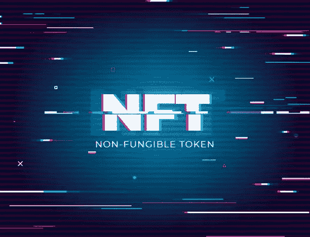

# 不可替换的令牌(NFT)

> 原文：<https://medium.com/coinmonks/non-fungible-tokens-nft-14288590254e?source=collection_archive---------7----------------------->

**简要概述**

“可替换的”一词意味着同样可替换或可交换。例如，我从你那里收集一张 100 元的钞票，然后再给你一张 100 元的钞票。你不会有被骗的感觉，因为两张纸币携带的价值是一样的。这就是可替代的含义。

另一方面，不可替代意味着不可交换。不可替代的物品不能被其他物品替代，它是独一无二的。例如，蒙娜丽莎的画是一件独特的艺术品。除了山寨和假货，没有别的了。任何独一无二的物品都是不可替代的。绘画、素描、音乐、电影等。可以被称为不可替代的项目。

把它放在一起，不可替代的代币(NFT)是区块链上的独特物品。

以太坊是区块链最受欢迎的智能合约。这使得它成为 NFT 兴旺发展的热门场所。随着更多智能合约区块链的推出，我们将在那里看到更多的活动。

NFT 将于 2021 年开始流行。2021 年 3 月，Vignesh Sundaresan 以 6900 万美元买下了一幅名为“Everydays:The First 5000 Days”的 NFT 作品。这是迄今为止 NFT 作品的最高价格。这也有助于 NFTs 的普及。

截至 2021 年底，整个 NFT 市场的价值为 410 亿美元

**如何从 NFTs 中获利**

**给创作者**

这些人创作音乐、艺术品和视频。他们能够在 NFT 市场上创作(上传)他们独特的作品，如 OpenSea、Rarible、BinanceNFT 等。

铸造之后，他们可以设定 NFT 的销售价格。NFTs 可以定价为固定价格或拍卖价格。固定价格意味着设定 NFT 的销售价格。对于拍卖定价，最终售价将由投标过程决定。创造者只会设定一个起始价格，人们会在特定的时间内出价。最后出价最高的人将获得 NFT。

对于这两种定价方法，创作者需要考虑造币费。铸币费是对处理任何 NFTs 交易所用能源的收费。就像我前面提到的，以太坊有最高的 NFT 活动，然而，系统通常是拥挤的，导致高昂的燃气(交易)费用。这影响了区块链的整体活动。交易费用太贵，有时甚至超过用户想要转账的金额。这导致了第二层扩展解决方案的产生，如 Polygon Network、Arbitrum、Optimism 等。这也是以太坊计划迁移到创建以太坊 2.0 的风险证明的部分原因。

OpenSea 是 NFT 最大的市场，位于以太坊。铸造费至少在 100 美元左右。支付这笔费用并不保证 NFT 将被铸造。这和其他费用一起提高了创作者的准入门槛，特别是在像尼日利亚这样的低收入国家。除非创造者有相当大的资本，否则他们无法铸造他们的 NFT。

BinanceNFT 是一个很好的选择。煤气费很低，因为它不在以太网上。BinanceNFT 位于币安智能链(BSC)上。造币费是 0.005 BNB。这相对于 OpenSea 真的很便宜。但 BinanceNFT 在推出平台前，对创作者进行了预注册和筛选。他们目前不允许新的创造者加入。这是一个主要的缺点，不像 OpenSea 是完全分散的，任何人都可以铸造一个 NFT。

OpenSea 目前正在研究让创作者免费制作 NFT 的方法。

除了从销售价格中获利，创作者还可以在他们的 NFT 中设定提成比例。这意味着，在 NFT 每转手一次，他们都将继续赚取一定比例的销售价格。

那是从造物主的角度。

**对于非创作者**

这适用于没有任何艺术技能的人——你不会画画、画画、唱歌、设计等等。你仍然可以从交易 NFT 中获利。

像投资加密货币一样，交易和投资 NFT 需要进行研究，检查某些指标，以确定 NFT 是否具有未来潜力。

这些指标需要对任何投资 NFT 的人进行检验——这适用于创造者和非创造者。这就是如何为非功能性测试做你自己的研究(DYOR)。

这个方法或框架是由硬币局的盖伊在 [YouTube](https://youtu.be/f12cCCl4tus) 上开发的。以下是需要注意的事项:

1.艺术

2.创始团队

3.路标

4.社区

5.交易指标

**1。艺术**

现在，尽管艺术品的估价看起来很不合理，但实际上并非如此。有某些因素决定了一件艺术品是否有价值。如果艺术品被非理性地估价，那么几乎任何东西都可以被高度估价。大多数卖出数百万美元的艺术品，如梵高、毕加索等，都有某些使它们变得有价值的东西，这同样适用于非艺术珍品。

对于 NFT 来说，稀有才是王道。例如，Bored Apes Yacht Club (BAYC)已经让 Bored Apes NFTs 拥有 172 种人工智能生成的独特特征，这些特征都是单独分配的。这也是无聊猿如此值钱的原因之一。

这就是为什么 NFT 不一定“漂亮”，有些可能看起来很恶心但却很有价值。去年，编号为 8585 的 NFT 无聊猿以 270 万美元的价格售出，成为 BAYC 中最贵的一只。阿姆最近花 46 万美元买了一只无聊的猿 NFT。

检查稀有和独特性状的数量非常重要。如果一个收藏有大量的非功能性转录因子，但只有少量的独特和罕见的性状，这是不好的。例如，一个收藏中有 20，000 个只有 20 种独特和稀有性状的 NFT，这意味着收藏中很少或没有稀有的 NFT。

收藏品中独特和稀有的特征越多，整个收藏品的价值就越高。某些 NFT 比其他的更有价值，因为它们有某些稀有的特性，这些特性增加了它们的价值。请记住，这些 NFT 是由人工智能随机生成的，算法随机为 NFT 分配性状，所以买家必须在寻找中获得这些有价值的 NFT。

对于非功能性思维来说，很难发现稀有性。 [Rarity.tools](http://Rarity.tools) 是一个对 NFT 收藏品的稀有度进行排名的网站。OpenSea 还在每个 NFT 的属性部分展示了各种独特特征的稀有性。

**2。创始团队**

NFT 系列背后的团队也非常重要。它们在决定收藏品的价值方面起着巨大的作用。例如，Matt Furie 是后来成为迷因(在尼日利亚，同志迷因)的卡通《佩佩青蛙》的创作者。2021 年 8 月，他在 OpenSea 上发布了他的悲伤青蛙区收藏，其中有 7000 张青蛙图片。根据 Vice 的数据，在一周内，Sad Frogs District 的交易量达到了 400 万美元，每只 Sad Frogs 的乙醚价格中位数为 450 美元。

没有创始人的信誉，这种水平的交易活动和高估值是不可能实现的。

这是加密货币领域可接受的一般规则，然而，BAYC 背后的团队完全是匿名的。他们互相用奇怪的名字称呼对方。它似乎仍然为他们工作，BAYC 是今天最有价值的收藏之一

**3。路线图**

加密货币的项目路线图包含项目的各个阶段、里程碑和时间表。它本质上包含了项目生命周期。

路线图在非功能性测试中并不常见。CryptoKitties 是首批在以太坊铸造的 NFT 系列之一，它于 2017 年铸造，用于 ERC-721 的实验。密码朋克的情况也是如此

BAYC 改变了这种说法，对于 NFT 的项目来说，路线图比以往任何时候都更加重要。NFT 的路线图将包含这些 NFT 的未来目标、合作关系、令牌投放和效用。

阅读你打算购买的 NFT 系列的路线图是很重要的。它还展示了该项目打算如何推动采用和改善该系列的形象。某些行动，如为现有持有人提供免费的 NFT、为长期持有人提供专属会员资格、使用发射台和 NFT 站，可以增加项目未来的价值。

最后，需要注意的是路线图只是一个故事——即使是骗局项目也会创建路线图。直到达到里程碑，这样的路线图才变得可靠。

**4。社区**

这是投资 NFT 收藏品之前要考虑的另一个因素。考察一个项目在网上的参与程度很重要，尤其是在 Twitter、Discord 和 Telegram 等平台上。具有较高关注度和参与度的项目通常是项目整体价值的良好迹象。

这是因为这表明在收藏中对 NFT 有很高的需求，这为销售 NFT 提供了一个市场，因为许多人愿意购买。简而言之，它提供了良好的流动性

一个几乎没有社区的 NFT 收藏意味着很少人会去卖那些非功能性食物。

**5。交易指标**

这是指在 NFT 集合中发生的交易水平。高交易量通常是一个好迹象，它表明高水平的流动性以及高交易活动。

重要的是要确保供应与持有者的数量保持平衡——一个良好的供需比。供给侧通常是固定的；BAYC 有 10，000 个 NFT，CryptoKitties 有 200 万个 NFT。

为了检验供求比率，你需要检验持有者的数量来确定这个比率。在 OpenSea 上，BAYC 拥有 10，000 个 NFT 和 6，200 个所有者，这使得供需比达到每个所有者 1.61 个 NFT。这很好，因为有人卖掉了他们所有的非艺术藏品，这不会影响整个 NFT 收藏的价值。

相比之下，如果一个集合有 10，000 个 NFT，有 200 个所有者，这导致每个所有者的供需比为 50。这显然很糟糕，一个卖家可能会降低整个收藏的价值。

这些是你在冒险交易或投资 NFTs 之前需要了解的基本原则，尤其是如果你想长期盈利的话。同样，像任何其他加密货币一样，投资 NFTs 的系统方法非常重要。

当我做 NFT 空间的概述时，有很多事情我没有提到，我没有提到像 Axie Infinity，Sandbox 等 NFT 游戏。我也没有谈到元宇宙的非功能性翻译。

NFT 空间仍然相对较新，它不仅将彻底改变艺术领域，还将站在元宇宙崛起的最前沿。据 MorningBrew 报道，2021 年，NFT 的总销售额(4100 万美元)几乎与全球销售额(5000 万美元)持平。

这是巨大的。随着 NFTs 在元宇宙找到更多的使用案例，预计会有更大的增长

> 加入 Coinmonks [电报频道](https://t.me/coincodecap)和 [Youtube 频道](https://www.youtube.com/c/coinmonks/videos)了解加密交易和投资

# 另外，阅读

*   [BlockFi vs Celsius](/coinmonks/blockfi-vs-celsius-vs-hodlnaut-8a1cc8c26630)|[Hodlnaut 点评](/coinmonks/hodlnaut-review-best-way-to-hodl-is-to-earn-interest-on-your-bitcoin-6658a8c19edf) | [KuCoin 点评](https://coincodecap.com/kucoin-review)
*   [Bitsgap 审查](/coinmonks/bitsgap-review-a-crypto-trading-bot-that-makes-easy-money-a5d88a336df2) | [Quadency 审查](/coinmonks/quadency-review-a-crypto-trading-automation-platform-3068eaa374e1) | [Bitbns 审查](/coinmonks/bitbns-review-38256a07e161)
*   [密码本交易平台](/coinmonks/top-10-crypto-copy-trading-platforms-for-beginners-d0c37c7d698c) | [Coinmama 审核](/coinmonks/coinmama-review-ace5641bde6e)
*   [印度的加密交易所](/coinmonks/bitcoin-exchange-in-india-7f1fe79715c9) | [比特币储蓄账户](/coinmonks/bitcoin-savings-account-e65b13f92451)
*   [OKEx vs KuCoin](https://coincodecap.com/okex-kucoin) | [摄氏替代品](https://coincodecap.com/celsius-alternatives) | [如何购买 VeChain](https://coincodecap.com/buy-vechain)
*   [币安期货交易](https://coincodecap.com/binance-futures-trading)|[3 commas vs Mudrex vs eToro](https://coincodecap.com/mudrex-3commas-etoro)