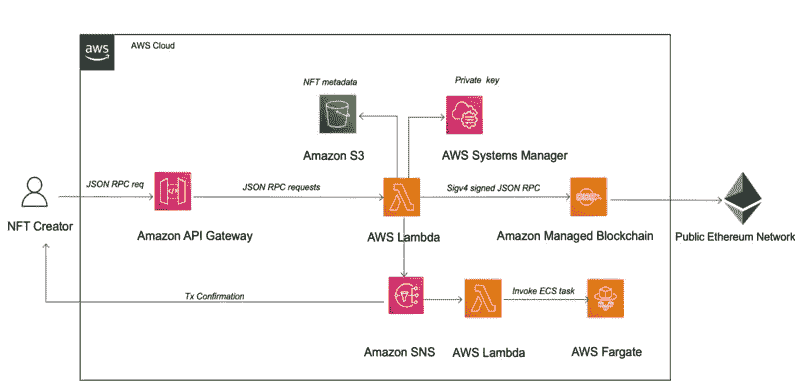
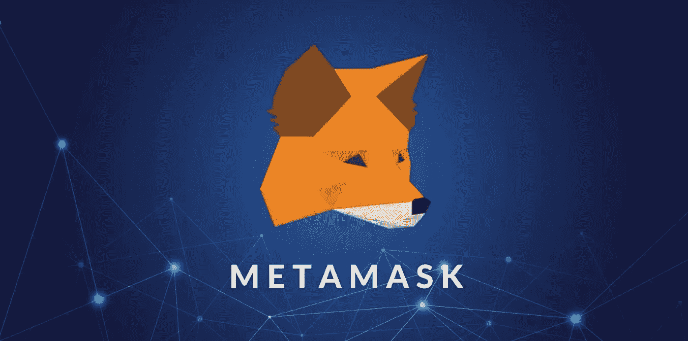
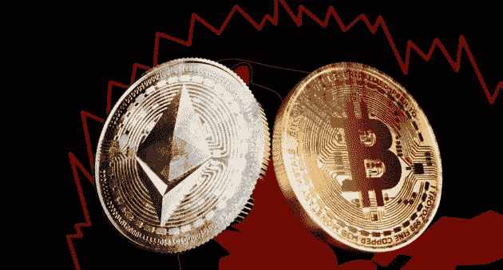

# 不可替代代币(NFT)是最新成为主流的加密货币现象？？！

> 原文：<https://medium.com/coinmonks/non-fungible-tokens-or-nfts-are-the-latest-cryptocurrency-phenomenon-to-go-mainstream-bc8b2cb7a563?source=collection_archive---------37----------------------->

# 那么什么是 NFT 呢？

用最简单的话来说， **NFTs** 将数字艺术作品和其他收藏品转化为独一无二、可验证的资产，便于在**区块链交易。**
是数字**数据库**支撑**比特币**以太坊等加密货币**。**
与非金融资产不同，这些资产是可替代的，这意味着它们可以被另一个相同价值的资产替代或交换，就像一美元钞票一样。

# NFT 是如何工作的？

NFTs 存在于区块链上，这是一种记录交易的分布式公共分类账。你可能最熟悉的是区块链，它是使加密货币成为可能的基础过程。

一个 **NFT** 由代表有形和无形项目的数字对象创建或“铸造”,包括:

艺术/gif/视频和体育集锦/收藏品/虚拟化身和/视频游戏皮肤/设计师运动鞋/音乐。

# 如何购买 NFTs？

这里有一个购买 NFT 的分步指南。

[https://d2908q01vomqb2.cloudfront.net/887309d048beef83ad3eabf2a79a64a389ab1c9f/2021/12/13/DBBLOG-1903-image001.png](https://d2908q01vomqb2.cloudfront.net/887309d048beef83ad3eabf2a79a64a389ab1c9f/2021/12/13/DBBLOG-1903-image001.png)

1-在加密交易所购买**以太坊**(如比特币基地环球)

2-将您的加密转移到加密钱包。比特币基地等一些交易所有内置的钱包功能，在你开户时提供，但其他选项包括专用钱包，如 T21 meta mask。

3-将您的钱包连接到 NFT 市场。

一旦连接上，你就可以开始浏览市场的 NFT 收藏并进行购买。

# **NFT 区块链&项目**

# **下篇见！^^**

快乐阅读，

> 加入 Coinmonks [电报频道](https://t.me/coincodecap)和 [Youtube 频道](https://www.youtube.com/c/coinmonks/videos)了解加密交易和投资

# 另外，阅读

*   [加密副本交易平台](/coinmonks/top-10-crypto-copy-trading-platforms-for-beginners-d0c37c7d698c) | [五大 BlockFi 替代方案](https://coincodecap.com/blockfi-alternatives)
*   [CoinLoan 审核](https://coincodecap.com/coinloan-review)|[Crypto.com 审核](/coinmonks/crypto-com-review-f143dca1f74c) | [火币保证金交易](/coinmonks/huobi-margin-trading-b3b06cdc1519)
*   [拜比特 vs 币安](https://coincodecap.com/bybit-binance-moonxbt)|[stealthexreview](/coinmonks/stealthex-review-396c67309988)|[Probit Review](https://coincodecap.com/probit-review)
*   [顶级付费加密货币和区块链课程](https://coincodecap.com/blockchain-courses)
*   [CBET 评论](https://coincodecap.com/cbet-casino-review) | [库科恩 vs 比特币基地](https://coincodecap.com/kucoin-vs-coinbase) | [拜比特 vs 比特币基地](https://coincodecap.com/bybit-vs-coinbase)