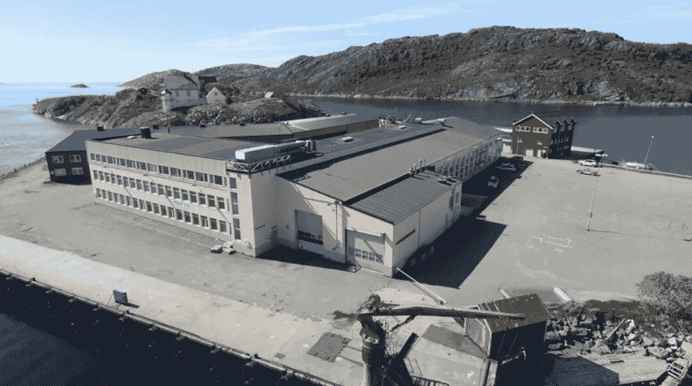

# 挪威是比特币开采的“绿色绿洲”，占全球哈希比率的 1%以上

> 原文：<https://medium.com/coinmonks/norway-is-a-green-oasis-for-bitcoin-mining-accounting-for-over-1-of-the-worldwide-hash-rate-3fb782df887c?source=collection_archive---------32----------------------->

**Visit our website:-** [**https://bitcoinsupports.com/**](https://bitcoinsupports.com/)

挪威的采矿资质令人印象深刻:这个欧洲小国使用 100%的绿色可再生能源，拥有 0.77%的比特币杂凑率。根据 Arcane Research 的一份报告，挪威的比特币(BTC)开采 100%可再生，并且“欣欣向荣”

“可再生能源的繁茂避难所，”解说员说。挪威产生了全球近 1%的哈希率，并且几乎完全由水力发电提供燃料。根据剑桥比特币电力消费指数(Cambridge bit coin Electricity Consumption Index)和 Coinshares 的统计数据，分析显示，挪威贡献了全球比特币总交易量的 0.77%。挪威的 500 万人口贡献了其中的十分之一，即世界人口的 0.07%。重要的是，根据挪威水资源和能源局(NVE)的数据，挪威的电力组合是 100%可再生的，其中 88%是水力，10%是风力。因此，挪威的比特币矿工完全依赖“绿色”能源。

“对于挪威的电力结构，比特币矿工应该知道的最重要的一点是，挪威的电力是 100%可再生的，而且这种情况将会持续下去。”Arcane Research 的分析师、该报告的作者贾兰·梅勒鲁德(Jaran Mellerud)告诉记者:“挪威北部的采矿活动大幅增长，那里有丰富的闲置水电，为矿工提供了难以置信的廉价和 100%可再生的电力。”

“在寒冷的北方，热量尤为珍贵，这使得采矿活动产生的多余热量得到再利用，这对行业和社会都有好处。”

自 2018 年以来，德国企业 Bluebite 已经在挪威北极地区运营数据中心。该公司首席执行官康纳·戴维斯(Conor Davis)告诉记者，该公司的一个数据中心在一个以前被称为“拉普兰地狱”的地区开采比特币，因为那里“气氛令人不快且不友好”。

**Visit our website:-** [**https://bitcoinsupports.com/**](https://bitcoinsupports.com/)

比特币采矿的引入，利用了挪威廉价、闲置和可再生的资源，重振了这个以前以铜矿开采闻名的地区。事实上，戴维斯告诉我们，午夜太阳之地提供了“低价能源、电力的二次应用、100%可持续能源、免费冷却，而且它是一个人们可以从新工作中受益的地方。”Bluebite 现在正在研究如何利用比特币采矿产生的热量来垂直种植草莓，或者向当地居民供热。尽管如此，戴维斯告诉记者，因为挪威很小，对“中国投资者”来说不太受欢迎，它的规模和范围使它“不适合所有人”尽管该研究声称“挪威矿工不是最大的”，但挪威仍然是比特币采矿的理想地点，因为它的可再生能源证书以及比特币采矿产生的热量的大量有趣和新颖的二次利用。

**Visit our website:-** [**https://bitcoinsupports.com/**](https://bitcoinsupports.com/)

世界各地的比特币制造者正在想方设法利用比特币开采产生的“废热”。一位比特币玩家用 S9 加热他的露营车，而一家荷兰公司用 Satoshi 的创新来种植比特币花。Kryptovault 的首席执行官 Kjetil Hove Pettersen 告诉记者，由于比特币矿工的热度，他们希望“开始海藻作业”，以补充他们现有的木材干燥过程。根据 Pettersen 的说法，“我们 99%的电能转化为热能”，这对于二次利用来说是很棒的。

**Visit our website:-** [**https://bitcoinsupports.com/**](https://bitcoinsupports.com/)

虽然“强大的神经和信念在这个空间忍受艰难时期”，彼得森同意戴维斯的观点，即挪威是比特币采矿的“绝佳”地点。最后但并非最不重要的是，在挪威开采比特币提供了以下优势:

**“生产的能源多于使用的能源，向其他地区出口这些能源的能力有限，比如欧洲大陆。”**

**完整博客访问:-**[**https://bitcoinsupports . com/Norway-is-a-green-oasis-For-bit coin-mining-accounting-over-1-of-the-the-world wide-hash-rate/**](https://bitcoinsupports.com/norway-is-a-green-oasis-for-bitcoin-mining-accounting-for-over-1-of-the-worldwide-hash-rate/)

**免责声明:以上为作者观点，不应视为投资建议。读者应该自己做研究。**

> 加入 Coinmonks [电报频道](https://t.me/coincodecap)和 [Youtube 频道](https://www.youtube.com/c/coinmonks/videos)了解加密交易和投资

# 另外，阅读

*   [如何开始通过加密贷款赚取被动收入](https://coincodecap.com/passive-income-crypto-lending)
*   [BigONE 交易所评论](/coinmonks/bigone-exchange-review-64705d85a1d4) | [电网交易 Bot](https://coincodecap.com/grid-trading)
*   [氹欞侊贸易评论](https://coincodecap.com/anny-trade-review) | [CoinSpot 评论](https://coincodecap.com/coinspot-review)
*   [新加坡十大最佳加密交易所](https://coincodecap.com/crypto-exchange-in-singapore) | [购买 AXS](https://coincodecap.com/buy-axs-token)
*   [投资印度的最佳加密软件](https://coincodecap.com/best-crypto-to-invest-in-india-in-2021) | [WazirX P2P](https://coincodecap.com/wazirx-p2p)
*   [7 大最佳零费用密码交易平台](https://coincodecap.com/zero-fee-crypto-exchanges)