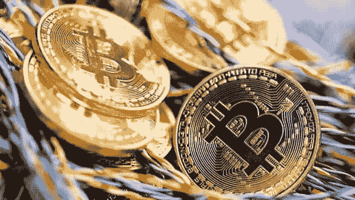

# 不是比特币。这将是金钱的未来！

> 原文：<https://medium.com/coinmonks/not-bitcoin-this-will-be-the-future-of-money-98e280b34b6a?source=collection_archive---------66----------------------->

最近的狂热只是让一个稳定的、中央集权的、国家控制的竞争对手的理由更加充分。输入数字现金。

比特币在 2021 年的疯狂波动已经确定了一件事:货币的未来将是电子化的，但它不会与赛博朋克乌托邦有丝毫相似之处。人民的力量将屈服于君主的力量。

困扰分散加密货币的狂热和恐慌正在增强其未来对手的吸引力:央行发行的数字现金。这些代币将是固定的、集中的和国家控制的。这正是用户在物联网世界中想要的，在这个世界中，机器需要随时、即时地相互结算索赔，但不会导致全球变暖。

官方电子硬币将是除实物现金之外的一种新型央行负债，不过，对于押注美元、日元或欧元未来价值的投资者来说，它们不会是一种新的资产类别。

这有明显的优势。为了避免成为新投机的避雷针，这意味着由 FedCoin、数字欧元和中国的电子 CNY 驱动的全球经济对能源资源的要求将远低于加密货币。在缺乏可信中介的情况下，保护区块链免受双重支出攻击的“挖掘”或工作证明协议需要高能耗的硬件。在比特币和以太坊之间，消耗的电力可以点亮 1600 万个美国家庭。

对于将验证官方硬币转移的分布式分类账来说，情况并非如此。这些分类账将仅由经中央银行许可的特定中介团体持有。正如我们在分散加密货币中看到的那样，网络中的节点可以锁定自己的资金来支持合法交易，而不是比恶意行为者更快地解决难题。

这种方法被称为风险证明，只需要一小部分能源工作证明需求。以太坊打算转行。加密货币以太网将取代硬件和电力，成为保护网络安全所需的投资。验证者将通过锁定至少 32 个乙醚来获得费用。(在我写作的时候，这是一个 72000 美元的承诺。)如果他们行为不端、离线或未能完成工作，处理者可能会失去抵押品。

一个中央机构或许可以更好地管理这样一个网络。毕竟，那些提供交易的人必须参与其中，就像他们声称的那样——而值得信任的人必须确保他们参与。正如法国巴黎银行亚洲资产管理公司(BNP Paribas Asset Management Asia)的经济学家罗志浩(Chi Lo)所言:“要核实”数字账本上的余额，不可避免地需要持有人的身份。“谁有硬币持有者的合法身份？政府！”

不受凭空创造多少法定货币约束的央行利用这种灵活性来避免灾难，就像他们最近在新冠肺炎疫情期间所做的那样。相比之下，由于货币供应有限，“比特币规模”的经济可能是危险的。正如罗所言，如果你固定名义变量，实际产出必须剧烈调整，以吸收任何经济冲击。

此外，加密货币的完美匿名是不切实际的。伴随而来的是高得令人无法接受的洗钱和恐怖融资风险。政府不想窥探所有——甚至大部分——网上交易。但他们也不会放弃自己想要的时候，去掀开假名面纱的权利。因此，全世界都对数字现金感兴趣。[中国的计划是最先进的，但其他央行也在竞争中。](https://accounts.binance.com/en/register?ref=75826706)

如果加密货币的采用令政府头疼，那么数字现金的过度普及也可能是一个问题。如果客户更愿意直接向货币当局索赔，银行可能会失去存款。用短期市场流动性为长期贷款融资的银行可能会在以后陷入困境。这些风险并不新鲜。但是，由于忽视它们到了与次贷相关的银行损失必须社会化的程度，当局造成了与公众的信任鸿沟:[技术无政府主义者用基于密码证明而不是信任的电子支付系统模板打破了这一鸿沟。](https://accounts.binance.com/en/register?ref=75826706)

十多年后，赛博朋克运动的成功不是用它帮助催生和普及的高度不稳定的投机资产类别来衡量，而是用区块链技术在传统金融体系中日益上升的影响力来衡量。内置自动执行软件代码的数字现金将以加密货币永远无法做到的方式改变货币的未来。代币会赢。但是信任不会输。

[了解更多关于加密的知识](https://accounts.binance.com/en/register?ref=75826706)

[Binance.com](https://accounts.binance.com/en/register?ref=75826706)

> 加入 Coinmonks [电报频道](https://t.me/coincodecap)和 [Youtube 频道](https://www.youtube.com/c/coinmonks/videos)了解加密交易和投资

# 另外，阅读

*   [Bookmap 点评](https://coincodecap.com/bookmap-review-2021-best-trading-software) | [美国 5 大最佳加密交易所](https://coincodecap.com/crypto-exchange-usa)
*   最佳加密[硬件钱包](/coinmonks/hardware-wallets-dfa1211730c6) | [Bitbns 评论](/coinmonks/bitbns-review-38256a07e161)
*   [新加坡十大最佳加密交易所](https://coincodecap.com/crypto-exchange-in-singapore) | [购买 AXS](https://coincodecap.com/buy-axs-token)
*   [红狗赌场评论](https://coincodecap.com/red-dog-casino-review) | [Swyftx 评论](https://coincodecap.com/swyftx-review) | [CoinGate 评论](https://coincodecap.com/coingate-review)
*   [投资印度的最佳密码](https://coincodecap.com/best-crypto-to-invest-in-india-in-2021)|[WazirX P2P](https://coincodecap.com/wazirx-p2p)|[Hi Dollar Review](https://coincodecap.com/hi-dollar-review)
*   [加拿大最佳加密交易机器人](https://coincodecap.com/5-best-crypto-trading-bots-in-canada) | [库币评论](https://coincodecap.com/kucoin-review)