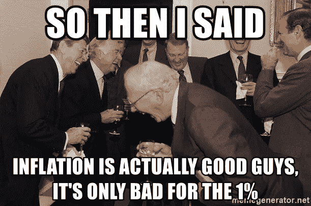
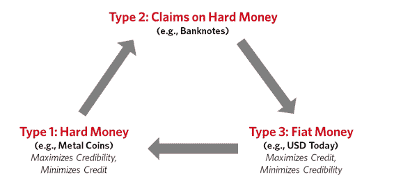
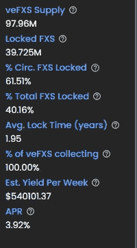
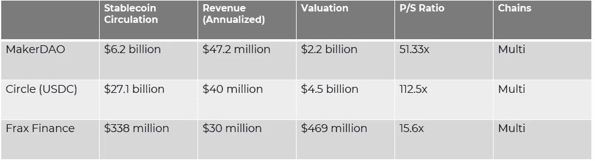
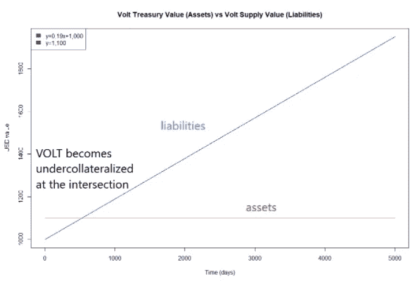

# 不太稳定的硬币和通货膨胀对冲——加密货币系统的演变

> 原文：<https://medium.com/coinmonks/not-so-stablecoin-and-the-inflation-hedge-an-evolution-of-crypto-monetary-system-d7520224e94d?source=collection_archive---------7----------------------->

***不想读了？*** [***此处***](https://twitter.com/tradfichad/status/1521795952868163585?s=20&t=RRyrw81fehkdfPKRW5h8aA) ***碎碎念:***[https://twitter.com/tradfichad](https://twitter.com/tradfichad)

美国消费物价指数飙升 8.5%，为 1981 年 12 月以来的最高年度增幅。这当然没有考虑到“暂时性通货膨胀”。然而，什么时候“短暂的通货膨胀”会变成“持续的”？作为一名消费者，我真的在乎它是否“短暂”吗？用约翰·梅纳德·凯恩斯的话说，“从长远来看，我们都会死。”对消费者来说，“暂时的通货膨胀”可能是永久性的，我们关心的是现在的价格高，而不是这个问题会在 6 个月内消失。

接下来的问题是，稳定的货币有多稳定，我们如何才能真正解决通胀问题？在我们讨论这个问题之前，让我们稍微深入一下我们当前的货币体系是如何随着时间的推移而演变的。

## 货币体系的演变

Credit: Ray Dalio

**硬通货体系** —以具有内在价值的物品为基础的货币体系，通常是金币、银币和铜币。不需要任何一方的信任。

**硬通货债权** —为方便起见，硬通货被借据取代。这些可以兑换成基础黄金或储备资产的价值。

*信贷系统开始爆炸，借贷爆炸，现在有比基础资产价值更多的借据可以赎回。*

**法定货币**——银行意识到抵押制度使其与黄金价值挂钩，并转向法定货币制度(美国在 1972 年放弃了“金本位制”)。法定货币的价值现在是基于对系统的信任和货币政策工具的使用来决定的。

## 稳定币

尽管加密原住民试图摆脱现有的金融和货币体系，但人们可以说，赋予后者生命的同样实验现在正在区块链进行。加密货币系统也是如此，其分类如下。

**硬通货系统**——$ BTC，$联邦理工学院

****(超额抵押的马厩)**—$戴，$米**

**法定货币(algo stables)——$ UST，$FRAX，$比恩(RIP)**

**回到我们现有的货币体系，像今天的美元这样的法定货币可以被视为“宽松地盯住”一篮子商品，因为美联储的目标是 2%的通胀率，有效地确保了美元的“价值”或购买力不会下降太多。如今，稳定的货币模仿同样的体系，保持与美元挂钩。**

## **稳定币 2.0**

********

**使用 Frax Finance 和 Volt Protocol 输入 Stablecoin 2.0，这些公司通过使用 Chainlink oracles 从劳工统计局发布的月度报告中获取通胀数据，将各自的抗通胀 Stablecoin 推向市场。**

**通过结合稳定的货币流动性和通胀挂钩债券的购买力保护，这些新的创新是现有稳定货币格局的下一次演变。**

**让我们开始吧。**

## **弗雷克斯金融公司——外国证券投资公司和 FPIS 公司**

**Frax 价格指数$ FPI 通货膨胀挂钩低抵押稳定货币
Frax 价格指数份额$ FPIS-治理令牌**

**$FPI 财政部最初将由$FRAX 支持，过渡到扩展到其他加密本地资产和非加密消费品和服务。虽然关于什么是非加密策略的新闻很少，但这种策略的出现标志着一个期待已久的未来，加密和非加密之间的界限将变得模糊。**

****保持钉住汇率****

**作为一种抵押不足的稳定货币，盯住美元与盯住美元 FRAX 的做法类似，后者是通过国债收益率来支撑的。超额收益被导向美元 FPIS 持有者，类似于美元 FXS。如果这不足以支持联系汇率，将铸造并出售新的 FPIS 元以增加国库。**

**简而言之:**

**国债收益率>通货膨胀= $FPIS 持有者赢了
国债收益率<通货膨胀= $FPIS 持有者输了**

**此外，在通货紧缩时期，收益率将完全指向美元 FPIS 持有者。**

**无名氏的问题是，盯住美元的政策能否持续下去。请想一想 TIPS 的收益率是如何得出的？—通过对现实世界的资产行使基础国债。除非我们能够成功地证明现实世界的资产比加密资产产生更多的收益，否则这一论点很快就会土崩瓦解。**

**在中短期内，由于风险调整后的回报、对流动性的需求(协议流动性激励)以及 crypto 中收益率策略的数量，crypto 的收益率可能仍将远高于现实世界的资产。另外，别忘了省去中间商和降低运营成本的绝对效率，据报道，宇迦实验室的净利润率超过 90%。鉴于 Frax Finance 正在寻求纳入其他加密资产以及$FRAX 以外的真实世界资产，转化为多种杠杆来利用纯真实世界资产支持的提示。**

**接下来的问题是……抵押担保下呢？很快，Frax Finance 每流通 1 美元赚的钱比 MakerDAO 和 Circle 加起来还多。因此，如果你认为抵押不足是一个障碍，你就要大吃一惊了。真正重要的是，Frax Finance 在维持美元与 Frax 的联系汇率方面有多成功。在 [24:11](https://www.youtube.com/watch?v=w5_91cCWFEQ) Sam Kazemian 解释了$FRAX 如何从未打破挂钩(1 美分的门槛),即使是在链上。**

**看看下面这些数据:**

****

**Source: app.frax.finace**

**纯产量策略的 veFXS 约为 3.92%，全有机，无象征性排放。**

****

**Source: Block49 Capital, 20 Sep 2021**

*   **马克尔道:每流通 1 美元，收入为 0.0076 美元**
*   **循环:每流通 1 美元，收入为 0.0015 美元**
*   ****Frax Finance:每 1 美元的流通收入为 0.0888 美元。****

***直接引用萨姆·卡泽米安在* [*55:23*](https://www.youtube.com/watch?v=w5_91cCWFEQ) *的话，FRAX 有 27 亿美元的供应，但收入只有 2 亿美元。这相当于每 1 美元的供应量带来约 0.0741 美元的收入。想想吧。***

## **伏特协议—$伏特和$VCON**

**$VOLT —通货膨胀挂钩超额抵押稳定币
$VCON —治理令牌**

**$伏特可以通过 a)用$FEI stablecoin 交换 b)通过在熔丝池上过度抵押资产来铸造。**

****保持钉住****

**$VOLT 认购了类似于$DAI 的超额抵押模型，支持一个大型国债来建立盈余收益率和储备。这为伏特维持其盯住美元的汇率提供了额外空间，即使外汇储备没有得到积极配置。**

****

**在 Frax 金融模型中，FPIS 是在收益率< inflation to support treasury. Kirk Hutchison makes the argument that this will in effect reduce liquidity as $FPIS is sold when the price is low (because yields < inflation) and bought back when the price is high (because yield >通货膨胀时铸造的。然而，对持有人的好处是显而易见的，因为当收益率高、FPIS 供应量低时，上涨空间会被放大。**

**Volt Protocol 试图做相反的事情，当收益率大于通胀时卖出$VCON 以支撑美国国债，当收益率小于通胀时回购。虽然从协议的角度来看这是有意义的，但对于$VCON 持有者来说，令牌经济学将如何发挥作用还不清楚。在高收益时期铸造更多的美元 VCON 可以让持有人受益，只要收益被成功捕获。然而，如果做不到这一点，由于收益率保持不变，代币供应增加，这将导致$VCON 持有者的下跌。**

**请注意，这很大程度上是我的猜测，因为$VCON tokenomics 的细节仍不清楚，我们正在等待团队提供更多信息。**

## **关于抗通胀稳定因素的阴阳思考**

**很明显，虽然 Frax Finance 和 Volt Protocol 都试图实现类似的目标，但方法就像阴阳两极一样。因此，尽管$FPIS 机制可能会导致美国财政部变薄，但对于寻求不断降低抵押率的算法稳定币来说，这可能不是什么大问题。**

**此外，看看超额抵押是否真的是正确的方法将是有趣的，当然联系汇率在理论上更安全，但代价是什么？鉴于 DeFi 的大部分，今天已经围绕流动性优化，很难说$VOLT > $FPI 是基于 Frax 协议在捍卫$FRAX 联系汇率方面的成功。**

**在这一点上，我对抵押不足的偏见可能正在渗出。虽然我确实有偏好，但这绝不是对 Volt 协议的抛弃。仍然有关于$VCON 的信息要发布，坦率地说，现在知道各自的结构将如何发展还为时过早。**

## **你为什么要在乎？**

**简而言之，考虑一下这将如何改变大众市场的游戏规则。在 Tradfi 中，类似于通胀跟踪基金的唯一选择是通胀挂钩债券，这种债券不能像发行纸币一样消费。抗通胀稳定币引入了两全其美的东西:通胀对冲+稳定的流动性。这意味着你可以对冲通货膨胀，同时保留随时交易其他资产的选择权。**

**鉴于 crypto 的核心精神是摆脱专制和集权的风险，Frax Finance 和 Volt Protocol 的扩张是抵制审查的关键。与$USDC 或$USDT 不同，两者都是完全分散的，并由链上资产支持，这有助于更公平的治理方法和对其用途的创造性探索。**

**如前所述，Frax Finance 和 Volt Protocol 计划扩展到由现实世界的资产支持。虽然我已经证明了加密资产的更高回报，但能够利用现实世界的资产意味着能够提供更可持续的收入来源，而不仅仅是来自其他赌注协议的基于排放的收益。虽然现在说还为时过早，但也许人们渴望在加密世界和非加密世界之间建立一座定义主导的桥梁(相对于$USDC/$USDT)。IMAJIN，在现实世界中花费$FPI 和$VOLT。**

**最后，还有人提到，现行的 BLS 消费物价指数挂钩只是一个开始。鉴于目前的 CPI 数据可能被认为是政府精心策划或精心挑选的，能够摆脱这一点意味着提供更真实的通胀对冲。通过盯住共同体选择的一篮子商品，DeFi 世界有可能率先推动新的通胀对冲可能是什么样子的进化可能性吗？**