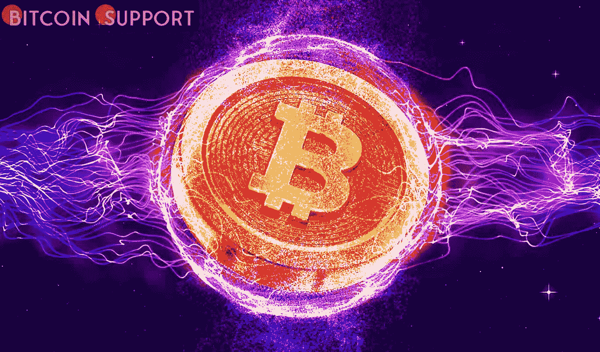

# 谈到 BTC 股票相关性，这不是我们想要的——本周关于比特币要知道的 5 件事

> 原文：<https://medium.com/coinmonks/not-what-we-want-in-terms-of-btc-stock-correlation-5-things-to-know-about-bitcoin-this-week-588342004432?source=collection_archive---------50----------------------->

**Visit our website for full blog:-** [**https://bitcoinsupports.com/not-what-we-want-in-terms-of-btc-stock-correlation-5-things-to-know-about-bitcoin-this-week/**](https://bitcoinsupports.com/not-what-we-want-in-terms-of-btc-stock-correlation-5-things-to-know-about-bitcoin-this-week/)

有什么东西能让比特币免于股灾吗？本周，并非所有人都看跌。比特币(BTC)在 4 月的第二周开始时磕磕绊绊，因为多头在努力维持 40，000 美元以上的支撑。在本周收盘时，市场担忧再度浮现，BTC/美元在经历了一个令人耳目一新的低波动周末后，在周日的最后几个小时以传统形式下跌。如今，普通的霍德勒感到进退两难:宏观力量承诺巨大的趋势转变，但实现起来却很缓慢，而“真正的”买家需求也同样从一般的加密资产中消失了。另一方面，那些内部人士没有表现出怀疑的迹象，比特币网络基本面达到历史新高等等就表明了这一点。

由于这些对立变量的合流，价格活动似乎不知道下一步该何去何从。在接下来的一周里，有没有可能发生一些变化？随着 40，000 美元的重新测试越来越近。

**比特币没有“巨额提现”吗？**

BTC/美元本周初重新夺回 42，000 美元，这是它在一夜之间失去的，因为它跌入了周收盘点位。比特币触及数周以来的最低值，与 3 月 23 日持平，当时在 Bitstamp 上触及 41，771 美元。

**Visit our website for full blog:-** [**https://bitcoinsupports.com/not-what-we-want-in-terms-of-btc-stock-correlation-5-things-to-know-about-bitcoin-this-week/**](https://bitcoinsupports.com/not-what-we-want-in-terms-of-btc-stock-correlation-5-things-to-know-about-bitcoin-this-week/)

As a result, the largest cryptocurrency also lost all of its gains from the previous session, returning to the top of its trading range from last month. This could wind up being a retest of earlier resistance as support, and rather than dreading the worst, many traders are hoping for a quick reversal.

“I’m buying the dip on a bullish retest of the flipped weekly mark, finex whale filling bids.” “You can wait for a monthly close to confirm if you want to wait for confirmation,” prominent Twitter user Credible Crypto posted in comments tonight.

Both Bitfinex whale purchasing and new chart data imply that Bitcoin’s Aroon signal has flipped bullish in recent days, according to Credible Crypto. Aroon, which is used to determine if an asset is in an uptrend or downtrend, has only issued bearish-to-bullish “crosses” six times since 2017 — the year of Bitcoin’s latest blow-off high.

[https://twitter.com/OtsukimiCrypto/status/1513336306641903624](https://twitter.com/OtsukimiCrypto/status/1513336306641903624)

According to trader and analyst Rekt Capital had plenty of reasons to embrace a positive thesis for Bitcoin, but the weekly closing of about $42,150 fell short of his target of $43,100\. “A BTC Weekly Candle Close like this, as well as a retest of $43.100 as fresh support, would be successful,” he said Sunday accompanied a chart.

“As a result, BTC is poised for a move higher inside the $43100-$52000 area, as indicated by the prior blue circle.”

**Across the board, stocks were under pressure**

So far, equities have had a bad day, with Asia leading the way with widespread losses, owing in part to China’s recent Coronavirus lockdowns.

In early trade, the Shanghai Composite Index and Hong Kong’s Hang Seng both plummeted more than 2%. Markets in Europe have yet to open as of this writing, but the current geopolitical tensions centred on Russia showed no signs of abating.

A probable lead for incumbent French President Emmanuel Macron over far-right contender Jean-Marie Le Pen in surveys provided a ray of hope for the euro. Beyond the short term, analysts are concerned about three trends: quickly rising inflation, bond market losses, and central banks’ apparent failure to respond so far. The European Central Bank (ECB) will meet this week with a focus on inflation control, which will include stopping asset purchases and increasing interest rates.

[https://twitter.com/Schuldensuehner/status/1513054154276618244](https://twitter.com/Schuldensuehner/status/1513054154276618244)

The situation exemplifies the problems that stocks and risk assets face in the current environment. The true depth of the economic reality is already obvious, as observers concur that the inflationary environment and concomitant central bank policies will diminish demand for Bitcoin and crypto.

Holger Zschaepitz disclosed in a prior Twitter post last week that, despite all of the increases in the S&P 500, the Fed’s asset purchases mean that progress since the Global Financial Crisis has been flat.

“To put things in perspective, the S&P 500 may have reached a new high today, but when compared to the Fed’s balance sheet, it is trading at the same level as in 2008,” he wrote. “Equities have traded sideways since 2008, effectively counteracting balance sheet expansion.”

**Do you want to go down together?**

The optimistic case for Bitcoin as a store of value in the face of failing currencies, according to Arthur Hayes, ex-CEO of derivatives behemoth BitMEX, is still there.

The issue is that such a scenario does not exist — at least not yet. Hayes reiterated his cautions in his most recent blog post, which was published on Monday, that pain would come before gain for the average investor with considerable risk asset exposure.

In the future, nation states and individuals may shift away from the dollar’s hegemony in favour of other assets, but for the time being, macro forces will continue to wreak havoc on crypto. If stocks are expected to fall as central banks attempt to ostensibly combat inflation, crypto’s growing association with them can only indicate one thing.

“The short-term (10-day) correlation is strong, and the medium-term (30-day and 90-day) correlations are rising and going to the right. “This is not what we want,” Hayes said of crypto-Nasdaq 100 correlations (NDX).

**“Correlations across all time periods must trend demonstratively downward for me to fly the flag in support of selling fiat and purchasing crypto in anticipation of an NDX catastrophe (30 percent to 50 percent loss).”**

Is it possible that the Fed’s activities will cause equities to lose half their value? It’s anyone’s guess, according to Hayes. “Are you sure you’re down 30%?” … A 50% drop?… He went on to say, “Your guess is as good as mine.”

**“But let’s be clear: the Fed has no plans to expand its balance sheet anytime soon, which means stocks aren’t going any higher.”**

**Visit our website for full blog:-** [**https://bitcoinsupports.com/not-what-we-want-in-terms-of-btc-stock-correlation-5-things-to-know-about-bitcoin-this-week/**](https://bitcoinsupports.com/not-what-we-want-in-terms-of-btc-stock-correlation-5-things-to-know-about-bitcoin-this-week/)

**情绪与典型市场不同**

难怪市场情绪因宏观前景黯淡而受到影响。

Crypto 恐惧&贪婪指数在三月底感受到 Crypto 的“贪婪”后，又回到了“恐惧”区域。随着交易员临阵退缩，这一模仿经典市场恐惧贪婪指数的指标，在不到两周的时间里，失去了正常化得分的一半。周一，Crypto Fear & Greed 得到 32 分(满分 100 分)，而其常规市场对手得到 46 分(满分 100 分)，被认为是“中性”

不管应得与否，范德波普警告读者不要根据情绪指标进行交易。“每个人都对市场非常乐观，”他继续说道，“但现在市场开始调整，恐惧占据了上风。”

**“大多数情况下，情绪并不是你应该如何交易的好指标。”**

**Visit our website for full blog:-** [**https://bitcoinsupports.com/not-what-we-want-in-terms-of-btc-stock-correlation-5-things-to-know-about-bitcoin-this-week/**](https://bitcoinsupports.com/not-what-we-want-in-terms-of-btc-stock-correlation-5-things-to-know-about-bitcoin-this-week/)

**基本面是让这种宗教继续存在的基础**

本周，一束光线来自一个熟悉的来源:尽管价格下降，但比特币的网络难度预计在未来几天只会下降 0.4%。难度将从历史高点向下转移，以反映采矿构成的变化，这可以说是比特币网络自我维持范式中最重要的组成部分。尽管上周 BTC/美元下跌了 10%,但微小的调整意味着矿商在当前价格下财务稳定，没有受到伤害。

**Visit our website for full blog:-** [**https://bitcoinsupports.com/not-what-we-want-in-terms-of-btc-stock-correlation-5-things-to-know-about-bitcoin-this-week/**](https://bitcoinsupports.com/not-what-we-want-in-terms-of-btc-stock-correlation-5-things-to-know-about-bitcoin-this-week/)

进一步的证据支持了这一说法，来自监控资源 MiningPoolStats 的散列率估计值也徘徊在历史高点。采矿业继续吸引大量投资，包括 Blockstream 的投资，该公司上周宣布推出一个太阳能发电场，一旦投入运营，每秒将产生 30 千万亿次浮点运算。

**访问我们的网站获取完整的博客:-**[**https://bitcoinsupports . com/not-what-we-want-in-terms-of-BTC-stock-correlation-5-this-to-know-this-this-week/**](https://bitcoinsupports.com/not-what-we-want-in-terms-of-btc-stock-correlation-5-things-to-know-about-bitcoin-this-week/)

**免责声明:这些是作者的观点，不应被视为投资建议。读者应该自己做研究。**

> 加入 Coinmonks [电报频道](https://t.me/coincodecap)和 [Youtube 频道](https://www.youtube.com/c/coinmonks/videos)了解加密交易和投资

# 另外，阅读

*   [CBET 回顾](https://coincodecap.com/cbet-casino-review) | [库币 vs 比特币基地](https://coincodecap.com/kucoin-vs-coinbase) | [拜比特 vs 比特币基地](https://coincodecap.com/bybit-vs-coinbase)
*   [如何在加拿大购买加密货币？](https://coincodecap.com/how-to-buy-cryptocurrency-in-canada)
*   [百无聊赖的猿游艇俱乐部(BAYC)评论](https://coincodecap.com/bored-ape-yacht-club-bayc-review)
*   [5 款最佳加密交易终端](https://coincodecap.com/crypto-trading-terminals) | [最佳 DeFi 应用](https://coincodecap.com/best-defi-apps)
*   [在美国如何使用 BitMEX？](https://coincodecap.com/use-bitmex-in-usa) | [BitMEX 评论](https://coincodecap.com/bitmex-review)