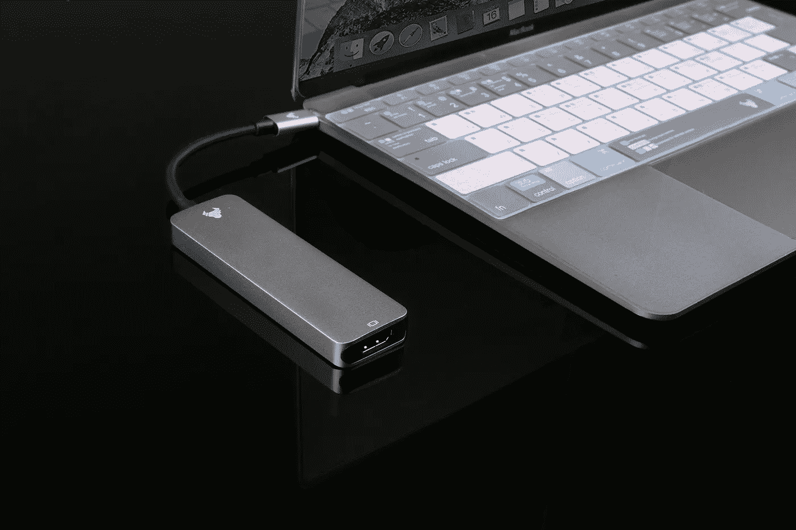

# 不是你的钥匙，不是你的密码！

> 原文：<https://medium.com/coinmonks/not-your-keys-not-your-crypto-1935a360cd83?source=collection_archive---------26----------------------->

Photo by [Rann Vijay](https://www.pexels.com/photo/a-usb-hub-plugged-into-a-laptop-7742586/)

## 每个人都喜欢掌管自己财务的想法。

随之而来的自由让人上瘾！但是，唉，掌控自己的财富仍然存在挑战。

在像比特币这样的数字货币时代，我们必须格外小心我们在哪里以及如何存储我们来之不易的加密资产。

这就是密钥发挥作用的地方。简而言之，它们是为了保证你的密码安全可靠，这样你就可以放心地睡觉了，因为你知道没有人可以在没有你的允许下动你的钱。

作为一名加密货币用户，你必须知道并理解在处理你有价值的加密资产时使用适当的安全措施的重要性——尤其是如果你在一个集中的交易所(CEX)进行交易。

黑客瞄准集中式交易所的主要原因是因为他们很容易成为目标——他们手头有大量的比特币，他们经常成为攻击者的目标，攻击者试图从他们的受害中获利。

在本文中，我们将讨论为什么集中式交易所会带来如此巨大的安全风险，我们可以通过使用冷存储钱包而不是热钱包(在联网设备上运行)或硬件钱包(如 [Trezor](https://trezor.io/#comparison) 或 [Ledger Nano S](https://www.ledger.com/) (离线存储私钥)来解决这一问题。

> 交易新手？试试[密码交易机器人](/coinmonks/crypto-trading-bot-c2ffce8acb2a)或[复制交易](/coinmonks/top-10-crypto-copy-trading-platforms-for-beginners-d0c37c7d698c)

# 什么是集中交易所？

您可能想知道什么是集中交易所(CE)。

CE 是一个在线平台，你可以在这里购买、出售和交易加密货币。

它与常规证券交易所的功能类似，主要区别在于，它们的资产不是股票和股份，而是比特币或以太坊等数字货币。

CEs 通常被称为在线加密交换，但它们的存在时间比大多数人意识到的要长得多。

第一个 CE 是 [MtGox](https://en.wikipedia.org/wiki/Mt._Gox) ，它于 2010 年推出，但在 2011 年至 2014 年期间遭到多次黑客攻击后，很快就因自身重量而崩溃。

自那以后，更多的人出现在舞台上，但这也没有阻止黑客瞄准他们:2018 年 12 月【CoinCheck 宣布，由于他们的服务器受到攻击，他们已经损失了 5.23 亿 NEM 令牌；而币安在报告某些账户的异常行为后发现其平台上的可疑活动后被迫暂时关闭——尽管后来在执法机构调查后重新开放，执法机构没有发现任何用户账户存在不法行为的证据！

# 消费电子展如何容易受到黑客攻击？

你可能想知道一个加密平台是如何被入侵的。

加密交换(CEs)易受攻击，因为它们在服务器上保存您的加密资产，以及用于访问这些资产的任何私钥。

消费电子产品通常不受政府监管，而且它们本质上是集中的——这意味着它们存在单点故障。

最后，即使您信任公司本身，员工也总有可能通过网络钓鱼或其他方式受到威胁或操纵，交出登录凭据。

# 如果一个集中的交易所被黑了会发生什么？

你失去了你的钱，你的加密货币永远消失了——你没有追索权，无论是法律还是其他。

# CEX 黑客的例子

你可能听说过所有这些黑客攻击，因为它们是历史上最臭名昭著的加密货币漏洞。让我们来看几个:

**Mt Gox**

2014 年，Mt Gox 是全球最大的比特币交易所。它声称拥有超过 80%的 BTC 购买量，这是惊人的，直到黑客从其服务器上窃取了 85 万 BTC——使其成为有史以来最大的加密盗窃案之一！

**Bitstamp**

Bitstamp 是另一个受欢迎的交易所，它在 2015 年因用户错误(他们的错)或钓鱼邮件(可能是别人的)而遭受了[黑客攻击。](https://www.coindesk.com/markets/2015/07/01/details-of-5-million-bitstamp-hack-revealed/)

在这次事件中，他们被偷了 500 万美元。

# 借贷平台的缺陷

Celsius、Blockfi 等贷款平台提供高收益加密储蓄账户，利率比传统银行更高。

然而，在市场低迷时期，这些平台极其脆弱。在上一次加密崩溃期间，几个平台[停止了提现](https://fortune.com/2022/06/16/crypto-lender-celsius-decision-to-halt-withdrawals-being-probed-by-texas-and-other-states/#:~:text=Several%20U.S.%20states%20including%20Texas,citing%20%E2%80%9Cextreme%20market%20conditions.%E2%80%9D)，现在正面临破产。

那些把辛苦赚来的钱存在这些借贷平台上的人很可能已经失去了这些钱。

# DeFi 也很脆弱

DeFi 也是脆弱的，即使当智能合同被审计时，黑客也能找到漏洞并窃取你的资金。以下是一些最大的 DeFi 黑客列表。

事实是，无论你多么信任你的审计师，DeFi 仍然依赖智能合约来保证你的安全。这也不是绝对正确的。智能合约以前被黑过，以后还会被黑。

# 购买、自行保管和 HODL

使用 CE &大多数 DeFi 协议就像把你的车钥匙放在垫子下面，同时相信小偷不会开走你的车。

如果你不能把自己的钥匙放在一个安全的地方，那么你需要找一个能替你保管钥匙的人，也就是说，一个可信的硬件钱包提供商或者**把它们放在银行的金库里**。

请记住，如果您不持有您的私钥，您就不真正拥有您的加密资产！

当你在寻找一个贷款平台或 DeFi 协议时，人们很容易对承诺的收益率感到兴奋。

但在大多数情况下，这只是更有利可图的美元成本平均到加密和自我保管你的资产，而没有暴露自己不必要的风险，如黑客攻击，破产或清算。**10%的年收益率承诺根本不值得。**

> 加入 Coinmonks [电报频道](https://t.me/coincodecap)和 [Youtube 频道](https://www.youtube.com/c/coinmonks/videos)了解加密交易和投资

# 另外，阅读

*   [Pionex 双重投资](https://coincodecap.com/pionex-dual-investment) | [AdvCash 审查](https://coincodecap.com/advcash-review) | [支持审查](https://coincodecap.com/uphold-review)
*   [面向开发者的 8 个最佳加密货币 API](https://coincodecap.com/best-cryptocurrency-apis)
*   [7 个最佳零费用加密交易平台](https://coincodecap.com/zero-fee-crypto-exchanges)
*   [最佳网上赌场](https://coincodecap.com/best-online-casinos) | [期货交易机器人](/coinmonks/futures-trading-bots-5a282ccee3f5)
*   [分散交易所](https://coincodecap.com/what-are-decentralized-exchanges) | [比特 FIP](https://coincodecap.com/bitbns-fip)
*   [用信用卡购买密码的 10 个最佳地点](https://coincodecap.com/buy-crypto-with-credit-card)