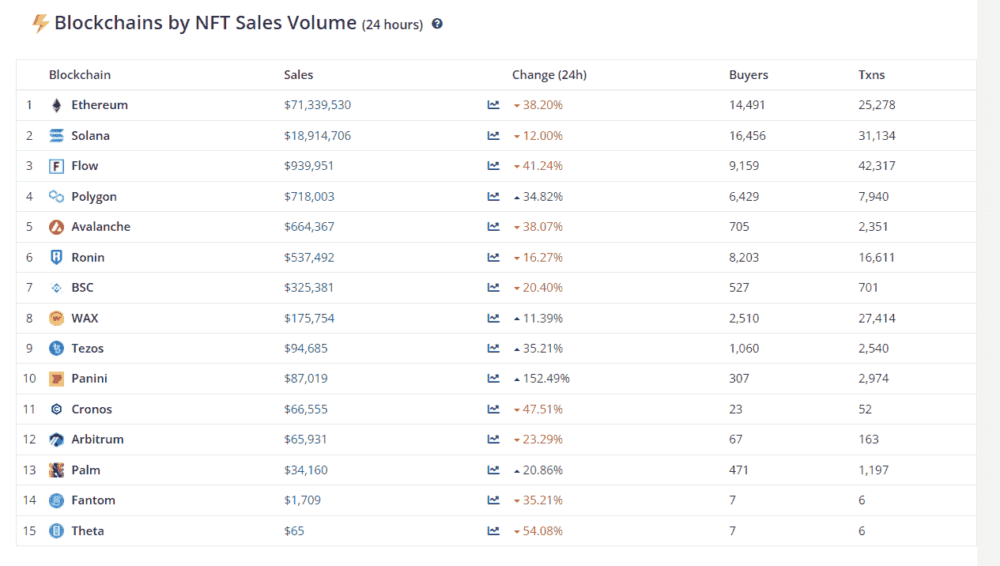

# 值得注意的俏皮新闻:索拉纳 NFT 好熊耙在面团，加上

> 原文：<https://medium.com/coinmonks/notable-nifty-news-solana-nft-okay-bears-rake-in-the-dough-plus-ad6293c10c5d?source=collection_archive---------40----------------------->

**For full blog visit:-**[**https://bitcoinsupports.com/notable-nifty-news-solana-nft-okay-bears-rake-in-the-dough-plus/**](https://bitcoinsupports.com/notable-nifty-news-solana-nft-okay-bears-rake-in-the-dough-plus/)

周四，OpenSea 的 24 小时销售记录由奥凯熊(Okay Bears)打破，这是一款由索拉纳提供动力的 NFT 葡萄酒，而南非精品葡萄酒 NFT 的拍卖也开始了，收集了超过 18 万美元。今天早些时候，由 Solana 提供动力的 NFT Okay Bears 首次超越了 OpenSea 24 小时销售跟踪系统上的所有其他以太坊项目。

这是索拉纳(SOL) NFT 公司的一个项目首次在广受欢迎的 NFT 市场 OpenSea 上获得 24 小时销售跟踪冠军。总部位于索拉纳的 NFT 提供了 1 万张独特的熊照片，据 NFT 追踪机构 Cryptoslam 统计，该公司在推特上表示，这些照片在发布后仅一天就销售一空，收入 23.1 万索尔，总销售额为 2310 万美元。

[https://twitter.com/okaybears/status/1519045520332771328](https://twitter.com/okaybears/status/1519045520332771328)

索拉纳网络已经成为以太坊在 NFT 市场主导地位的竞争对手。今天，就 24 小时 NFT 销售量而言，它是第二活跃的区块链。

**For full blog visit:-**[**https://bitcoinsupports.com/notable-nifty-news-solana-nft-okay-bears-rake-in-the-dough-plus/**](https://bitcoinsupports.com/notable-nifty-news-solana-nft-okay-bears-rake-in-the-dough-plus/)

南非葡萄酒行业历史上第一次将拍卖优质葡萄酒 NFTs。南非最伟大、最具历史意义的五大葡萄酒收藏被拍卖为 NFTs，收入约 300 万兰特(18.68 万美元)。

艺术品拍卖商兼顾问 Strauss & Co 主持了此次拍卖，多家葡萄酒庄园参与其中，包括 Klein Constantia、Meerlust、Mullineux、Kanonkop 和 Vilafonté。其中两件拍品立即以比特币支付(BTC)。拍卖的技术合作伙伴、Web3 初创公司 Fanfire 的首席执行官格特-扬·范·罗延(Gert-Jan Van Rooyen)说:“这表明收藏家们可以通过这些新的所有权证书拥有和交易精美的葡萄酒。

**“未来，收藏家们将能够在他们的加密货币钱包中存储来自世界各地的一整套葡萄酒。”**

[https://twitter.com/gvrooyen/status/1518627572942348289](https://twitter.com/gvrooyen/status/1518627572942348289)

**五只 NFT 藏品继续跑赢其余。**

据推特用户 NFTstatistics.eth(网名@punk9059)称，Bored Ape Yacht Club、志那都红豆、Clone X、Doodles 和 Moonbirds NFTs 继续成为市场的主要赢家。

[https://twitter.com/punk9059/status/1519019473121931264](https://twitter.com/punk9059/status/1519019473121931264)

这位推特用户拥有 17000 名粉丝，自称是 NFT 数据、图表和思想的保管人。根据 CryptoSlam 的数据，这五件非传统艺术收藏品现在被评为 NFT 销售额最高的 12 件收藏品之一。

**其他有用信息**

本周早些时候，ApeCoin 出现短暂抛售，此前有消息称，知名代币(NFT)公司 Bored Ape Yacht Club (BAYC)在一次抢劫中损失了 240 万美元的数字收藏品。中国一家法院最近对一家 NFT 市场做出了史无前例的判决，该市场允许用户制作被盗艺术品的 NFT。一名 NFTCN 的用户被指控窃取中国画家和艺术家马的版权作品。

**完整博客访问:-**[**https://bitcoinsupports . com/notify-nifty-news-Solana-NFT-okay-bears-rake-in-the-dough-plus/**](https://bitcoinsupports.com/notable-nifty-news-solana-nft-okay-bears-rake-in-the-dough-plus/)

**免责声明:以上为作者观点，不应视为投资建议。读者应该自己做研究。**

> 加入 Coinmonks [电报频道](https://t.me/coincodecap)和 [Youtube 频道](https://www.youtube.com/c/coinmonks/videos)了解加密交易和投资

# 另外，阅读

*   [3 商业评论](/coinmonks/3commas-review-an-excellent-crypto-trading-bot-2020-1313a58bec92) | [Pionex 评论](https://coincodecap.com/pionex-review-exchange-with-crypto-trading-bot) | [Coinrule 评论](/coinmonks/coinrule-review-2021-a-beginner-friendly-crypto-trading-bot-daf0504848ba)
*   [莱杰 vs n rave](/coinmonks/ledger-vs-ngrave-zero-7e40f0c1d694)|[莱杰 nano s vs x](/coinmonks/ledger-nano-s-vs-x-battery-hardware-price-storage-59a6663fe3b0) | [币安评论](/coinmonks/binance-review-ee10d3bf3b6e)
*   [Bybit Exchange 审查](/coinmonks/bybit-exchange-review-dbd570019b71) | [Bityard 审查](https://coincodecap.com/bityard-reivew) | [Jet-Bot 审查](https://coincodecap.com/jet-bot-review)
*   [3 commas vs crypto hopper](/coinmonks/3commas-vs-pionex-vs-cryptohopper-best-crypto-bot-6a98d2baa203)|[赚取加密利息](/coinmonks/earn-crypto-interest-b10b810fdda3)
*   最好的比特币[硬件钱包](/coinmonks/hardware-wallets-dfa1211730c6) | [BitBox02 回顾](/coinmonks/bitbox02-review-your-swiss-bitcoin-hardware-wallet-c36c88fff29)