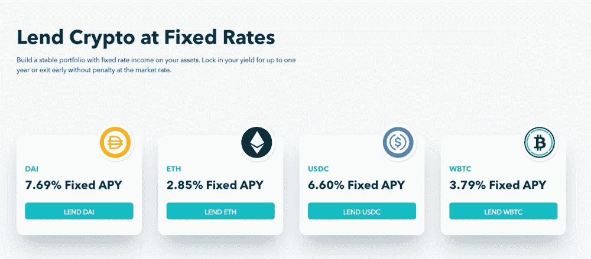
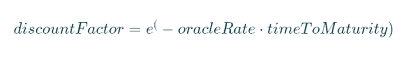
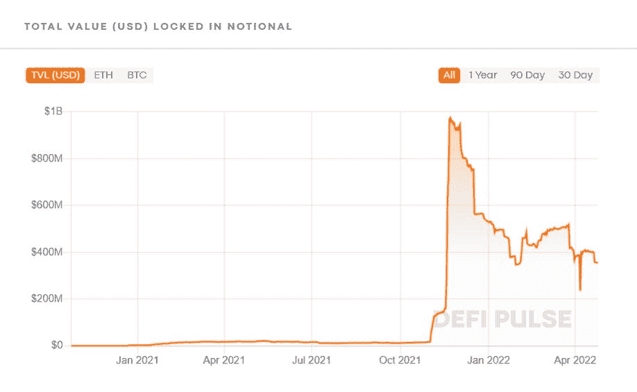

# 名义:固定收益 DeFi 产品的阿尔法

> 原文：<https://medium.com/coinmonks/notional-the-alpha-of-fixed-income-defi-products-a5637d2092b5?source=collection_archive---------15----------------------->

凭借其有机价格行动，名义银行在 631 个独特的流动性池中积累了 3.56 亿美元的 TVL，是固定收益 DeFi 中最高的。

**Fixed Lending Rates on Notional**

在 DeFi 中赚取收益可能会令人生畏。为了收获每一滴流出的收益，参与者不断寻找新的 DeFi 协议，以更有效的方法来捕捉这些收益或为他们复杂的多层投资策略定义。例如，以渴望为例。金融最初是一个简单的收益率聚集器，随着时间的推移，它变得越来越复杂，因此可以获得更多的收益率。今天，它使用复杂的收益农业策略，如在复利等平台上的递归贷款，不断将资金从一个池转移到另一个池，甚至将资金分配给一个不太成熟的 DeFi 协议，以最大化其产出。诸如此类的举措可能会给我们一种印象，即频繁重组基金的更扭曲的策略会产生更高的收益率。

## 等等，是这样吗？

上个月，以太坊上的名义固定利率、固定期限借贷协议向其贷款人提供的固定收益率在戴上高达 7.32%，在 USDC 上高达 4.74%。在同一时期，戴递归贷款的复合利率为 3.55 %，而 USDC 为 3.66 %。

这里值得注意的是,**名义银行完全依赖有机的市场供求行为来为其贷款人产生这些高收益，而不是像递归贷款那样遵循其他协议的高度复杂的策略。**使用自动做市商根据用户的交易规模更新利率。利率由当前市场的供求关系决定，并因每次借贷交易而异。然而，一旦执行，用户的利率在整个期限内是固定的，不会改变。

## 名义利率是如何得到固定利率的？

名义银行的工作原理受到传统金融中流行了几十年的零息债券机制的启发。零息债券的发行和定价都大大低于到期时的面值。由于票面价值是预先确定的，任何希望从投资中获得固定回报的人都可以以折扣价购买零息债券，并在以后以票面价值赎回。从而为自己谋利。

零息票债券的价格可以计算如下:

价格= M ÷ (1 + r)n

其中:

*   M =债券的到期价值或面值
*   r =所需利率
*   n =到期前的年数

如果投资者希望在一年后到期的面值为 10，000 美元的债券上获得 8%的回报；他们愿意支付以下费用:

$10,000 / (1 + 0.08)1 = $9,259.26.

如果借款人接受这一要约，债券将以 9259.26 美元/10000 美元=面值的 92.6%出售给投资者。到期时，投资者获得 10，000 美元——9，259.26 美元= 740 美元，相当于每年 8%的利息。

与零息票债券定价机制类似，名义债券使用以下公式对其 AMM(名义债券相当于零息票债券)中交易现金的现值进行定价:

在哪里，

## 这种策略在名义上表现如何？

**目前为止名义上的 TVL**

《名义》在 2021 年 11 月 21 日达到了 9.77 亿美元的最高 TVL，这是它推出的第一个月。从那时起，它见证了 TVL 的下降趋势，类似于所有其他 DeFi 协议。在撰写本文时，Defi Pulse 将其 3.56 亿美元的 TVL 列为 Defi 协议中最具优势的第 25 名。谈到它的用户指标，从它启动以来一直在上升，V2 有 755 个参与用户。在这些用户中，121 个独特的借款人、225 个贷款人和 617 个流动性提供者总共根据协议进行了 329 次借入交易和 411 次借出交易。以 fDAI、fUSDC、fETH 和 fBTC 计价的总借款量总计为 1.922 亿美元，其中 fUSDC 是借款量最大的资产，借款量为 1.2117 亿美元，其次是 fDAI，借款量为 6530 万美元。在贷款方面，该平台的贷款额略高于 2.97 亿美元，其中 1.6 亿美元来自 fUSDC，1.2165 亿美元来自 fDAI。

从第一天起，名义银行就为其投资者创造了更高的收益率。借款人愿意支付溢价(相对于其他借贷平台)来锁定他们的借贷成本。这转化为贷方的高收益。其他固定利率借贷平台大多不为借贷双方服务，因此不存在这种均衡。产生的收益是“有机的”，这意味着它直接来自平台，来自借款人支付的款项。这就是利率的决定因素。这种简单的固定利率固定期限方法正取得巨大成功，因为它每天都在吸引新用户加入该协议。

你也可以尝试其改变游戏规则的固定利率固定期限加密借款和贷款，以获得高 APYs，而不会因利率变化而失去内心的平静！

访问:[名义金融](https://notional.finance/)

**来源**

*   [概念白皮书](https://docs.notional.finance/notional-v2/)
*   Defi 脉冲
*   沙丘分析
*   投资媒体

> 加入 Coinmonks [电报频道](https://t.me/coincodecap)和 [Youtube 频道](https://www.youtube.com/c/coinmonks/videos)了解加密交易和投资

# 另外，阅读

*   [最佳加密交换平台](https://coincodecap.com/best-crypto-swap-platforms) | [最佳加密交易所](https://coincodecap.com/crypto-exchange)
*   [购买比特币印度](/coinmonks/buy-bitcoin-in-india-feb50ddfef94) | [Pionex 审查](/coinmonks/pionex-review-exchange-with-crypto-trading-bot-1e459d0191ea) | [加密交易机器人](/coinmonks/crypto-trading-bot-c2ffce8acb2a)
*   [n 零复习](/coinmonks/ngrave-zero-review-c465cf8307fc) | [Phemex 复习](/coinmonks/phemex-review-4cfba0b49e28) | [PrimeXBT 复习](/coinmonks/primexbt-review-88e0815be858)
*   最佳[区块链分析](https://bitquery.io/blog/best-blockchain-analysis-tools-and-software)工具| [赚比特币](/coinmonks/earn-bitcoin-6e8bd3c592d9)
*   [Cloudbet 赌场评论](https://coincodecap.com/cloudbet-casino-review) | [点火赌场评论](https://coincodecap.com/ignition-casino-review)
*   [加密套利](/coinmonks/crypto-arbitrage-guide-how-to-make-money-as-a-beginner-62bfe5c868f6)指南| [如何做空比特币](/coinmonks/how-to-short-bitcoin-568a2d0b4ae5)