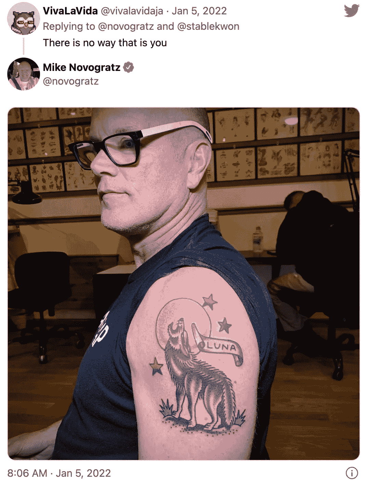
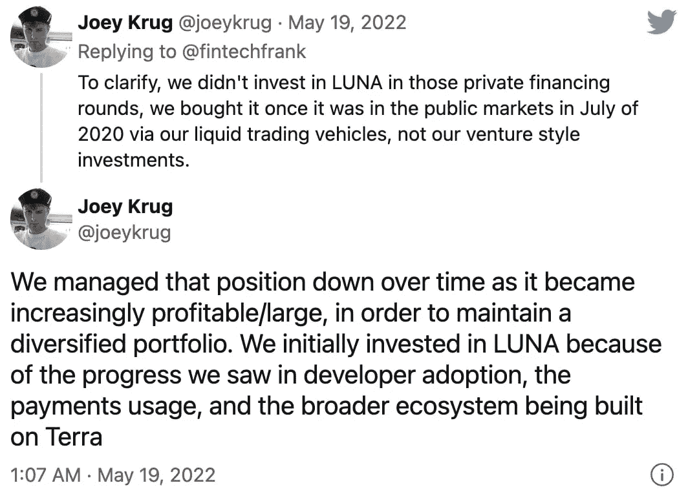

# 诺沃格拉茨认为，露娜纹身不断提醒人们投资“需要谦逊”

> 原文：<https://medium.com/coinmonks/novogratz-believes-luna-tattoo-acts-as-a-steady-reminder-investing-requires-humility-f0d1768f86c4?source=collection_archive---------63----------------------->

Mike Novogratz 表示，尽管受到最近 Terra 崩溃的严重羞辱，加密部门仍将保持增长。

加密资产管理公司 Galaxy Digital 的亿万富翁创始人迈克·诺沃格拉茨(Mike Novogratz)告诉他的追随者，他的卢娜纹身将提醒他们在风险投资领域保持谦虚。

卢纳/UST 倒闭后，诺沃格拉茨周三写了一封公开信给他的追随者，他说，“我的纹身将不断提醒人们，风险投资需要谦逊。”

诺沃格拉茨在 1 月 5 日向他的 461，000 名推特粉丝展示了他的狼主题纹身，这是他支持现已崩溃的 Terra 生态系统的热情姿态。

上周，Terra 的 UST stablecoin 崩溃，在不到 72 小时的时间里，它的姐妹令牌 LUNA 的价格从 60 美元跌至 0 美元。这次崩溃让加密生态系统损失了近 400 亿美元。

“崩溃削弱了对 crypto 和 DeFi 的信心，”Novogratz 在信中说，“每当钱以如此突然的方式丢失时，人们都希望得到答案。”

尽管上周出现了“令人心痛”的市场混乱，但他认为加密领域比以往任何时候都更加强大，而且不会很快消失。

“这并不意味着加密市场将触底反弹。这将需要重组、赎回周期、整合以及对加密的信心恢复。”

他强调，银河数码在 2020 年第四季度用资产负债表资本投资了 LUNA，该公司的财政部从未使用过 UST。

“我们团队投资 LUNA 的最初论点是围绕区块链本地支付系统的扩张展开的。”

根据 Galaxy Digital 5 月 13 日的声明，该公司预计截至 5 月 11 日的净综合收入将损失 3 亿美元，合伙人的资本将减少至 22 亿美元，比 3 月 31 日下降 12%。

Terraform Labs 的早期投资者之一潘迪拉资本今天宣布，在 TerraUSD 崩溃之前，它已经出售了大约 80%的 LUNA 投资。潘迪拉合伙人 Paul Veradittakit 声称，该公司能够将 170 万美元转化为 1.7 亿美元。

秘密主题纹身近年来变得非常流行，2021 年，与秘密纹身相关的谷歌搜索增加了 222%。据 Crypto Head 称，超过 900 人纹了比特币(BTC)“B”，而 Dogecoin (DOGE)和以太坊(ETH)纹身也变得越来越流行。