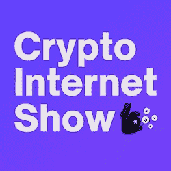

# 现在主持…斯塔克斯的加密互联网展

> 原文：<https://medium.com/coinmonks/now-hosting-the-crypto-internet-show-by-stacks-1b62b0871a3e?source=collection_archive---------53----------------------->

【2022 年 4 月

麦克·check🎙…is 这玩意开着吗？

这些年来，我花了无数的时间与比我聪明的专家交谈，来满足我的求知欲。无论是从创始人或投资者的旅程中学习，对最新技术趋势的见解，还是对我收集的各种兴趣进行深入研究。正如亨利·福特所说:“任何停止学习的人都老了，无论是二十岁还是八十岁。任何坚持学习的人都会保持年轻。”—我已经尽了最大努力，用他的话说就是保持年轻。

很快，我发现自己想通过这些对话来教育他人，并帮助扩大这些专家，他们的故事，见解，以及更多来教育他人。很快，我发现自己正在这样做，并且更多地出现在世界各地的舞台上，就从跨境旅行到创业到风险投资的各种话题发表播客。

自 2018 年末以来，在研究了区块链和 web 3.0 行业的每个角落后，2020 年初，我更倾向于围绕一切 **web 3.0 的对话。**讨论的范围很广，从我的[每日行业摘要](https://kyleellicott.medium.com/building-in-public-a-year-of-documenting-web3-cdf05dbc00f)到投资者如何投资，从向行业最聪明的人学习到现在担任加密互联网节目的**主持人。**

[加密互联网秀](https://podcasts.bcast.fm/crypto-internet-show)是一个新的系列，涵盖了各种深入的 web 3.0 主题，以及基于比特币的项目和协议的开发**—**[我已经写了关于](https://kyleellicott.medium.com/the-bitcoin-odyssey-a-165m-pledge-to-accelerate-bitcoin-adoption-12aa58e8e9cb)的 2022 年扩展主题。每周，我都会和常客**布列塔尼·拉夫林**(斯塔克斯基金会)**穆尼布·阿里**(信托机器)**帕特里克·斯坦利**(终身保有& CityCoins)以及受邀的行业专家嘉宾一起出现在展位上。

我们刚刚开始这一季，并期待着伟大的插曲和即将到来的客人。为了对这部剧有所了解，以下是我们最近的几集:

 [## 使用比特币创造一种真正去中心化的稳定硬币

### 这个加密互联网展览涵盖了使用比特币创造一个真正去中心化的稳定硬币的概念。密码…

podcast . bcast . FM](https://podcasts.bcast.fm/e/xny0mq58-using-bitcoin-to-create-a-truly-decentralized-stablecoin)  [## 传输证明精简版的概念及其使用方法

### 这个加密互联网展示涵盖了传输证明建兴的概念，以及如何使用它。加密互联网展…

podcast . bcast . FM](https://podcasts.bcast.fm/e/v8wlkwpn-the-concept-of-proof-of-transfer-lite-and-how-it-can-be-used)  [## 比特币定义 101:赌注和收益农业策略，IDOs 等

### 这个加密互联网展涵盖了比特币 DeFI 101:赌注和收益农业策略，IDOs 等。这个密码…

podcast . bcast . FM](https://podcasts.bcast.fm/e/x8v52l3n-bitcoin-defi-101-staking-yielding-farming-strategies-idos-more)  [## 基于机制的比特币协议设计与构建

### 这个加密互联网展示涵盖了设计和建立比特币协议的机制。机制是一种新的…

podcast . bcast . FM](https://podcasts.bcast.fm/e/xn10vr08-designing-and-building-protocols-on-bitcoin-with-mechanism)  [## 使用 Zest 协议的低抵押比特币贷款

### 这一加密互联网展示涵盖了使用 Zest 协议的未充分抵押的比特币贷款。加密互联网展是…

podcast . bcast . FM](https://podcasts.bcast.fm/e/v8516lr8-undercollateralized-bitcoin-loans-with-zest-protocol) 

在[苹果播客](https://podcasts.apple.com/us/podcast/crypto-internet-show/id1613046732)、 [Spotify](https://open.spotify.com/show/3xturOTS1WogOiUKH8rmXi) 、[谷歌播客](https://podcasts.google.com/feed/aHR0cHM6Ly9mZWVkcy5iY2FzdC5mbS9jcnlwdG8taW50ZXJuZXQtc2hvdw==)、 [Bcast](https://podcasts.bcast.fm/crypto-internet-show) 、 [Deezer](https://deezer.com/show/3475437) 或者你最喜欢的播客平台上听每一集。

如果你想听现场直播，问问题，或加入对话，请务必在美国东部时间周三下午 5:00 通过 Twitter Spaces 关注每一集的 [Stacks Twitter](https://twitter.com/Stacks) 账户。

> 加入 Coinmonks [电报频道](https://t.me/coincodecap)和 [Youtube 频道](https://www.youtube.com/c/coinmonks/videos)了解加密交易和投资

# 另外，阅读

*   [阿联酋 5 大最佳加密交易所](https://coincodecap.com/best-crypto-exchanges-in-uae) | [SimpleSwap 评论](https://coincodecap.com/simpleswap-review)
*   购买 Dogecoin 的 7 种最佳方式 | [ZebPay 评论](https://coincodecap.com/zebpay-review)
*   [最佳期货交易信号](https://coincodecap.com/futures-trading-signals) | [流动性交易所评论](https://coincodecap.com/liquid-exchange-review)
*   [火币的加密交易信号](https://coincodecap.com/huobi-crypto-trading-signals) | [Swapzone 审查](/coinmonks/swapzone-review-crypto-exchange-data-aggregator-e0ad78e55ed7)
*   最佳[密码交易机器人](https://coincodecap.com/best-crypto-trading-bots) | [购买索拉纳](https://coincodecap.com/buy-solana) | [矩阵导出评论](https://coincodecap.com/matrixport-review)