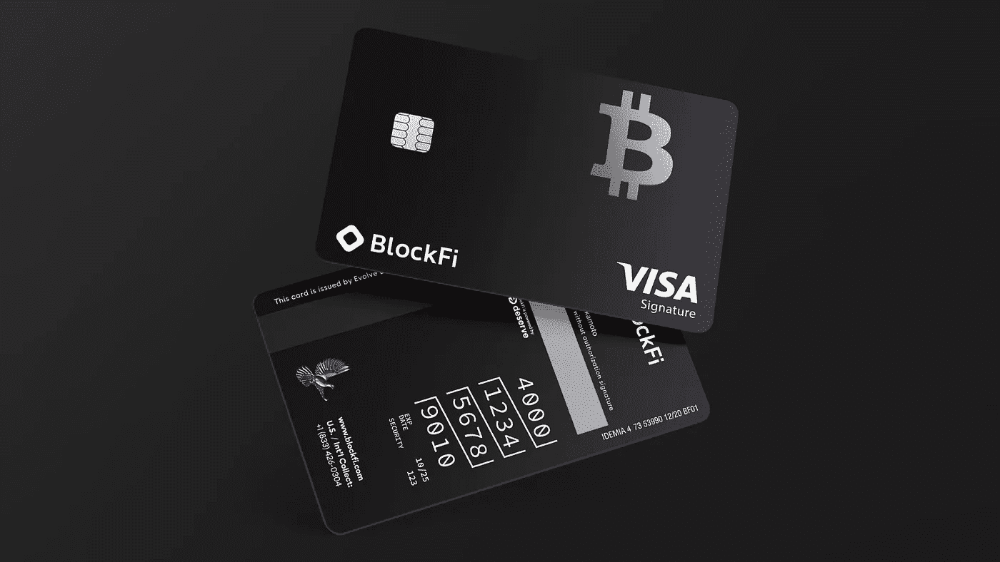
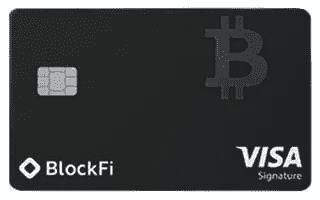
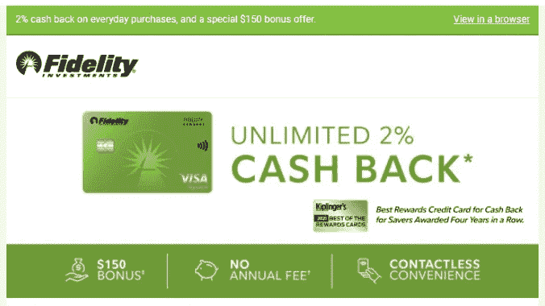

# 现在没有年费，BlockFi Visa 卡终于值了吗？

> 原文：<https://medium.com/coinmonks/now-with-no-annual-fee-is-the-blockfi-visa-card-finally-worth-it-669a63a8d908?source=collection_archive---------26----------------------->

No Annual Fee? What’s the Catch?

嘿，各位，一如既往，我不是一个财务顾问，这些都不是财务建议，只是为了教育和娱乐的目的。请做你自己的研究，找到什么投资可能最适合你。

# 加密货币相关的信用卡/借记卡

如果你关注过我的其他一些关于加密货币卡的帖子，你会知道我经常试图计算出它是否值得，尤其是当你考虑到所涉及的机会成本时。换句话说，如果你承诺任何代币或金钱到任何卡上，以兑现或奖励你所做的任何购买，重要的是要考虑是否有一个更好的产品在那里，你可以把你的钱用在工作上。

就本文而言，虽然有一些欧洲的选择，如 [Nexo](https://support.nexo.io/hc/en-us/articles/360008238593-What-is-the-Nexo-Card-and-what-are-the-benefits-) 卡，但我真的只关注美国公民/居民的美国卡，因为美国通常有最好的信用卡选择，有最大/最好的现金返还奖励以及最大的注册奖金。此外，我不打算深入探讨借记卡，因为它们要么需要大量股份(如 Crypto.com 的[)，要么与保管平台相关联，如](https://crypto.com/app/xya2fj7g7a) [SoFi](https://sofi.app.link/kvjLD43n9pb) 或 [Robinhood](https://join.robinhood.com/jamesk521) ，这些平台不允许你交易、产出或出售你的加密货币。最后，还有其他一些很棒的借记卡，比如来自 [Outlet Finance](https://outlet.finance/open-account?referrerId=pEFTbofcjoSTK7DWf4Szbx2dyd53&referrerName=James_Koo) 的，或者 Voyager 即将推出的。然而，即使这些可能会帮助你在你持有的基金上积累一些不错的 APY，它们也不一定有最好的购买返现率。所以换句话说，开立出口融资账户或航海家账户来积累你的 APY 可能是有意义的，但实际上在这些账户上做任何真实的消费都不会有那么多好处。此外，我个人不会知道我可以在其他平台上获得几乎两倍的 APY，如 [Midas](https://midas.investments/?p=0191) 。

# [BlockFi 的](https://app.blockfi.com/signup/?ref=bf0af2ad) Visa 签名信用卡

BlockFi 刚刚发布了一些[对他们的卡的更新](https://blockfi.com/blockfi-announces-no-annual-fee-and-updated-benefits-for-the-blockfi-rewards)，最大的新闻是他们现在已经取消了 200 美元的年费。高额的年费一直是我没有把这张卡公之于众的直接原因，但现在这笔费用已经被免除了，再加上这个国家[疯狂的通货膨胀率，](https://www.usinflationcalculator.com/inflation/current-inflation-rates/)，我想现在算一算看一看可能是值得的。我们先来分解一下 BlockFi 卡目前的几个方面:

**1)无年费**

一个非常显著的变化，特别是考虑到它曾经是 200 美元

**2)无对外交易费用**

显然，对于那些大部分时间都呆在美国的人来说，这没什么大不了的，但对于那些移居国外的人或国际乘客来说，这可能会改变游戏规则。有许多卡没有国外交易费，但在那些提供持续返现且没有年费的卡中，这是相当罕见的。话虽如此，我觉得这对 BlockFi 卡来说是一大利好。

**3)“在您的前 3 个月内赚取 3.5%的加密回报”:条款和条件实际上规定“在激活后的前 90 天内，在所有购买中赚取 3.5%的比特币回报，最多 100 美元的比特币。要达到 100 美元的上限，至少需要 5000 美元的美元卡消费。”**

这有点令人困惑，因为如果你计算一下，5000 美元的 3.5%实际上是 175 美元，所以我不明白为什么为了达到 100 美元的上限，你必须花费 5000 美元，而实际上应该是大约 2857.15 美元。

**4)“每年花费超过 50，000 美元的每笔购买可在 crypto 中赚取 2%的回报”**

这基本上意味着，你花在 2，857.15 美元到 50，000 美元之间的任何东西，你将获得 1.5%的收益，如果你花的更多，你将开始获得 2%的收益。一旦您的周年纪念日到来，这一总支出奖金基本上会重置，这意味着为了有资格获得奖金，您必须再花费 50，000 美元，以便有资格再次获得 crypto 中的另一个 2%。

**5)交易奖励“在所有符合条件的交易中返还 0.25%的比特币，每月最多 500 美元的比特币”**

老实说，我认为这是一个微不足道的好处，原因有二:

*   首先，为了充分利用 500 美元的好处，我需要每月交易价值约 200，000 美元的密码，我怀疑普通散户投资者/消费者是否能够充分利用这一点
*   第二，这有点误导，因为尽管 BlockFi 宣传他们本身没有交易费，但他们确实有一个买卖墙，这是他们赚钱的方式之一。所以基本上这个好处意味着你不会像平时那样被哄抬价格…但前提是你的交易价值低于 20 万美元。

**6)稳定币红利:“拥有稳定币资产的持卡人……可以在现行稳定币 APY 的基础上额外赚取高达 2%的 APY。**

就像前一点一样，我也认为这是一个虚无的汉堡，特别是考虑到 BlockFi 在 stablecoins 上提供的最高利率是 [7%的 APY。](https://blockfi.com/rates/)这意味着使用 BlockFi 卡，你最多可以获得 9%的 APY，而且这只是你的第一个价值 20，000 英镑的马厩。我不是在抨击利率，尤其是如果你非常信任 BlockFi，但像大多数托管平台一样，你在 BlockFi 上持有的资产没有保险，如果你同意这一点，那么还有其他平台，如 [Voyager](https://voyager.onelink.me/WNly/referral?af_sub5=JAM83321F) 在 USDC 提供 9%的 APY(或 10%的加息)，或我最喜欢的 [Midas Investments，](https://midas.investments/?p=0191)提供 14.5%的本地稳定币 APY(或 17.6%的 Midas Boost)，没有最低或最高限额因此，对我来说，在 BlockFi 上投入大量稳定的资金没有太大意义，尤其是如果我不用开信用卡就能获得更好的回报。

# BlockFi Visa 签名与竞争对手相比如何？

现在，我的 no BS，基准卡是富达无限 2%返现卡，我会一直与所有信用卡进行比较:

这里没有先令，但任何一个来自积分和里程社区的人都可以告诉你，这几乎是所有体面回报卡的标准。这是这张卡的当前规格:

**1)无年费**

**2)“国外交易费:每笔国外购买交易的 1%”**

就像我之前提到的，就没有年费卡而言，大多数都有国外交易费来抵消信用公司的成本。但我必须指出，与其他无年费卡相比，1%仍然相对较低，因为许多卡可以一直升至 3.5%。

**3)“在开户后的前 90 天内，您至少进行了 1，500 美元的合格净购买，即可获得 15，000 点奖励积分，相当于 150 美元的现金返还。限时优惠。**

的确，这种优惠是有限的，因为它通常不附带任何注册奖励。虽然要注意，有针对性的蜗牛邮件提供 300 美元的注册奖金，以及以前的奖金为 100 美元的 1000 美元，甚至 500 美元的消费。据我所知，150 美元的报价是目前最好的公开报价。

**4)“每日购物无限制 2%返现。”**

这是该卡的主要用途，因为无论你购买的金额是 100 美元还是 1，000，000 美元或更多，基本上都有 2%的返还。现在请注意，返现是以积分形式进行的，可以 1:1 兑换现金，但您必须在[富达(免费)](https://www.fidelity.com/customer-service/friendsandfamilyoffer2?m=eefb7b6b687c0b11d6b90f9bc8b54aaa77&t=&r=74748&cid=&ccsource=email_referral)开立账户才能兑换。

# 每张卡一个盒子

我知道不同的人的消费率会有很大的不同，所以下面是两种不同类型的消费者的案例基础，这可能包括大多数零售消费者。通过对每种情况进行数学分析，我们有希望看到这张卡的真正价值，或者至少看到我们可能在机会成本上损失了多少。

**情况 1)仅针对支出奖金**

BlockFi:如果一个人在 BlockFi 卡上消费 2857.15 美元，他就有资格获得价值 100 美元的 BTC，包括国内和国外的。

忠诚:如果一个人在他们的忠诚卡上消费 2857.15 美元，他们将从实际消费中获得 57.14 美元，加上 150 美元的签约奖金，总计 207.14 美元。这个数额是国内的，但是对于收取 1%国外交易费的国际人士来说，总数将下降到 178.57 美元。

仅比较消费奖金，很明显，不考虑国外交易费用，富达更值得获得短期奖金。

**案例 2)平均花费 58，488 美元:**为什么是 58，488 美元？根据 visualcapitalist.com[的数据，普通消费者每月花费大约 4874 美元，或者至少他们去年 10 月/11 月的花费，全年平均花费为 58488 美元。就我个人而言，我认为这个数字非常高，因为我通常不会花这么多钱，但这和我发现的其他研究差不多。不管怎样，向前看…](https://www.visualcapitalist.com/a-breakdown-of-americans-monthly-credit-card-spending/)

BlockFi:如果一个人在他们的 BlockFi 卡上花费 58，488 美元，他们将获得 100 美元(用于他们的第一笔 2，857.15 美元的花费)+707 美元(用于在 2，857.15 美元到 5 万美元之间的花费)+169.76 美元(用于剩余的 8，488 美元的花费)= **$976.76。**同样因为没有年费，这个 976.76 美元的数字对海外和/或国内都是一样的。

忠诚:如果一个人在他们的忠诚卡上消费 58，488 美元，他们将获得 1，169.76 美元(对于他们所有的 58，488 美元消费)+150 美元注册奖金=**= 1，319.76 美元。这个总数将用于国内购买，但是如果你收取 1%的国外交易费(584.88 美元)，那么假设你所有的消费都是在国外完成的，那么这个总数就是 734.88 美元。**

这里的结果有点复杂，但似乎在国内，富达卡仍然为其客户提供了更好的回报，在一年后为其客户提供了近 350 美元的额外收益。无论如何，**对于外籍人士来说，只有当 41.3%或更多的采购以美元结算时，忠诚度才是值得的。如果低于这个数字，BlockFI 卡似乎是一个更好的选择**。我还认为，不考虑国外交易费用，它仍然是 ex-pat 的选择，因为作为一名 ex-pat 超过 10 年的人，我仍然会在网上购买至少三分之一到一半的商品，主要是美元，这意味着我不必担心国外交易费用占我支出的很大一部分。

# 最后

我知道我在这里并没有为 BlockFi 描绘一幅美好的画面，但是不管回报率如何，如果你对 DCA BTC 感兴趣，BlockFi 卡可能是迫使你这样做的一个不错的选择。此外，正如我在之前提到的[，我不像刚开始使用 Crypto 时那样经常使用 BlockFi，但我认为这种卡本身对加密经济有好处，因为它将帮助更多人加入加密货币。](https://www.publish0x.com/jaik83/outgrowing-blockfi-xeldqdw)

我会开一张 BlockFi 卡吗？近期内不会，可能直到他们开始对所有购买提供 2%的返现，而不仅仅是超过 50，000 美元。此外，我还关注了贸易领域的其他卡，比如面包金融推出的一种新的 2%返现卡[,据说它将提供 2%的返现，而且没有国外交易费或年费！如果这张卡真的发行，从长远来看，它可能是比 BlockFi *和* Fidelity 更好的选择。](https://www.cnbc.com/select/american-express-bread-financial-new-cash-back-credit-card/)

有没有听过或者用过我没提过的卡？还是已经注册了 BlockFi 卡？如果你有，我很想听听你使用它的经历。无论如何，感谢你的阅读，请记得在推特上关注我:【https://twitter.com/CryptosWith

**资源**

1.  [https://support . Nexo . io/HC/en-us/articles/360008238593-什么是 Nexo-卡，什么是福利-](https://support.nexo.io/hc/en-us/articles/360008238593-What-is-the-Nexo-Card-and-what-are-the-benefits-)
2.  [https://www . usinflationcalculator . com/inflation/current-inflation-rates/](https://www.usinflationcalculator.com/inflation/current-inflation-rates/)
3.  [https://www . Reddit . com/r/block fi/comments/i0f2br/no _ trade _ fee _ is _ the _ difference _ in _ buy _ sell _ price/](https://www.reddit.com/r/blockfi/comments/i0f2br/no_trade_fee_is_the_difference_in_buy_sell_price/)
4.  [https://block fi . com/block fi-announced-no-annual-fee-and-updated-benefits for-the-block fi-rewards](https://blockfi.com/blockfi-announces-no-annual-fee-and-updated-benefits-for-the-blockfi-rewards#)

> 加入 Coinmonks [电报频道](https://t.me/coincodecap)和 [Youtube 频道](https://www.youtube.com/c/coinmonks/videos)了解加密交易和投资

# 另外，阅读

*   [CoinDCX 评论](/coinmonks/coindcx-review-8444db3621a2) | [加密保证金交易交易所](https://coincodecap.com/crypto-margin-trading-exchanges)
*   [红狗赌场评论](https://coincodecap.com/red-dog-casino-review) | [Swyftx 评论](https://coincodecap.com/swyftx-review) | [造币厂评论](https://coincodecap.com/coingate-review)
*   [Bookmap 评论](https://coincodecap.com/bookmap-review-2021-best-trading-software) | [美国 5 大最佳加密交易所](https://coincodecap.com/crypto-exchange-usa)
*   [如何在 FTX 交易所交易期货](https://coincodecap.com/ftx-futures-trading) | [OKEx vs 币安](https://coincodecap.com/okex-vs-binance)
*   [CoinLoan 审查](https://coincodecap.com/coinloan-review) | [YouHodler 审查](/coinmonks/youhodler-4-easy-ways-to-make-money-98969b9689f2) | [BlockFi 审查](https://coincodecap.com/blockfi-review)
*   [XT.COM 评论](https://coincodecap.com/profittradingapp-for-binance)币安评论 |