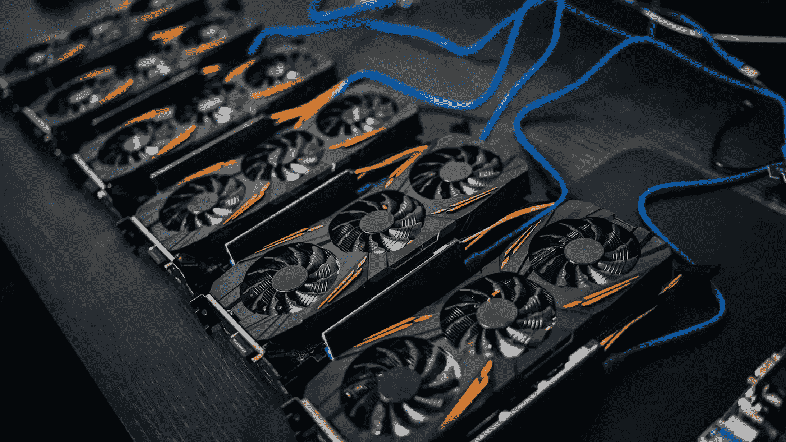
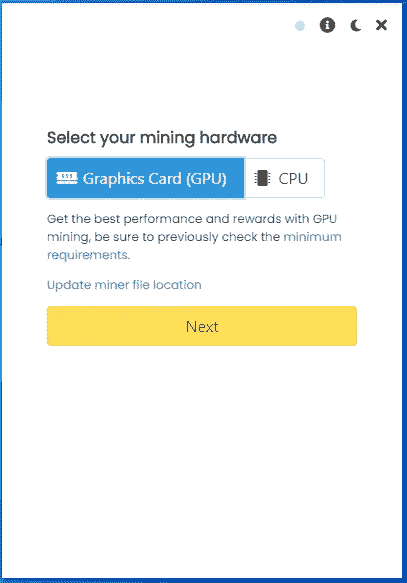
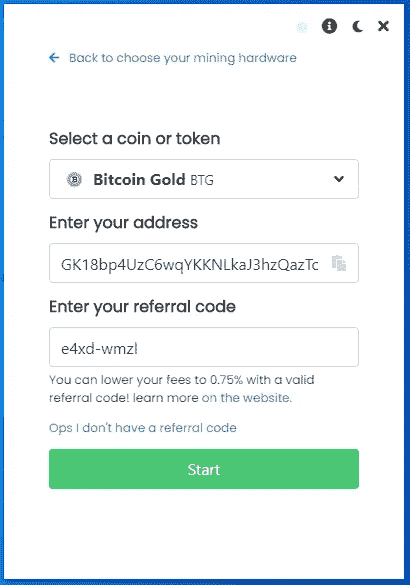
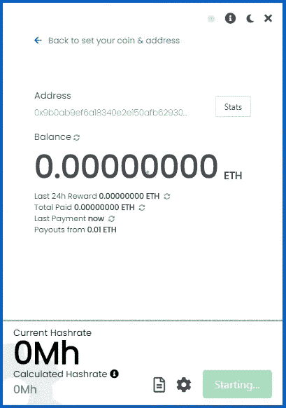
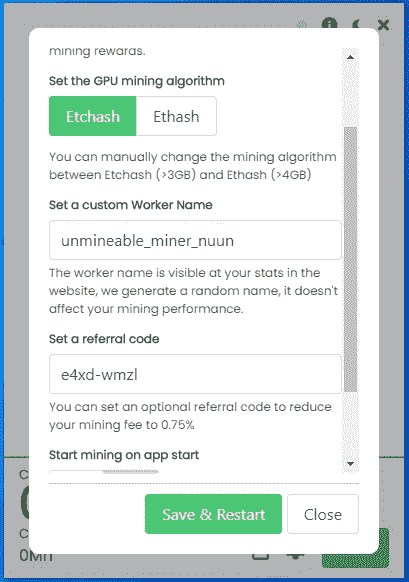
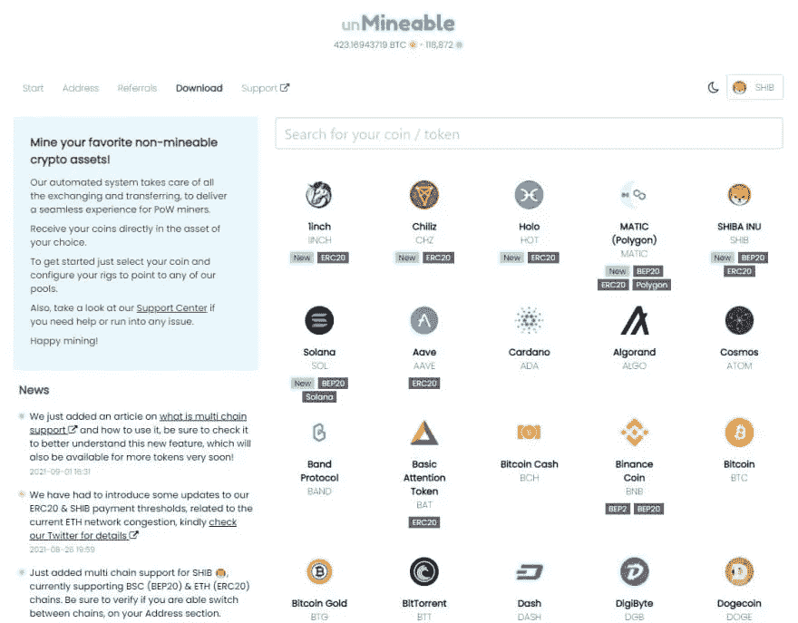

# 英伟达 RTX 3060 采矿加密与您的 GPU 在 2022 年

> 原文：<https://medium.com/coinmonks/nvidia-rtx-3060-mining-crypto-with-your-gpu-in-2022-94cb6a281be5?source=collection_archive---------3----------------------->

读完这篇文章后，你将能够使用你的显卡来获得额外的收入，而不是让它闲置在你的电脑上！

在开始之前，你需要知道有一些你必须考虑的预防措施，我将在文章的最后更详细地讨论它们，所以我建议你在开始 GPU 挖掘之前阅读该部分。

你可能会问自己这是否值得尝试，你可以用你的英伟达 RTX 3060 GPU 有效地挖掘哪些硬币。

遵循本帖中描述的指导方针，你将能够使用 RTX 3060 采矿:

*   以太坊
*   卡尔达诺阿达
*   索拉纳
*   拉文科恩
*   以太坊经典
*   柴犬
*   总督
*   币安·BNB
*   多边形 Matic 和更多的硬币。

这怎么可能？我想这些硬币应该是不可拆卸的。下面继续看！！

我可以通过电报帮助设置和优化:[https://t.me/cryptominingadvisor](https://t.me/cryptominingadvisor)

**第一步:**准备一个钱包和一个公共地址，这样你就可以在区块链为你想要开采的硬币获得资金。

使用您的币安帐户、Crypto 或 Guarda 钱包。如果您没有帐户，请通过下面的链接创建帐户。

[币安](https://accounts.binance.com/en/register?ref=K5XIYGD8)
[Crypto.com](https://crypto.com/app/az7qh3qye4)
[瓜达](https://grd.to/ref/GcgX)

其他选项可能包括*原子钱包*、*出埃及记*、*信任钱包*。

有纸质钱包和其他网络钱包。

例如，如果您选择了 Metamask.io，那么建议您向其添加一些网络，如币安智能链和多边形，这样您将能够使用 Metamask 与这些区块链进行交互。

**第二步:**下载无法运行的软件。

在下载文件之前，在 Windows Defender、防病毒软件和浏览器中设置一些文件夹排除，这样你就可以下载文件，而不会受到危险文件通知的困扰。

官方的无敌软件可以从这个网站下载:[无敌下载](https://www.unmineable.com/miner)

下载 MFI 版本(包括矿工文件)。

**第三步:**提取并以管理员身份运行 Unmineable。

不可挖掘的软件只是一个可执行文件，它已经包含了所有的配置，所以它是挖掘任何加密的最好和最容易的方法。

**在 windows 中以管理员身份运行文件。**

当您运行它时，它看起来就像这样:

可以选择 GPU 卡。

它会将你带到第二个屏幕，在那里你将输入你的比特币黄金 BTG 地址和**代码，这将允许你把你的开发费从 1%降到 0.75%** 。

使用代码: **e4xd-wmzl** 将您的开发费用从 1%降至 0.75%(这很重要)。

您的屏幕应该是这样的:

单击开始按钮后，您应该会看到一个类似的屏幕:

此时，我建议您单击底部的选项来显示日志(看起来像一张纸)，这里单击强制停止。

然后点击设置图标(看起来像一个齿轮)，在弹出的屏幕中你要仔细检查几件事情:

1.  确保选择的算法是 etcash 如果您使用 4GB 卡进行挖掘，使用 ETHASH 用于 6GB 或更大的卡，如果您选择了 CPU，一切都准备好开始挖掘，不需要选择任何东西。
2.  确保代码 **e4xd-wmzl** 显示在推荐框中(推荐，非强制)。
3.  为您的员工(您从中进行挖掘的计算机)设置一个名称。
4.  将你的挖掘强度设置为最高，我建议你在不使用电脑的时候使用高强度。

它看起来像这样:

点击保存和重启按钮开始挖掘！！

一旦它开始，你可以检查你的图形卡或 CPU 的速度，显示为当前的哈希值。

你也可以点击右上角的统计按钮，直接转到 Unmineable 网站，在那里你可以检查你的余额，并要求手动支付。

**注意**建议您更改 windows 中的一些设置，增加 Windows 虚拟内存，有人会禁用更新，还会禁用睡眠模式、休眠或任何可以在电脑不使用时关闭电脑的功能。

使用笔记本电脑时，确保它有一些电池或插上电源，这样它就不会关机。

考虑监控 GPU 的温度，尽量不要超过 70C 的 GPU 和 95C 的内存，你可以使用硬件监视器来检查温度或 MSI 加力，你也可以用来设置超频配置文件，并在你的 RTX 3060 采矿时获得更好的哈希拉。

恭喜，如果你正在使用不可采矿，你现在是一名矿工了！！

**现在你可以登录 Unmineable 查看你的状态:**

Unmineable.com 是一个采矿池，允许你用你的 CPU 使用 RandomX 或 GPU 使用 etcash 或 Ethash 采矿，并支付你选择的任何硬币。

为了检查您的余额，请登录[不可挖掘的](https://unmineable.com/)，然后选择您想要挖掘的硬币。在这个例子中，比特币黄金。

然后，您可以根据您的算法选择显示 RandomX 或 ETCHAS 或 ETHASH 的选项卡，并在显示“输入您的地址以检查您的统计数据:”的框中输入您的地址。

这样做后，你会看到你的帐户余额，你甚至可以要求付款。

如果您在配置软件时遇到问题，想要一个简单的选项，您可以通过下面的链接获得我在视频中使用的预配置版本的采矿程序:

[仅 BrosMrig CPU](https://cdn.discordapp.com/attachments/914134365649403924/920037852400726037/BrosMrig_6.16.0.zip)

[phoenix miner Nvidia/AMD Gpu Only](https://cdn.discordapp.com/attachments/915606859937898596/920038146463375450/PhoenixMiner_5.9d_Windows.zip)

*如果你有任何困难，请打电报给我，我可以进一步帮助你*

[https://t.me/cryptominingadvisor](https://t.me/cryptominingadvisor)

在 unmineable 上挖掘您的硬币后，考虑下注硬币以从您的加密中获得额外的被动收入，您可以阅读下面的新手下注教程:

[什么是跑马圈地？| 2022 年用 Crypto 赚取被动收入](/coinmonks/how-to-earn-passive-income-with-crypto-staking-in-2022-99ae1ec0d53)

如果您正在寻找更多关于 CPU 挖掘的信息，PDF 电子书中有很好的指南，并且是免费的，请访问:

[用 CPU 挖掘密码](https://leanpub.com/how-to-start-mining-crypto-with-cpu/)

*本帖包含附属链接；如果您从本文中提供的链接购买产品或服务，以帮助支持本出版物，并且不收取额外费用，作者可能会获得报酬。*

> 加入 Coinmonks [电报频道](https://t.me/coincodecap)和 [Youtube 频道](https://www.youtube.com/c/coinmonks/videos)了解加密交易和投资

## 也阅读

 [## 杠杆代币[多头代币]终极指南

### 杠杆化令牌是具有杠杆化风险敞口的 ERC20 令牌，不考虑保证金、要求、管理…

medium.com](/coinmonks/leveraged-token-3f5257808b22)  [## 最佳加密交易所| 2021 年十大加密货币交易所

### 编辑描述

blog.coincodecap.com](https://blog.coincodecap.com/crypto-exchange)  [## 2021 年最佳加密交换平台| CoinCodeCap

### 编辑描述

blog.coincodecap.com](https://blog.coincodecap.com/best-swap-platforms)  [## 10 大最佳网上赌场[2021] |赢取免费 BTC | CoinCodeCap

### 编辑描述

blog.coincodecap.com](https://blog.coincodecap.com/best-online-casinos)  [## 2021 年最佳加密借贷平台| 6 大比特币借贷平台

### 获得比特币和其他加密货币的最佳贷款利率

medium.com](/coinmonks/top-5-crypto-lending-platforms-in-2020-that-you-need-to-know-a1b675cec3fa)  [## 2021 年 6 大最佳硬件钱包|顶级加密硬件钱包[更新]

### 最好的加密货币硬件钱包是绝对必要的。我们将在 NGRAVE、Ledger Nano X 和…

medium.com](/coinmonks/the-best-cryptocurrency-hardware-wallets-of-2020-e28b1c124069)  [## 2021 年最佳免费加密交易机器人

### 2021 年币安、比特币基地、库币和其他密码交易所的最佳密码交易机器人。四进制，位间隙…

medium.com](/coinmonks/crypto-trading-bot-c2ffce8acb2a)