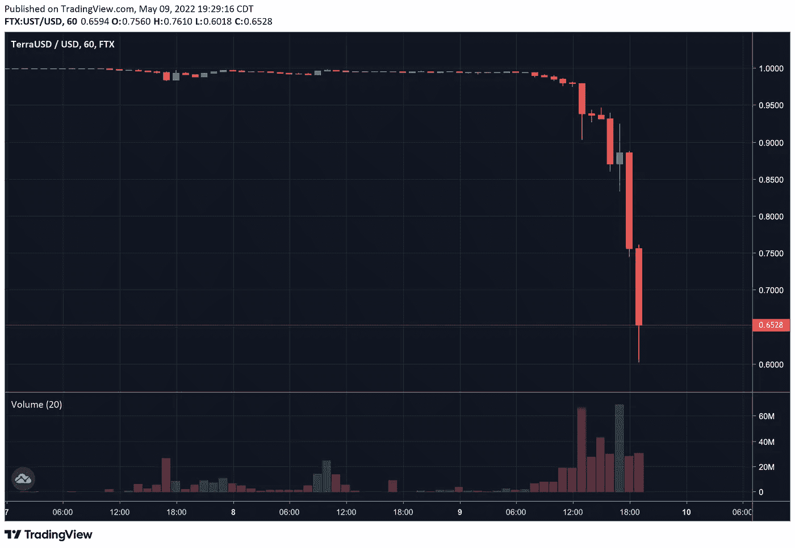
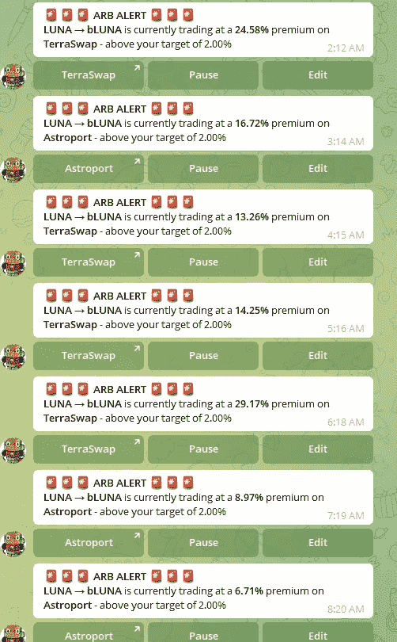

# 来自 Terra 死亡螺旋的观察

> 原文：<https://medium.com/coinmonks/observations-from-terras-death-spiral-5ff1fecb2ce5?source=collection_archive---------6----------------------->

如果昨天 Terra 死亡螺旋的已实现风险不是一个粗略的提醒，请记住整个 Defi/Crypto 是有风险的，并请注意这不仅仅是财务建议和教育(希望是娱乐)目的。

# 伟大的分离

在过去的几天里，整个 Terra 生态系统受到了重创，UST 的联系汇率出现了历史性的崩溃，这也系统性地将 LUNA 带到了年初至今的低点。然而，如果你跟上新闻，脱挂钩真正开始于周末，当时 UST 在曲线池中出现大量倾销，造成大规模池失衡，随后在 UST 的价格行动中产生市场差异。此外，一些精选的鲸鱼钱包同时起锚，这无疑吓坏了 Terra 市场，导致价值约 40-50 亿美元的资产一夜之间起锚。在所谓的“死亡螺旋”中，人们总体上对 UST 失去了极度的信心，实质上存在着抛售 UST 的巨大压力，推动联系汇率进一步下跌，这也因此给人们带来了抛售卢娜的间接压力。最后，随着 LUNA 的价格暴跌，价值数百万美元的 LUNA 被清算，这进一步增加了抛售和信心丧失，推动市场进一步下跌。DoKwon 和 LFG 在最近几个月购买了大量 BTC 加入其储备，以帮助支持 UST，但考虑到 TVL 的锚从 200 多亿美元下降到 85 亿美元(在撰写本文时)，这并不奇怪，BTC 储备的几十亿美元无法支撑 UST 向 0.60 美元范围的大幅下滑。

如果你期待阅读更多关于去标签化死亡螺旋本身的内容，我这篇文章的目的不是谈论崩溃的机制，也不是这里出了什么问题的根本问题，所以如果你想了解更多关于去标签化的信息，我强烈建议你尝试从官方来源获得你的新闻，因为正如我稍后会谈到的，twitter 有一个巨大的趋势，可以激起很多 FUD。

由于我昨晚熬夜跟踪了很多这种行为，我昨晚得出了很多大大小小的观察结果:

**1)总的来说，加密货币市场的效率非常低** —尽管它们现在更加接近，但 UST/卢娜的利率在多个平台上过去和现在都有很大差异。如果我现在使用 [Uniswap](https://app.uniswap.org/#/swap?chain=mainnet) 的话，挂钩汇率大约是 0.80 美元，如果我使用 [OkCoin](https://www.okcoin.com/join?channelId=600144249) 的话，挂钩汇率是 0.91 美元，或者如果我使用“白鲸”的连锁汇率，挂钩汇率大约是 0.93 美元。12 小时前，这些差异甚至更大。—链上价格仍然固定在 1 美元到 1 美元左右，而链外价格则上下浮动，从 0.60 美分左右一直涨到 0.95 美分左右。

我知道通常套利有其公开市场的功能目的，以帮助拉平价格(在很大程度上，我完全同意这一点)，但昨晚，我不会。随着网络拥塞，流动性池被冻结，以及简单的服务关闭，许多晚期散户投资者完全无法去杠杆化他们的头寸，以便他们能够阻止自己被清算，或者至少能够将他们的资产从 Terra 转移到像 USDC 这样波动性较小的地方。因此，没有多少人能够转移他们的资金，价格差异只会增加人们在 twitter 上表现出的不确定性和恐慌。

2)说到 Twitter，**我真的不认为从长远来看,**这种“来找我兄弟”的心态对一个项目真的有好处，在这里，我特别要说的是 DoKwon，他是 Terra 生态系统的傀儡。现在不要误解我的意思，从我读到的内容来看，我认为这个家伙是一个才华横溢的梦想家，他创造了一个令人难以置信的生态系统。但我认为贬低其他项目或秘密努力不仅对这些项目本身有害，而且对整个秘密经济也有害。以下面的推文为例:

现在完全公平地说，我相信 DoKwon 是加密经济的大力支持者，我知道对我来说，随机挑选推文然后短视地展示它们是不公平的。然而，作为最大的 TVL·区块链的唯一傀儡，不管他喜欢与否，他是公众人物，人们会(有时是错误的)解读他所说的话，不管他是不是故意开玩笑。也就是说，我完全可以看到这会如何在露娜/Terra 的背上画出一个目标，这也是我相信为什么我们会在本周看到这个崩溃的原因。我们看到了丹尼尔·塞斯塔(Daniele Sesta)和青蛙国家(Frog Nation)类似的(但没有那么大)崩盘，导致许多青蛙军团和其他非假设散户投资者损失了大量资金。Dani 和 DoKwon 一样，都有一种“来找我兄弟”的态度，也有类似的问题:

除了这些小打小闹，我还是对#疯子社区印象深刻。一些人开放了他们的 DMs 来帮助其他亏损的人。此外，我还阅读了无数来自社区成员的推文和信息，他们真的很关心彼此。在困难时期，许多人互相同情和支持。

3)说到达尼，**虽然这与发生在米姆的银行挤兑相似，但我认为 UST 的银行挤兑是那次的 10 倍。MIM，即神奇的互联网货币，是一种稳定的硬币，通过 [Abracadabra.money](https://abracadabra.money/) 防止其挂钩过度抵押，在今年早些时候的 [Sifu 丑闻](https://www.publish0x.com/jaik83/mim-if-that-didnt-break-it-perhaps-nothing-will-xlzrgkv)中也经历了压力测试。然而，与 MIMs 不同的是，UST depeg 突破了 0.98 美元的区间，触及更低的水平，从而使事情变得更具灾难性。MIMs 银行挤兑和 UST 银行挤兑一样，表明了区块链和协议是如何共生共存的。米姆斯是第三级与发生在时代仙境的丑闻有关，而 LFG 抛售 BTC 引起了整个加密空间巨大的 FUD。**

4) **如果关于 Citadel 的传言是真的，一场针对 TradFi 的战争可能已经开始，如果它还没有开始的话**。作为“来找我兄弟”态度的后续，当 DoKwon 公开发布他购买 BTC 的时间和数量时，它为有足够资本操纵市场和做空 sh 的潜在参与者创建了一个游戏计划！从你的身体里出来，就像这里发生的一样。实际上，传言是 Citadel 有人策划了一次攻击，其中包括做空 DoKwon 购买的 BTC:

如果这不是在你背上画一个目标，我不知道是什么，但 TradFi 肯定有动机和资本这样做。

5) **白鲸协议是野兽**。如果你不熟悉白鲸，你可以在我之前的[帖子](/@CryptosWith/earning-more-than-20-apy-on-white-whale-instead-of-anchor-for-your-ust-e556f59672)中读到它，本质上它有一个套利库，当不同协议上存在 UST 价格偏差时，它会寻求自动利用不同的套利机会。因此，完全免责声明，我可能是完全错误的，但我个人相信 UST 最终会恢复联系汇率制，因此，我在白鲸的 arb 金库里留下了一袋 UST。在这个挂钩汇率极度波动的时期，从上周末开始，我看到白鲸每隔几分钟就吐出套利机会。它是否忠实于“保持联系”。成为鲸鱼”的座右铭？显然不是。但尽管如此，它的功能给我留下了极其深刻的印象，只要 arb 金库继续利用价格差异，我很可能会继续在那里放一个包。

6)说到套利，不仅 UST、**有套利机会，卢娜和布鲁纳**也有一些疯狂的套利机会:

当溢价约为 9%时，我自己进行了套利，但如果我更有耐心(并且没有睡觉)，我可能会获得近 30%的溢价。考虑到卢娜身上的价格波动，这是完全愚蠢的吗？大概吧。但话说回来，我仍然相信生态系统仍然会恢复，这就引出了我的下一个观察。

外面有很多德根人。是的，anchor 出现了巨大的流动性流失，是的，许多人通过清算损失了数亿美元，但尽管如此，在撰写本文时，TVL 仍有超过 85 亿美元的 anchor，其中包括超过 20 亿美元的抵押品。这与上周 TVL 的 200 亿人相差甚远，但我认为这个系统中还有很多生命。最重要的是，除了试图套利的人之外，还有(并将继续)大量试图做空和做多任何东西的人。

同样，看到许多内容创作者(无论是在 twitter、Youtube 还是任何其他平台上)如何谈论这一点也很有趣。在这次惨败之前，也许我所关注的每一个内容创作者(包括我自己)都提到了 Anchor 协议的所有好处以及如何从 Terra 生态系统中赚钱，但有许多人要么感到沉默，要么觉得自己有责任让他们的追随者进入一个明显失败的东西，并有可能将生命储蓄置于危险之中。我自己，试图识别(当我可以的时候)我博客中的任何项目的潜在风险，但让我们诚实地在这里——当你看到疯狂的高收益和快速致富的可能性时，它可以激发我们所有人的德根。正是因为这个原因，我故意不写关于我个人参与的超级冒险的德根项目的博客，因为我不喜欢有人代表我冒这种风险。话虽如此，我和许多其他内容创作者一样，知道这种死亡螺旋的可能性是存在的，但我想我们都同意，这发生得非常快，让大多数人大吃一惊。

# 结论

在过去的几天里，我们学到了很多东西，我希望这些经验能帮助我们睁大眼睛投入到下一步的投资中去。Terra 会恢复吗？我当然希望如此，但在这一点上还很难说，因为在我写这篇文章的时候，UST 的价格已经波动了+/- 5%。所以，请再一次做你自己的研究，并对你遇到的一切保持批判的态度。我相信有时冒点风险当然是可以接受的，但是请试着完全理解那些风险是什么，如果你接受风险，就要愿意接受可能的后果。

再次感谢阅读。花点时间和你爱的人在一起，记住市场不会只关心一个人，不管我们怎么想，他们都会继续做他们该做的事情。

关注我的新推特账户@ CryptosWith:[https://twitter.com/CryptosWith](https://twitter.com/CryptosWith)

资源:

1.  【https://www.youtube.com/watch?v=Ii5_UVf4SUw 号
2.  【https://app.uniswap.org/#/swap?chain=mainnet 
3.  [https://www.okcoin.com/join?channelId=600144249](https://www.okcoin.com/join?channelId=600144249)
4.  [https://abracadabra.money/](https://abracadabra.money/)
5.  [https://www . publish 0x . com/jai k83/mim-if-that-not-break-it-maybe-nothing-will-xlzrgkv](https://www.publish0x.com/jaik83/mim-if-that-didnt-break-it-perhaps-nothing-will-xlzrgkv)
6.  [https://medium . com/@ CryptosWith/earning-above-20-apy-on-white-whale-inst-of-anchor-for-your-ust-e556f 59672](/@CryptosWith/earning-more-than-20-apy-on-white-whale-instead-of-anchor-for-your-ust-e556f59672)

> 加入 Coinmonks [电报频道](https://t.me/coincodecap)和 [Youtube 频道](https://www.youtube.com/c/coinmonks/videos)了解加密交易和投资

## 另外，阅读

*   [如何购买 Monero](https://coincodecap.com/buy-monero) | [IDEX 评论](https://coincodecap.com/idex-review) | [BitKan 交易机器人](https://coincodecap.com/bitkan-trading-bot)
*   [CoinDCX 评论](/coinmonks/coindcx-review-8444db3621a2) | [加密保证金交易交易所](https://coincodecap.com/crypto-margin-trading-exchanges)
*   [折叠 App 审核](https://coincodecap.com/fold-app-review) | [Kucoin 交易机器人](/coinmonks/kucoin-trading-bot-automate-your-trades-8cf0ca2138e0) | [Probit 审核](https://coincodecap.com/probit-review)
*   [如何匿名购买比特币](https://coincodecap.com/buy-bitcoin-anonymously) | [比特币现金钱包](https://coincodecap.com/bitcoin-cash-wallets)