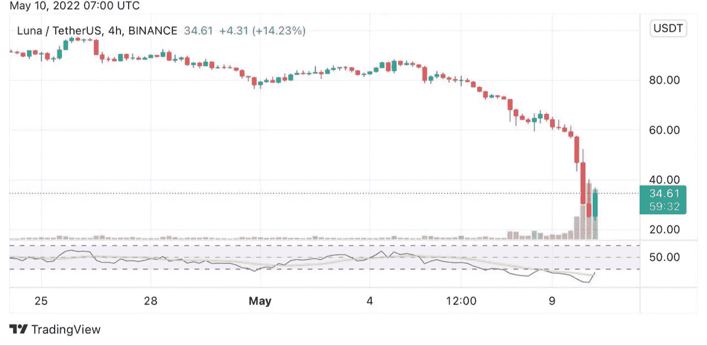

# 哦露娜！

> 原文：<https://medium.com/coinmonks/oh-luna-de82cb675f8c?source=collection_archive---------23----------------------->

我绝对不是唯一一个看到这一点的人，这似乎是如此不真实和灵魂破碎。我们的新宠第一层区块链露娜在 24 小时内下跌了 50%,是目前任何人的投资组合中表现最差的资产。

在过去的 24 小时里，发生了很多事情，没有什么好事，对金融投资者来说只是一个噩梦时期。石油下跌，股票下跌，金属下跌，加密货币下跌，比特币在同样的 24 小时内损失超过 10%。Alts？什么是 alts？我什么也找不到，只有一滩红蜡烛。发生了什么事？俄罗斯做了什么新的事情吗？还是这次是中国？或者，也许是大衰退的逼近；不可能，美元 DXY 处于过去 20 年来从未见过的峰值，当美元表现如此良好时，投资者往往会持有它，再加上美联储加息，美元是零风险投资的最佳选择(假设通货膨胀没有成为头条新闻)。

现在，转到 Terra 和他们的令牌；卢娜和 UST。最近，月神区块链背后的公司 Terra 因购买比特币和一篮子其他加密货币以支持其稳定的货币 UST 而成为头条新闻。Terra foundation 没有采用传统的美元挂钩制度，而是引用通货膨胀和其他可能影响当地货币的当地经济状况作为 UST 不打算将美元作为其稳定货币挂钩的原因，因此他们继续疯狂购买价值近 100 亿美元的比特币。

这个消息受到了加密界的好评，直到最近当比特币和其他加密货币进入大屠杀情绪时，随着美元走强，出现了轻微的脱钩。周一几个小时后，42，500 比特币(约值 14 亿美元)从 Luna 钱包中转移，这引起了交易员和投资者的恐慌，如果这笔资产在公开市场上出售，游戏就结束了！拜拜！

这导致 Luna 和 UST 持有人的恐慌性抛售，使事情变得更糟，推动 UST 盯住美元的汇率低于 0.8 美元，并使 Luna 的价格当天暴跌 50%以上，从历史高点下跌 82%。

Luna 4hr chart

就在不到一天前，Luna foundation guard 宣布，将采取果断措施，积极捍卫 UST 联系汇率制度和更广泛的 Terra 经济的稳定。措施包括随着市场状况开始稳定，贷款价值 7.5 亿美元的 UST 以积累更多的比特币。

投资者正怀着浓厚的兴趣关注着 Luna。它会产生巨大的反弹吗？或者它会走向无穷远吗？

> 加入 Coinmonks [电报频道](https://t.me/coincodecap)和 [Youtube 频道](https://www.youtube.com/c/coinmonks/videos)了解加密交易和投资

# 另外，阅读

*   [Bookmap 点评](https://coincodecap.com/bookmap-review-2021-best-trading-software) | [美国 5 大最佳加密交易所](https://coincodecap.com/crypto-exchange-usa)
*   最佳加密[硬件钱包](/coinmonks/hardware-wallets-dfa1211730c6) | [Bitbns 评论](/coinmonks/bitbns-review-38256a07e161)
*   [新加坡十大最佳加密交易所](https://coincodecap.com/crypto-exchange-in-singapore) | [购买 AXS](https://coincodecap.com/buy-axs-token)
*   [红狗赌场评论](https://coincodecap.com/red-dog-casino-review) | [Swyftx 评论](https://coincodecap.com/swyftx-review) | [CoinGate 评论](https://coincodecap.com/coingate-review)
*   [投资印度的最佳密码](https://coincodecap.com/best-crypto-to-invest-in-india-in-2021)|[WazirX P2P](https://coincodecap.com/wazirx-p2p)|[Hi Dollar Review](https://coincodecap.com/hi-dollar-review)